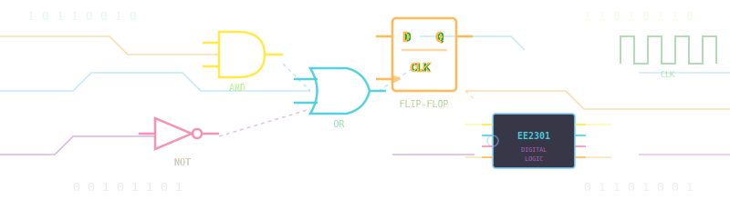

  

# Digital System Design

## An Intelligent Interactive Textbook

**EE 2301 — Introduction to Digital System Design**

University of Minnesota — Twin Cities Department of Electrical & Computer Engineering

  <a href="unit1-number-systems/" class="md-button md-button--primary">Get Started</a>
  <a href="sims/" class="md-button">Explore MicroSims</a>
  <a href="glossary/" class="md-button">View Glossary</a>

---

## Welcome

This is an **AI-assisted intelligent interactive textbook** for sophomore and junior-level Electrical and Computer Engineering students. Built using MkDocs Material and Claude Code, it provides modern, accessible learning materials covering the complete fundamentals of digital logic design.

!!! tip "Quick Navigation"
    - **New to digital logic?** Start with [Unit 1 — Number Systems](unit1-number-systems/index.md)
    - **Already familiar with binary?** Jump to [Unit 2 — Boolean Algebra](unit2-boolean-algebra/index.md)
    - **Looking for quick reference?** Check the [Glossary](glossary.md) or [FAQ](faq.md)

---

## Course Units

### Part I: Foundations

| Unit | Topic | Key Concepts |
|:----:|-------|--------------|
| 1 | [Number Systems](unit1-number-systems/index.md) | Binary, octal, hexadecimal, two's complement |
| 2 | [Boolean Algebra](unit2-boolean-algebra/index.md) | Logic gates, theorems, De Morgan's laws |
| 3 | [Applications of Boolean Algebra](unit3-applications-boolean-algebra/index.md) | Adders, subtractors, comparators, decoders |

### Part II: Minimization Techniques

| Unit | Topic | Key Concepts |
|:----:|-------|--------------|
| 4 | [Minterm & Maxterm Expansions](unit4-minterm-maxterm-expansions/index.md) | Canonical forms, SOP/POS, cofactors |
| 5 | [Karnaugh Maps](unit5-karnaugh-maps/index.md) | K-map simplification, prime implicants |
| 6 | [Quine-McCluskey Method](unit6-quine-mccluskey/index.md) | Algorithmic minimization, PI charts |

### Part III: Circuit Implementation

| Unit | Topic | Key Concepts |
|:----:|-------|--------------|
| 7 | [Multi-Level Gate Circuits](unit7-multi-level-gates/index.md) | NAND/NOR universality, bubble pushing |
| 8 | [Combinational Logic Modules](unit8-combinational-modules/index.md) | MUX, decoders, encoders, comparators |

### Part IV: Sequential Logic

| Unit | Topic | Key Concepts |
|:----:|-------|--------------|
| 9 | [Sequential Logic Fundamentals](unit9-sequential-fundamentals/index.md) | Latches, flip-flops, timing diagrams |
| 10 | [Sequential Circuit Design](unit10-sequential-design/index.md) | Counters, registers, FSM design |

### Part V: Advanced Topics

| Unit | Topic | Key Concepts |
|:----:|-------|--------------|
| 11 | [Programmable Logic Devices](unit11-programmable-logic/index.md) | ROM, PLA, PAL, CPLD, FPGA, LUTs |
| 12 | [Introduction to VHDL](unit12-vhdl/index.md) | Entities, architectures, behavioral modeling |
| 13 | [System Integration](unit13-system-integration/index.md) | Top-down design, datapath-controller, timing analysis |

---

## Interactive MicroSims

Explore digital logic concepts through **103 interactive simulations**:

### :material-numeric: Number Systems

Base Converter, Binary Arithmetic, Overflow Detection

[:octicons-arrow-right-24: View 7 MicroSims](sims/index.md#unit-1-number-systems)

### :material-gate-and: Boolean Algebra

Logic Gates, Truth Tables, De Morgan's Theorem

[:octicons-arrow-right-24: View 8 MicroSims](sims/index.md#unit-2-boolean-algebra)

### :material-calculator: Combinational Logic

Adders, K-Maps, MUX, Decoders, Encoders

[:octicons-arrow-right-24: View 26 MicroSims](sims/index.md#unit-3-applications-of-boolean-algebra)

### :material-flip-to-back: Sequential Logic

Flip-Flops, Counters, Shift Registers, FSMs

[:octicons-arrow-right-24: View 8 MicroSims](sims/index.md#unit-9-sequential-logic-fundamentals)

### :material-memory: Programmable Logic & VHDL

FPGAs, PLDs, VHDL Modeling, Testbenches

[:octicons-arrow-right-24: View MicroSims](sims/index.md#unit-11-programmable-logic-devices)

### :material-cog-sync: System Integration

Datapath-Controller, Timing Analysis, Digital Lock

[:octicons-arrow-right-24: View MicroSims](sims/index.md#unit-13-system-integration-and-design-projects)

[Explore All MicroSims :material-arrow-right:](sims/index.md){ .md-button .md-button--primary }
[View Course Structure Tree :material-file-tree:](sims/course-structure-tree/index.md){ .md-button }

---

## Learning Resources

| Resource | Description |
|----------|-------------|
| :material-book-alphabet: [Glossary](glossary.md) | 225 terms with ISO 11179 compliant definitions |
| :material-frequently-asked-questions: [FAQ](faq.md) | 63 frequently asked questions |
| :material-graph: [Concept List](learning-graph/concept-list.md) | Complete learning graph with dependencies |
| :material-chart-bar: [Book Metrics](learning-graph/book-metrics.md) | Detailed textbook statistics |

---

## Features

!!! abstract "What Makes This Textbook Different"

    - :material-robot: **AI-Assisted Content** — Generated with Claude Code for clarity and consistency
    - :material-stairs: **Scaffolded Learning** — Concepts build on explicit prerequisites
    - :material-play-box: **Interactive Simulations** — 103 p5.js MicroSims you can run in your browser
    - :material-pencil: **Practice Problems** — 200 end-of-unit problems with detailed solutions
    - :material-checkbox-marked: **Self-Assessment** — 108 quiz questions with detailed explanations
    - :material-book-search: **Comprehensive Glossary** — ISO 11179 compliant terminology
    - :material-link-variant: **Curated References** — Wikipedia, textbooks, and online resources

---

## Target Audience

This textbook is designed for:

- Sophomore and junior-level **Electrical Engineering** students
- **Computer Engineering** students
- Students pursuing minors in electronics or embedded systems
- Anyone seeking foundational knowledge in **digital logic design**

!!! info "Prerequisites"
    Basic algebra and introduction to programming (any language)

---

## Built With

-   :simple-materialformkdocs: [**MkDocs Material**](https://squidfunk.github.io/mkdocs-material/)

    Documentation framework

-   :material-robot: [**Claude Code**](https://claude.ai/code)

    AI-assisted content generation

-   :simple-p5dotjs: [**p5.js**](https://p5js.org/)

    Interactive simulations

-   :material-math-integral: [**MathJax**](https://www.mathjax.org/)

    Mathematical notation

---

**Senior Design Project**

University of Minnesota — Twin Cities

Department of Electrical & Computer Engineering

*An AI-assisted intelligent textbook demonstrating how AI can augment educational content creation while maintaining pedagogical quality.*

