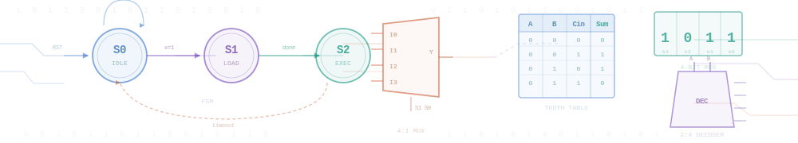

  

# Digital System Design

## An Intelligent Interactive Textbook

**EE 2301 — Introduction to Digital System Design**

---

University of Minnesota — Twin Cities Department of Electrical & Computer Engineering

An AI-assisted interactive textbook with 13 units, 106 MicroSims, and 200+ practice problems covering the complete fundamentals of digital logic.

13

Units

106

MicroSims

224K

Words

971

Pages

[Enter Textbook :material-arrow-right:](home.md){ .md-button .md-button--primary }
[View MicroSims :material-play-box:](sims/index.md){ .md-button }
[Course Description :material-book-open-variant:](course-description.md){ .md-button }

  

