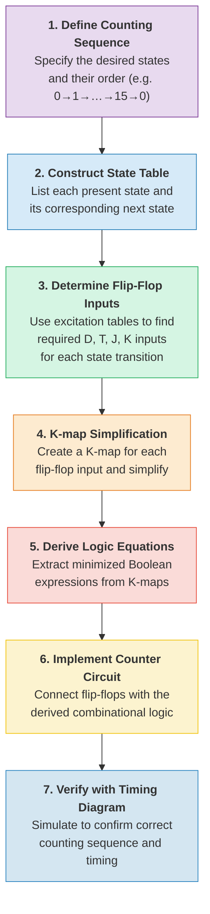
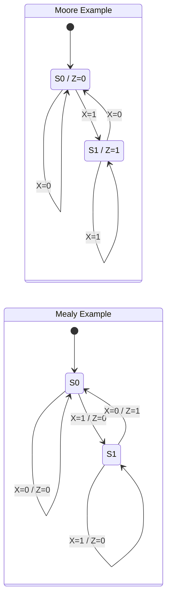
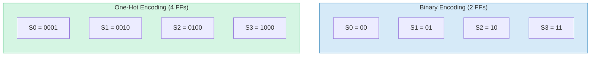
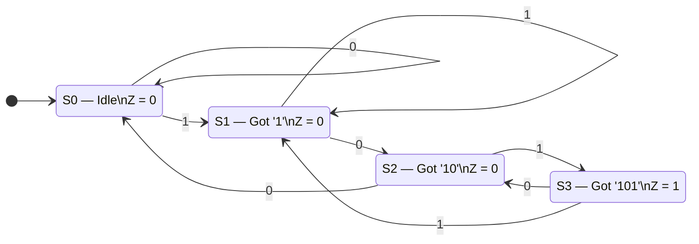
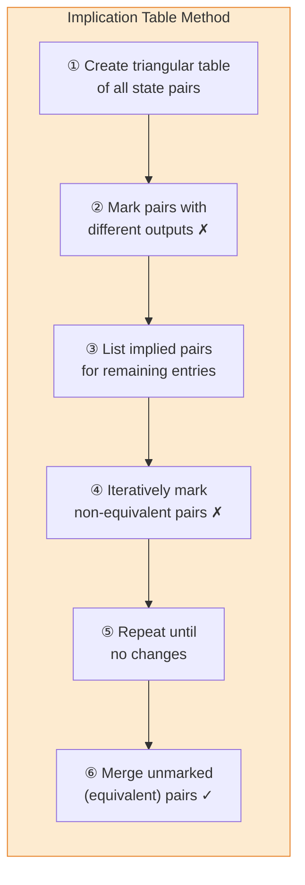

<div class="unit1-styled" markdown>

# Unit 10: Sequential Circuit Design

<details class="video-overview">
<summary><strong>Unit Overview</strong> (click to expand)</summary>

Welcome to Unit 10, where we take the flip-flops from the previous unit and put them to work in complete sequential circuits — circuits that count, shift data, and make decisions over time.

We begin with registers — groups of flip-flops working together to store multi-bit data. Shift registers move data one bit at a time in several configurations: serial-in serial-out, serial-in parallel-out, parallel-in serial-out, and the universal shift register that combines all capabilities.

Next, we tackle counters. Ripple counters are simple but suffer from cumulative delays. Synchronous counters solve this by clocking every flip-flop simultaneously. You will design up-counters, down-counters, modulo-N counters, BCD counters, ring counters, and Johnson counters.

The highlight of this unit is the finite state machine, or FSM. There are two models: Moore machines, where outputs depend only on the current state, and Mealy machines, where outputs depend on both the current state and inputs. Mealy machines can respond faster, but Moore machines are often simpler to design.

You will express FSM behavior using state diagrams and state tables, choose a state encoding, and follow a systematic design procedure. As a practical application, we design sequence detectors — circuits that monitor a stream of bits and signal when a particular pattern appears.

**Key Takeaways**

1. Registers and shift registers store and move multi-bit data, providing the essential storage and data-transfer building blocks used in processors and communication interfaces.
2. Synchronous counters overcome the speed limitations of ripple counters, and specialized types such as modulo-N, BCD, ring, and Johnson counters serve a wide range of applications.
3. Finite state machines — in both Moore and Mealy forms — provide a systematic methodology for designing sequential circuits that follow a defined sequence of states.

</details>

<h2 style="color: #5A3EED !important; border-bottom: 2px solid #5A3EED; padding-bottom: 0.3rem; font-weight: 700; margin-top: 2rem;">Summary</h2>

<div style="background: #EEF4FF; border: 2px solid #A8C8FF; border-radius: 12px; padding: 20px 24px; margin: 1rem 0; box-shadow: 0 2px 8px rgba(90,61,237,0.07);">
<p style="color: #333; line-height: 1.85; font-size: 1.02rem; margin: 0;">
This unit brings together the concepts from previous units to design complete sequential circuits. Students will learn to design registers for parallel data storage and shifting, construct counters for various counting sequences, and master the systematic design of finite state machines (FSMs). The FSM design methodology—from state diagrams through state tables to optimized circuit implementations—forms the capstone of introductory digital design, enabling students to create controllers and sequencers that respond to inputs and produce timed output sequences.
</p>
</div>

<h2 style="color: #5A3EED !important; border-bottom: 2px solid #5A3EED; padding-bottom: 0.3rem; font-weight: 700; margin-top: 2rem;">Concepts Covered</h2>

<div style="background: #F8F6FF; border: 2px solid #D4C8FF; border-radius: 12px; padding: 20px 24px; margin: 1rem 0;" markdown>

1. Register Fundamentals
2. Parallel Load Registers
3. Shift Register Operation
4. Serial-In-Serial-Out (SISO) Register
5. Serial-In-Parallel-Out (SIPO) Register
6. Parallel-In-Serial-Out (PISO) Register
7. Bidirectional Shift Registers
8. Universal Shift Register
9. Counter Fundamentals
10. Asynchronous (Ripple) Counters
11. Synchronous Counters
12. Binary Up Counter Design
13. Binary Down Counter Design
14. Up/Down Counter
15. Modulo-N Counters
16. BCD Counter (Decade Counter)
17. Ring Counter
18. Johnson Counter
19. Finite State Machine Concepts
20. Moore Machine Model
21. Mealy Machine Model
22. State Diagram Representation
23. State Table Construction
24. State Assignment Strategies
25. FSM Design Procedure
26. Next State Logic Design
27. Output Logic Design
28. One-Hot State Encoding
29. State Minimization
30. Sequence Detector Design

</div>

<h2 style="color: #5A3EED !important; border-bottom: 2px solid #5A3EED; padding-bottom: 0.3rem; font-weight: 700; margin-top: 2rem;">Prerequisites</h2>

<div style="background: #EEF4FF; border: 2px solid #A8C8FF; border-radius: 12px; padding: 20px 24px; margin: 1rem 0; box-shadow: 0 2px 8px rgba(90,61,237,0.07);" markdown>

Before studying this unit, students should be familiar with:

- Flip-flops: D, JK, and T types (Unit 9)
- Timing diagrams and timing parameters (Unit 9)
- Characteristic and excitation tables (Unit 9)
- K-map simplification (Unit 5)
- Combinational building blocks (Unit 8)

</div>

---

<h2 style="color: #5A3EED !important; border-bottom: 2px solid #5A3EED; padding-bottom: 0.3rem; font-weight: 700; margin-top: 2rem;">10.1 Introduction to Sequential Circuit Design</h2>

<div markdown style="background: #EEF4FF; border: 2px solid #A8C8FF; border-radius: 12px; padding: 24px 28px; margin: 1.2rem 0; box-shadow: 0 2px 8px rgba(90,61,237,0.07);">

The preceding unit established how individual flip-flops store single bits of information and respond to clock edges. This unit takes the next step: combining multiple flip-flops with combinational logic to build **functional sequential systems** — registers that store and manipulate multi-bit data, counters that generate ordered sequences, and finite state machines that implement complex control behavior.

Sequential circuit design is the capstone of introductory digital logic. Every processor, communication controller, and embedded system relies on the design methodologies presented here. The three major categories of sequential circuits form a natural progression of complexity:

| Category | Purpose | Key Characteristic | Design Complexity |
|----------|---------|-------------------|-------------------|
| Registers | Store and transfer multi-bit data | Parallel or serial data movement | Low |
| Counters | Generate counting sequences | Predetermined state sequence | Medium |
| Finite State Machines | Implement arbitrary control logic | Input-dependent state transitions | High |

All three categories share a common architecture: **flip-flops** hold the current state, **combinational logic** computes the next state and outputs, and a **clock signal** synchronizes state transitions. The difference lies in how the next-state logic is structured and how complex the state-transition rules are.

</div>

!!! info "Design Hierarchy"
    Registers and counters are actually special cases of finite state machines with highly regular next-state logic. Understanding them as separate categories simplifies learning, but recognizing their common FSM foundation deepens architectural understanding.

---

<h2 style="color: #5A3EED !important; border-bottom: 2px solid #5A3EED; padding-bottom: 0.3rem; font-weight: 700; margin-top: 2rem;">10.2 Register Fundamentals</h2>

<div markdown style="background: #EEF4FF; border: 2px solid #A8C8FF; border-radius: 12px; padding: 24px 28px; margin: 1.2rem 0; box-shadow: 0 2px 8px rgba(90,61,237,0.07);">

A **register** is a group of flip-flops that collectively store a multi-bit binary word. An $n$-bit register consists of $n$ flip-flops sharing a common clock signal, with each flip-flop storing one bit of the word.

Registers are the most fundamental storage elements in digital systems. They appear everywhere:

- **Data registers** in processors hold operands and results
- **Address registers** point to memory locations
- **Instruction registers** hold the currently executing instruction
- **Status registers** store condition flags
- **I/O registers** buffer data to and from peripherals

The two fundamental operations on registers are **parallel load** (writing all bits simultaneously) and **shift** (moving bits one position per clock cycle).

</div>

---

<h2 style="color: #5A3EED !important; border-bottom: 2px solid #5A3EED; padding-bottom: 0.3rem; font-weight: 700; margin-top: 2rem;">10.3 Parallel Load Registers</h2>

<div markdown style="background: #EEF4FF; border: 2px solid #A8C8FF; border-radius: 12px; padding: 24px 28px; margin: 1.2rem 0; box-shadow: 0 2px 8px rgba(90,61,237,0.07);">

A **parallel load register** accepts all $n$ data bits simultaneously on a single clock edge, making it ideal for capturing the output of a combinational circuit or receiving data from a bus.

</div>

<h3 style="color: #5A3EED; font-weight: 600; margin-top: 1.2rem;">10.3.1 Structure</h3>

<div markdown style="background: #EEF4FF; border: 2px solid #A8C8FF; border-radius: 12px; padding: 24px 28px; margin: 1.2rem 0; box-shadow: 0 2px 8px rgba(90,61,237,0.07);">

A 4-bit parallel load register consists of:

- Four D flip-flops with a common clock
- Four data inputs: $D_3, D_2, D_1, D_0$
- Four outputs: $Q_3, Q_2, Q_1, Q_0$
- A **Load** enable signal

</div>

<h3 style="color: #5A3EED; font-weight: 600; margin-top: 1.2rem;">10.3.2 Operation</h3>

<div markdown style="background: #EEF4FF; border: 2px solid #A8C8FF; border-radius: 12px; padding: 24px 28px; margin: 1.2rem 0; box-shadow: 0 2px 8px rgba(90,61,237,0.07);">

The Load signal determines whether the register accepts new data or retains its current value:

| Load | Clock Edge | Operation |
|------|-----------|-----------|
| 0 | $\uparrow$ | **Hold** — all $Q_i$ retain current values |
| 1 | $\uparrow$ | **Load** — each $Q_i$ receives corresponding $D_i$ |

The Load function is implemented by placing a 2-to-1 multiplexer at each flip-flop's D input. When Load = 1, the MUX selects the external data input. When Load = 0, the MUX feeds back the flip-flop's current output, creating a hold condition.

<h4 style="color: #5A3EED; font-weight: 600;">Input Equation for Each Flip-Flop</h4>

$D_i^{FF} = Load \cdot D_i + Load' \cdot Q_i$

where:

- $D_i^{FF}$ is the actual D input to the $i$-th flip-flop
- $D_i$ is the external data input
- $Q_i$ is the current output of the $i$-th flip-flop
- $Load$ is the load enable signal

<h4 style="color: #5A3EED; font-weight: 600;">Diagram: 4-Bit Parallel Load Register</h4>

<div style="text-align: center; margin: 1.5rem 0;">
<svg viewBox="0 0 620 340" style="max-width: 600px; width: 100%;" xmlns="http://www.w3.org/2000/svg">
  <defs>
    <style>
      .pr-block { stroke-width: 2; }
      .pr-label { font-family: 'Segoe UI', Arial, sans-serif; font-weight: 700; }
      .pr-sig   { font-family: 'Courier New', monospace; font-size: 13px; font-weight: 700; }
      .pr-small { font-family: 'Segoe UI', Arial, sans-serif; font-size: 10px; fill: #555; }
      .pr-wire  { stroke: #455A64; stroke-width: 2; fill: none; }
      .pr-fb    { stroke: #E53935; stroke-width: 1.8; fill: none; stroke-dasharray: 5,3; }
      .pr-bus   { stroke-width: 2.5; fill: none; }
    </style>
  </defs>
  <rect x="0" y="0" width="620" height="340" rx="12" fill="#FAFBFF" stroke="#E0E0E0" stroke-width="1"/>

  <!-- Title -->
  <text x="310" y="22" text-anchor="middle" font-family="Segoe UI, Arial" font-size="14" font-weight="700" fill="#5A3EED">4-Bit Parallel Load Register</text>

  <!-- ============ LOAD BUS (horizontal, top) ============ -->
  <line x1="30" y1="52" x2="530" y2="52" class="pr-bus" stroke="#E67E22"/>
  <text x="18" y="57" class="pr-sig" fill="#E67E22" text-anchor="end">Load</text>
  <!-- Taps down to each MUX select -->
  <line x1="100" y1="52" x2="100" y2="100" stroke="#E67E22" stroke-width="1.5"/>
  <circle cx="100" cy="52" r="3" fill="#E67E22"/>
  <line x1="230" y1="52" x2="230" y2="100" stroke="#E67E22" stroke-width="1.5"/>
  <circle cx="230" cy="52" r="3" fill="#E67E22"/>
  <line x1="360" y1="52" x2="360" y2="100" stroke="#E67E22" stroke-width="1.5"/>
  <circle cx="360" cy="52" r="3" fill="#E67E22"/>
  <line x1="490" y1="52" x2="490" y2="100" stroke="#E67E22" stroke-width="1.5"/>
  <circle cx="490" cy="52" r="3" fill="#E67E22"/>
  <text x="100" y="96" text-anchor="middle" class="pr-small" fill="#E67E22">sel</text>
  <text x="230" y="96" text-anchor="middle" class="pr-small" fill="#E67E22">sel</text>
  <text x="360" y="96" text-anchor="middle" class="pr-small" fill="#E67E22">sel</text>
  <text x="490" y="96" text-anchor="middle" class="pr-small" fill="#E67E22">sel</text>

  <!-- ============ BIT 3 (leftmost) ============ -->
  <!-- Data input D₃ -->
  <text x="75" y="78" class="pr-sig" fill="#27AE60">D₃</text>
  <line x1="75" y1="82" x2="75" y2="100" class="pr-wire"/>
  <polygon points="71,96 75,104 79,96" fill="#455A64"/>
  <!-- MUX -->
  <rect x="55" y="104" width="90" height="44" rx="6" class="pr-block" fill="#FDEBD0" stroke="#E67E22"/>
  <text x="100" y="130" text-anchor="middle" class="pr-label" font-size="12" fill="#E67E22">2:1 MUX</text>
  <!-- MUX to FF wire -->
  <line x1="100" y1="148" x2="100" y2="172" class="pr-wire"/>
  <polygon points="96,168 100,176 104,168" fill="#455A64"/>
  <!-- D Flip-Flop -->
  <rect x="60" y="176" width="80" height="50" rx="6" class="pr-block" fill="#E8DAEF" stroke="#7D3C98"/>
  <text x="100" y="198" text-anchor="middle" class="pr-label" font-size="11" fill="#7D3C98">D FF₃</text>
  <text x="70" y="190" font-family="Courier New" font-size="9" fill="#7D3C98">D</text>
  <text x="128" y="190" font-family="Courier New" font-size="9" fill="#7D3C98">Q</text>
  <!-- Clock triangle -->
  <polygon points="60,216 70,211 60,206" fill="#1565C0" stroke="#1565C0" stroke-width="1"/>
  <!-- Q₃ output -->
  <line x1="100" y1="226" x2="100" y2="260" class="pr-wire"/>
  <text x="100" y="274" text-anchor="middle" class="pr-sig" fill="#2980B9">Q₃</text>
  <!-- Feedback: Q₃ back to MUX -->
  <line x1="100" y1="244" x2="40" y2="244" class="pr-fb"/>
  <line x1="40" y1="244" x2="40" y2="126" class="pr-fb"/>
  <line x1="40" y1="126" x2="55" y2="126" class="pr-fb"/>
  <polygon points="51,122 59,126 51,130" fill="#E53935"/>
  <circle cx="100" cy="244" r="3" fill="#E53935"/>

  <!-- ============ BIT 2 ============ -->
  <text x="205" y="78" class="pr-sig" fill="#27AE60">D₂</text>
  <line x1="205" y1="82" x2="205" y2="100" class="pr-wire"/>
  <polygon points="201,96 205,104 209,96" fill="#455A64"/>
  <rect x="185" y="104" width="90" height="44" rx="6" class="pr-block" fill="#FDEBD0" stroke="#E67E22"/>
  <text x="230" y="130" text-anchor="middle" class="pr-label" font-size="12" fill="#E67E22">2:1 MUX</text>
  <line x1="230" y1="148" x2="230" y2="172" class="pr-wire"/>
  <polygon points="226,168 230,176 234,168" fill="#455A64"/>
  <rect x="190" y="176" width="80" height="50" rx="6" class="pr-block" fill="#E8DAEF" stroke="#7D3C98"/>
  <text x="230" y="198" text-anchor="middle" class="pr-label" font-size="11" fill="#7D3C98">D FF₂</text>
  <text x="200" y="190" font-family="Courier New" font-size="9" fill="#7D3C98">D</text>
  <text x="258" y="190" font-family="Courier New" font-size="9" fill="#7D3C98">Q</text>
  <polygon points="190,216 200,211 190,206" fill="#1565C0" stroke="#1565C0" stroke-width="1"/>
  <line x1="230" y1="226" x2="230" y2="260" class="pr-wire"/>
  <text x="230" y="274" text-anchor="middle" class="pr-sig" fill="#2980B9">Q₂</text>
  <line x1="230" y1="244" x2="170" y2="244" class="pr-fb"/>
  <line x1="170" y1="244" x2="170" y2="126" class="pr-fb"/>
  <line x1="170" y1="126" x2="185" y2="126" class="pr-fb"/>
  <polygon points="181,122 189,126 181,130" fill="#E53935"/>
  <circle cx="230" cy="244" r="3" fill="#E53935"/>

  <!-- ============ BIT 1 ============ -->
  <text x="335" y="78" class="pr-sig" fill="#27AE60">D₁</text>
  <line x1="335" y1="82" x2="335" y2="100" class="pr-wire"/>
  <polygon points="331,96 335,104 339,96" fill="#455A64"/>
  <rect x="315" y="104" width="90" height="44" rx="6" class="pr-block" fill="#FDEBD0" stroke="#E67E22"/>
  <text x="360" y="130" text-anchor="middle" class="pr-label" font-size="12" fill="#E67E22">2:1 MUX</text>
  <line x1="360" y1="148" x2="360" y2="172" class="pr-wire"/>
  <polygon points="356,168 360,176 364,168" fill="#455A64"/>
  <rect x="320" y="176" width="80" height="50" rx="6" class="pr-block" fill="#E8DAEF" stroke="#7D3C98"/>
  <text x="360" y="198" text-anchor="middle" class="pr-label" font-size="11" fill="#7D3C98">D FF₁</text>
  <text x="330" y="190" font-family="Courier New" font-size="9" fill="#7D3C98">D</text>
  <text x="388" y="190" font-family="Courier New" font-size="9" fill="#7D3C98">Q</text>
  <polygon points="320,216 330,211 320,206" fill="#1565C0" stroke="#1565C0" stroke-width="1"/>
  <line x1="360" y1="226" x2="360" y2="260" class="pr-wire"/>
  <text x="360" y="274" text-anchor="middle" class="pr-sig" fill="#2980B9">Q₁</text>
  <line x1="360" y1="244" x2="300" y2="244" class="pr-fb"/>
  <line x1="300" y1="244" x2="300" y2="126" class="pr-fb"/>
  <line x1="300" y1="126" x2="315" y2="126" class="pr-fb"/>
  <polygon points="311,122 319,126 311,130" fill="#E53935"/>
  <circle cx="360" cy="244" r="3" fill="#E53935"/>

  <!-- ============ BIT 0 (rightmost) ============ -->
  <text x="465" y="78" class="pr-sig" fill="#27AE60">D₀</text>
  <line x1="465" y1="82" x2="465" y2="100" class="pr-wire"/>
  <polygon points="461,96 465,104 469,96" fill="#455A64"/>
  <rect x="445" y="104" width="90" height="44" rx="6" class="pr-block" fill="#FDEBD0" stroke="#E67E22"/>
  <text x="490" y="130" text-anchor="middle" class="pr-label" font-size="12" fill="#E67E22">2:1 MUX</text>
  <line x1="490" y1="148" x2="490" y2="172" class="pr-wire"/>
  <polygon points="486,168 490,176 494,168" fill="#455A64"/>
  <rect x="450" y="176" width="80" height="50" rx="6" class="pr-block" fill="#E8DAEF" stroke="#7D3C98"/>
  <text x="490" y="198" text-anchor="middle" class="pr-label" font-size="11" fill="#7D3C98">D FF₀</text>
  <text x="460" y="190" font-family="Courier New" font-size="9" fill="#7D3C98">D</text>
  <text x="518" y="190" font-family="Courier New" font-size="9" fill="#7D3C98">Q</text>
  <polygon points="450,216 460,211 450,206" fill="#1565C0" stroke="#1565C0" stroke-width="1"/>
  <line x1="490" y1="226" x2="490" y2="260" class="pr-wire"/>
  <text x="490" y="274" text-anchor="middle" class="pr-sig" fill="#2980B9">Q₀</text>
  <line x1="490" y1="244" x2="430" y2="244" class="pr-fb"/>
  <line x1="430" y1="244" x2="430" y2="126" class="pr-fb"/>
  <line x1="430" y1="126" x2="445" y2="126" class="pr-fb"/>
  <polygon points="441,122 449,126 441,130" fill="#E53935"/>
  <circle cx="490" cy="244" r="3" fill="#E53935"/>

  <!-- ============ CLK BUS (horizontal, bottom) ============ -->
  <line x1="30" y1="300" x2="530" y2="300" class="pr-bus" stroke="#1565C0"/>
  <text x="18" y="305" class="pr-sig" fill="#1565C0" text-anchor="end">CLK</text>
  <!-- Taps up to each FF -->
  <line x1="100" y1="300" x2="100" y2="260" stroke="#1565C0" stroke-width="1.5"/>
  <circle cx="100" cy="300" r="3" fill="#1565C0"/>
  <line x1="230" y1="300" x2="230" y2="260" stroke="#1565C0" stroke-width="1.5"/>
  <circle cx="230" cy="300" r="3" fill="#1565C0"/>
  <line x1="360" y1="300" x2="360" y2="260" stroke="#1565C0" stroke-width="1.5"/>
  <circle cx="360" cy="300" r="3" fill="#1565C0"/>
  <line x1="490" y1="300" x2="490" y2="260" stroke="#1565C0" stroke-width="1.5"/>
  <circle cx="490" cy="300" r="3" fill="#1565C0"/>

  <!-- ============ LEGEND ============ -->
  <line x1="35" y1="326" x2="55" y2="326" class="pr-fb"/>
  <text x="60" y="330" class="pr-small" fill="#E53935">Q feedback (hold path)</text>
  <line x1="200" y1="326" x2="220" y2="326" class="pr-wire"/>
  <text x="225" y="330" class="pr-small">Data path</text>
  <line x1="340" y1="326" x2="360" y2="326" class="pr-bus" stroke="#E67E22"/>
  <text x="365" y="330" class="pr-small" fill="#E67E22">Load bus</text>
  <line x1="460" y1="326" x2="480" y2="326" class="pr-bus" stroke="#1565C0"/>
  <text x="485" y="330" class="pr-small" fill="#1565C0">CLK bus</text>
</svg>
</div>

When **Load = 1**, each MUX selects the external data input $D_i$. When **Load = 0**, the MUX feeds back $Q_i$ (dashed red), holding the current value. All four flip-flops share a single clock line (blue bus at bottom) and a single Load control line (orange bus at top).

</div>

---

<h2 style="color: #5A3EED !important; border-bottom: 2px solid #5A3EED; padding-bottom: 0.3rem; font-weight: 700; margin-top: 2rem;">10.4 Shift Register Operation</h2>

<div markdown style="background: #EEF4FF; border: 2px solid #A8C8FF; border-radius: 12px; padding: 24px 28px; margin: 1.2rem 0; box-shadow: 0 2px 8px rgba(90,61,237,0.07);">

A **shift register** moves data bit by bit through a chain of flip-flops. On each clock pulse, the content of each flip-flop transfers to the next flip-flop in the chain, while new data enters from one end.

</div>

<h3 style="color: #5A3EED; font-weight: 600; margin-top: 1.2rem;">10.4.1 Basic Shift Right Operation</h3>

<div markdown style="background: #EEF4FF; border: 2px solid #A8C8FF; border-radius: 12px; padding: 24px 28px; margin: 1.2rem 0; box-shadow: 0 2px 8px rgba(90,61,237,0.07);">

In a 4-bit shift-right register, each flip-flop's D input is connected to the Q output of the flip-flop to its left:

$D_i = Q_{i+1}$ for $i = 0, 1, 2$

$D_3 = Serial\_In$

On each rising clock edge, all bits shift one position to the right, and a new bit enters at the leftmost position (MSB).

</div>

<h3 style="color: #5A3EED; font-weight: 600; margin-top: 1.2rem;">10.4.2 Shift Register Types</h3>

<div markdown style="background: #EEF4FF; border: 2px solid #A8C8FF; border-radius: 12px; padding: 24px 28px; margin: 1.2rem 0; box-shadow: 0 2px 8px rgba(90,61,237,0.07);">

Shift registers are classified by their input and output configurations:

<h4 style="color: #5A3EED; font-weight: 600;">Serial-In-Serial-Out (SISO)</h4>

The **SISO** register accepts data one bit at a time through a serial input and produces output one bit at a time from the serial output (the last flip-flop's Q). Data must be shifted through all $n$ stages before it appears at the output.

- **Use case:** Serial communication, data delay lines
- **Latency:** $n$ clock cycles to pass a bit from input to output

<h4 style="color: #5A3EED; font-weight: 600;">Serial-In-Parallel-Out (SIPO)</h4>

The **SIPO** register accepts serial input but makes all flip-flop outputs available simultaneously. After $n$ clock cycles of shifting, the complete $n$-bit word is available at the parallel outputs.

- **Use case:** Serial-to-parallel conversion (e.g., receiving serial data for parallel processing)
- **Latency:** $n$ clock cycles to fill the register

<h4 style="color: #5A3EED; font-weight: 600;">Parallel-In-Serial-Out (PISO)</h4>

The **PISO** register loads all bits simultaneously via parallel inputs, then shifts them out one at a time through the serial output.

- **Use case:** Parallel-to-serial conversion (e.g., transmitting parallel data over a serial link)
- **Operation:** Load parallel data (1 cycle), then shift out (n cycles)

| Type | Serial In | Parallel In | Serial Out | Parallel Out | Primary Application |
|------|-----------|-------------|------------|--------------|-------------------|
| SISO | Yes | No | Yes | No | Delay lines, data buffering |
| SIPO | Yes | No | No | Yes | Serial-to-parallel conversion |
| PISO | No | Yes | Yes | No | Parallel-to-serial conversion |
| PIPO | No | Yes | No | Yes | Parallel storage (same as load register) |

**4-Bit SISO Shift Register Trace:**

| Clock Cycle | Serial In | $Q_3$ | $Q_2$ | $Q_1$ | $Q_0$ (Serial Out) |
|-------------|-----------|-------|-------|-------|---------------------|
| 0 (initial) | — | 0 | 0 | 0 | 0 |
| 1 | 1 | 1 | 0 | 0 | 0 |
| 2 | 0 | 0 | 1 | 0 | 0 |
| 3 | 1 | 1 | 0 | 1 | 0 |
| 4 | 1 | 1 | 1 | 0 | 1 |

After 4 clock cycles, the first bit entered (1) appears at the serial output.

</div>

<h4 style="color: #5A3EED; font-weight: 600;">MicroSim: Shift Register Simulator</h4>

<div style="background: #EEF4FF; border: 2px solid #A8C8FF; border-radius: 12px; padding: 18px; margin: 1.2rem 0; box-shadow: 0 2px 8px rgba(90,61,237,0.07);">
<iframe src="../sims/shift-register-simulator/main.html" width="100%" height="590px" scrolling="no" style="border:none; border-radius:8px; overflow:hidden;"></iframe>
</div>

---

<h2 style="color: #5A3EED !important; border-bottom: 2px solid #5A3EED; padding-bottom: 0.3rem; font-weight: 700; margin-top: 2rem;">10.5 Bidirectional and Universal Shift Registers</h2>

<h3 style="color: #5A3EED; font-weight: 600; margin-top: 1.2rem;">10.5.1 Bidirectional Shift Register</h3>

<div markdown style="background: #EEF4FF; border: 2px solid #A8C8FF; border-radius: 12px; padding: 24px 28px; margin: 1.2rem 0; box-shadow: 0 2px 8px rgba(90,61,237,0.07);">

A **bidirectional shift register** can shift data in either direction—left or right—controlled by a direction signal:

- **Direction = 0:** Shift right ($D_i = Q_{i+1}$, serial input at MSB)
- **Direction = 1:** Shift left ($D_i = Q_{i-1}$, serial input at LSB)

A 2-to-1 multiplexer at each flip-flop's D input selects between the left-neighbor output (for shift right) and the right-neighbor output (for shift left).

<div style="text-align: center; margin: 1.5rem 0;">
<svg viewBox="0 0 660 340" style="max-width: 640px; width: 100%;" xmlns="http://www.w3.org/2000/svg">
  <defs>
    <style>
      .bd-block { stroke-width: 2; }
      .bd-label { font-family: 'Segoe UI', Arial, sans-serif; font-weight: 700; }
      .bd-sig   { font-family: 'Courier New', monospace; font-size: 12px; font-weight: 700; }
      .bd-small { font-family: 'Segoe UI', Arial, sans-serif; font-size: 10px; }
      .bd-tiny  { font-family: 'Courier New', monospace; font-size: 9px; font-weight: 600; }
      .bd-wire  { stroke: #455A64; stroke-width: 2; fill: none; }
      .bd-sr    { stroke: #2E7D32; stroke-width: 2; fill: none; }
      .bd-sl    { stroke: #1565C0; stroke-width: 2; fill: none; }
      .bd-bus   { stroke-width: 2.5; fill: none; }
    </style>
  </defs>
  <rect x="0" y="0" width="660" height="340" rx="12" fill="#FAFBFF" stroke="#E0E0E0" stroke-width="1"/>

  <!-- Title -->
  <text x="330" y="22" text-anchor="middle" font-family="Segoe UI, Arial" font-size="14" font-weight="700" fill="#5A3EED">4-Bit Bidirectional Shift Register</text>

  <!-- ======================================================== -->
  <!-- DIRECTION BUS — orange, y=46                             -->
  <!-- ======================================================== -->
  <line x1="35" y1="46" x2="600" y2="46" class="bd-bus" stroke="#E67E22"/>
  <text x="22" y="51" class="bd-sig" fill="#E67E22" text-anchor="end">Dir</text>
  <!-- Taps to each MUX center (sel) -->
  <line x1="100" y1="46" x2="100" y2="98" stroke="#E67E22" stroke-width="1.5"/>
  <circle cx="100" cy="46" r="3" fill="#E67E22"/>
  <line x1="245" y1="46" x2="245" y2="98" stroke="#E67E22" stroke-width="1.5"/>
  <circle cx="245" cy="46" r="3" fill="#E67E22"/>
  <line x1="390" y1="46" x2="390" y2="98" stroke="#E67E22" stroke-width="1.5"/>
  <circle cx="390" cy="46" r="3" fill="#E67E22"/>
  <line x1="535" y1="46" x2="535" y2="98" stroke="#E67E22" stroke-width="1.5"/>
  <circle cx="535" cy="46" r="3" fill="#E67E22"/>

  <!-- ======================================================== -->
  <!-- SHIFT-RIGHT RAIL — green, y=68                           -->
  <!-- Carries data left → right (Dir=0)                        -->
  <!-- ======================================================== -->
  <!-- SR_IN → MUX₃ "0" input stub -->
  <text x="10" y="72" class="bd-sig" fill="#2E7D32">SR_IN</text>
  <line x1="48" y1="68" x2="82" y2="68" class="bd-sr"/>
  <line x1="82" y1="68" x2="82" y2="98" class="bd-sr"/>
  <polygon points="78,94 82,102 86,94" fill="#2E7D32"/>
  <!-- Q₃ → MUX₂ "0": horizontal at y=68 -->
  <line x1="132" y1="68" x2="227" y2="68" class="bd-sr"/>
  <line x1="227" y1="68" x2="227" y2="98" class="bd-sr"/>
  <polygon points="223,94 227,102 231,94" fill="#2E7D32"/>
  <!-- Q₂ → MUX₁ "0": horizontal at y=68 -->
  <line x1="277" y1="68" x2="372" y2="68" class="bd-sr"/>
  <line x1="372" y1="68" x2="372" y2="98" class="bd-sr"/>
  <polygon points="368,94 372,102 376,94" fill="#2E7D32"/>
  <!-- Q₁ → MUX₀ "0": horizontal at y=68 -->
  <line x1="422" y1="68" x2="517" y2="68" class="bd-sr"/>
  <line x1="517" y1="68" x2="517" y2="98" class="bd-sr"/>
  <polygon points="513,94 517,102 521,94" fill="#2E7D32"/>

  <!-- ======================================================== -->
  <!-- SHIFT-LEFT RAIL — blue, y=82                             -->
  <!-- Carries data right → left (Dir=1)                        -->
  <!-- ======================================================== -->
  <!-- SL_IN → MUX₀ "1" input stub -->
  <text x="608" y="86" class="bd-sig" fill="#1565C0">SL_IN</text>
  <line x1="600" y1="82" x2="553" y2="82" class="bd-sl"/>
  <line x1="553" y1="82" x2="553" y2="98" class="bd-sl"/>
  <polygon points="549,94 553,102 557,94" fill="#1565C0"/>
  <!-- Q₀ → MUX₁ "1": horizontal at y=82 -->
  <line x1="503" y1="82" x2="408" y2="82" class="bd-sl"/>
  <line x1="408" y1="82" x2="408" y2="98" class="bd-sl"/>
  <polygon points="404,94 408,102 412,94" fill="#1565C0"/>
  <!-- Q₁ → MUX₂ "1": horizontal at y=82 -->
  <line x1="358" y1="82" x2="263" y2="82" class="bd-sl"/>
  <line x1="263" y1="82" x2="263" y2="98" class="bd-sl"/>
  <polygon points="259,94 263,102 267,94" fill="#1565C0"/>
  <!-- Q₂ → MUX₃ "1": horizontal at y=82 -->
  <line x1="213" y1="82" x2="118" y2="82" class="bd-sl"/>
  <line x1="118" y1="82" x2="118" y2="98" class="bd-sl"/>
  <polygon points="114,94 118,102 122,94" fill="#1565C0"/>

  <!-- ======================================================== -->
  <!-- BIT 3 (MSB) — column center x=100                       -->
  <!-- ======================================================== -->
  <!-- MUX -->
  <rect x="58" y="98" width="84" height="42" rx="6" class="bd-block" fill="#FDEBD0" stroke="#E67E22"/>
  <text x="100" y="124" text-anchor="middle" class="bd-label" font-size="11" fill="#E67E22">2:1 MUX</text>
  <text x="72" y="110" class="bd-tiny" fill="#2E7D32">0</text>
  <text x="124" y="110" class="bd-tiny" fill="#1565C0">1</text>
  <!-- MUX → FF -->
  <line x1="100" y1="140" x2="100" y2="166" class="bd-wire"/>
  <polygon points="96,162 100,170 104,162" fill="#455A64"/>
  <!-- D FF -->
  <rect x="60" y="170" width="80" height="50" rx="6" class="bd-block" fill="#E8DAEF" stroke="#7D3C98"/>
  <text x="100" y="192" text-anchor="middle" class="bd-label" font-size="11" fill="#7D3C98">D FF₃</text>
  <text x="70" y="184" font-family="Courier New" font-size="9" fill="#7D3C98">D</text>
  <text x="128" y="184" font-family="Courier New" font-size="9" fill="#7D3C98">Q</text>
  <polygon points="60,210 70,205 60,200" fill="#1565C0" stroke="#1565C0" stroke-width="1"/>
  <!-- Q₃ output -->
  <line x1="100" y1="220" x2="100" y2="252" class="bd-wire"/>
  <text x="100" y="264" text-anchor="middle" class="bd-sig" fill="#333">Q₃</text>
  <circle cx="100" cy="244" r="3" fill="#455A64"/>
  <!-- Q₃ shift-right branch: right to vertical, up to green rail -->
  <line x1="100" y1="244" x2="132" y2="244" class="bd-sr"/>
  <line x1="132" y1="244" x2="132" y2="68" class="bd-sr"/>

  <!-- ======================================================== -->
  <!-- BIT 2 — column center x=245                              -->
  <!-- ======================================================== -->
  <rect x="203" y="98" width="84" height="42" rx="6" class="bd-block" fill="#FDEBD0" stroke="#E67E22"/>
  <text x="245" y="124" text-anchor="middle" class="bd-label" font-size="11" fill="#E67E22">2:1 MUX</text>
  <text x="217" y="110" class="bd-tiny" fill="#2E7D32">0</text>
  <text x="269" y="110" class="bd-tiny" fill="#1565C0">1</text>
  <line x1="245" y1="140" x2="245" y2="166" class="bd-wire"/>
  <polygon points="241,162 245,170 249,162" fill="#455A64"/>
  <rect x="205" y="170" width="80" height="50" rx="6" class="bd-block" fill="#E8DAEF" stroke="#7D3C98"/>
  <text x="245" y="192" text-anchor="middle" class="bd-label" font-size="11" fill="#7D3C98">D FF₂</text>
  <text x="215" y="184" font-family="Courier New" font-size="9" fill="#7D3C98">D</text>
  <text x="273" y="184" font-family="Courier New" font-size="9" fill="#7D3C98">Q</text>
  <polygon points="205,210 215,205 205,200" fill="#1565C0" stroke="#1565C0" stroke-width="1"/>
  <line x1="245" y1="220" x2="245" y2="252" class="bd-wire"/>
  <text x="245" y="264" text-anchor="middle" class="bd-sig" fill="#333">Q₂</text>
  <circle cx="245" cy="244" r="3" fill="#455A64"/>
  <!-- Q₂ shift-right branch (right) -->
  <line x1="245" y1="244" x2="277" y2="244" class="bd-sr"/>
  <line x1="277" y1="244" x2="277" y2="68" class="bd-sr"/>
  <!-- Q₂ shift-left branch (left) -->
  <line x1="245" y1="244" x2="213" y2="244" class="bd-sl"/>
  <line x1="213" y1="244" x2="213" y2="82" class="bd-sl"/>

  <!-- ======================================================== -->
  <!-- BIT 1 — column center x=390                              -->
  <!-- ======================================================== -->
  <rect x="348" y="98" width="84" height="42" rx="6" class="bd-block" fill="#FDEBD0" stroke="#E67E22"/>
  <text x="390" y="124" text-anchor="middle" class="bd-label" font-size="11" fill="#E67E22">2:1 MUX</text>
  <text x="362" y="110" class="bd-tiny" fill="#2E7D32">0</text>
  <text x="414" y="110" class="bd-tiny" fill="#1565C0">1</text>
  <line x1="390" y1="140" x2="390" y2="166" class="bd-wire"/>
  <polygon points="386,162 390,170 394,162" fill="#455A64"/>
  <rect x="350" y="170" width="80" height="50" rx="6" class="bd-block" fill="#E8DAEF" stroke="#7D3C98"/>
  <text x="390" y="192" text-anchor="middle" class="bd-label" font-size="11" fill="#7D3C98">D FF₁</text>
  <text x="360" y="184" font-family="Courier New" font-size="9" fill="#7D3C98">D</text>
  <text x="418" y="184" font-family="Courier New" font-size="9" fill="#7D3C98">Q</text>
  <polygon points="350,210 360,205 350,200" fill="#1565C0" stroke="#1565C0" stroke-width="1"/>
  <line x1="390" y1="220" x2="390" y2="252" class="bd-wire"/>
  <text x="390" y="264" text-anchor="middle" class="bd-sig" fill="#333">Q₁</text>
  <circle cx="390" cy="244" r="3" fill="#455A64"/>
  <!-- Q₁ shift-right branch (right) -->
  <line x1="390" y1="244" x2="422" y2="244" class="bd-sr"/>
  <line x1="422" y1="244" x2="422" y2="68" class="bd-sr"/>
  <!-- Q₁ shift-left branch (left) -->
  <line x1="390" y1="244" x2="358" y2="244" class="bd-sl"/>
  <line x1="358" y1="244" x2="358" y2="82" class="bd-sl"/>

  <!-- ======================================================== -->
  <!-- BIT 0 (LSB) — column center x=535                        -->
  <!-- ======================================================== -->
  <rect x="493" y="98" width="84" height="42" rx="6" class="bd-block" fill="#FDEBD0" stroke="#E67E22"/>
  <text x="535" y="124" text-anchor="middle" class="bd-label" font-size="11" fill="#E67E22">2:1 MUX</text>
  <text x="507" y="110" class="bd-tiny" fill="#2E7D32">0</text>
  <text x="559" y="110" class="bd-tiny" fill="#1565C0">1</text>
  <line x1="535" y1="140" x2="535" y2="166" class="bd-wire"/>
  <polygon points="531,162 535,170 539,162" fill="#455A64"/>
  <rect x="495" y="170" width="80" height="50" rx="6" class="bd-block" fill="#E8DAEF" stroke="#7D3C98"/>
  <text x="535" y="192" text-anchor="middle" class="bd-label" font-size="11" fill="#7D3C98">D FF₀</text>
  <text x="505" y="184" font-family="Courier New" font-size="9" fill="#7D3C98">D</text>
  <text x="563" y="184" font-family="Courier New" font-size="9" fill="#7D3C98">Q</text>
  <polygon points="495,210 505,205 495,200" fill="#1565C0" stroke="#1565C0" stroke-width="1"/>
  <line x1="535" y1="220" x2="535" y2="252" class="bd-wire"/>
  <text x="535" y="264" text-anchor="middle" class="bd-sig" fill="#333">Q₀</text>
  <circle cx="535" cy="244" r="3" fill="#455A64"/>
  <!-- Q₀ shift-left branch (left only) -->
  <line x1="535" y1="244" x2="503" y2="244" class="bd-sl"/>
  <line x1="503" y1="244" x2="503" y2="82" class="bd-sl"/>

  <!-- ======================================================== -->
  <!-- CLK BUS — purple, y=290                                  -->
  <!-- ======================================================== -->
  <line x1="35" y1="290" x2="600" y2="290" class="bd-bus" stroke="#7D3C98"/>
  <text x="22" y="295" class="bd-sig" fill="#7D3C98" text-anchor="end">CLK</text>
  <line x1="100" y1="290" x2="100" y2="270" stroke="#7D3C98" stroke-width="1.5"/>
  <circle cx="100" cy="290" r="3" fill="#7D3C98"/>
  <line x1="245" y1="290" x2="245" y2="270" stroke="#7D3C98" stroke-width="1.5"/>
  <circle cx="245" cy="290" r="3" fill="#7D3C98"/>
  <line x1="390" y1="290" x2="390" y2="270" stroke="#7D3C98" stroke-width="1.5"/>
  <circle cx="390" cy="290" r="3" fill="#7D3C98"/>
  <line x1="535" y1="290" x2="535" y2="270" stroke="#7D3C98" stroke-width="1.5"/>
  <circle cx="535" cy="290" r="3" fill="#7D3C98"/>

  <!-- ======================================================== -->
  <!-- LEGEND                                                    -->
  <!-- ======================================================== -->
  <line x1="40" y1="320" x2="65" y2="320" class="bd-sr"/>
  <polygon points="61,317 68,320 61,323" fill="#2E7D32"/>
  <text x="73" y="324" class="bd-small" fill="#2E7D32">Shift right (Dir=0)</text>

  <line x1="215" y1="320" x2="240" y2="320" class="bd-sl"/>
  <polygon points="219,317 212,320 219,323" fill="#1565C0"/>
  <text x="245" y="324" class="bd-small" fill="#1565C0">Shift left (Dir=1)</text>

  <line x1="380" y1="320" x2="405" y2="320" class="bd-bus" stroke="#E67E22"/>
  <text x="410" y="324" class="bd-small" fill="#E67E22">Dir bus</text>

  <line x1="490" y1="320" x2="515" y2="320" class="bd-bus" stroke="#7D3C98"/>
  <text x="520" y="324" class="bd-small" fill="#7D3C98">CLK bus</text>

  <text x="580" y="324" class="bd-tiny" fill="#2E7D32">0</text>
  <text x="590" y="324" class="bd-tiny" fill="#1565C0">1</text>
  <text x="600" y="324" class="bd-small" fill="#555">= MUX inputs</text>
</svg>
</div>

</div>

<h3 style="color: #5A3EED; font-weight: 600; margin-top: 1.2rem;">10.5.2 Universal Shift Register</h3>

<div markdown style="background: #EEF4FF; border: 2px solid #A8C8FF; border-radius: 12px; padding: 24px 28px; margin: 1.2rem 0; box-shadow: 0 2px 8px rgba(90,61,237,0.07);">

The **universal shift register** is the most versatile shift register design, combining all capabilities into a single module controlled by a 2-bit mode selector.

<h4 style="color: #5A3EED; font-weight: 600;">Universal Shift Register Mode Table</h4>

| $S_1$ | $S_0$ | Operation |
|-------|-------|-----------|
| 0 | 0 | **Hold** — no change |
| 0 | 1 | **Shift right** — data moves toward LSB |
| 1 | 0 | **Shift left** — data moves toward MSB |
| 1 | 1 | **Parallel load** — all bits loaded simultaneously |

The **74194** is the classic TTL implementation of a 4-bit universal shift register. Each flip-flop's D input is driven by a 4-to-1 multiplexer controlled by $S_1S_0$, selecting among:

- $Q_i$ (current value, for hold)
- $Q_{i+1}$ (left neighbor, for shift right)
- $Q_{i-1}$ (right neighbor, for shift left)
- $D_i$ (parallel input, for load)

<h4 style="color: #5A3EED; font-weight: 600;">Input Equation for Bit <em>i</em></h4>

$$D_i^{FF} = \overline{S_1}\,\overline{S_0}\,Q_i + \overline{S_1}\,S_0\,Q_{i+1} + S_1\,\overline{S_0}\,Q_{i-1} + S_1\,S_0\,D_i$$

where:

- $D_i^{FF}$ is the actual input to flip-flop $i$
- $S_1, S_0$ are the mode select signals
- $Q_{i+1}$ is the left-neighbor output (shift right source)
- $Q_{i-1}$ is the right-neighbor output (shift left source)
- $D_i$ is the parallel data input

<h4 style="color: #5A3EED; font-weight: 600;">Diagram: Single Bit-Slice of Universal Shift Register</h4>

The following diagram shows the internal structure of **one bit position** ($i$). Each of the four flip-flops in the 74194 has an identical 4:1 MUX driving its D input. The four MUX inputs correspond directly to the four terms of the input equation above.

<div style="text-align: center; margin: 1.5rem 0;">
<svg viewBox="0 0 520 400" style="max-width: 500px; width: 100%;" xmlns="http://www.w3.org/2000/svg">
  <defs>
    <style>
      .us-block { stroke-width: 2; }
      .us-label { font-family: 'Segoe UI', Arial, sans-serif; font-weight: 700; }
      .us-sig   { font-family: 'Courier New', monospace; font-size: 12px; font-weight: 700; }
      .us-small { font-family: 'Segoe UI', Arial, sans-serif; font-size: 10px; }
      .us-tiny  { font-family: 'Courier New', monospace; font-size: 10px; font-weight: 600; }
      .us-wire  { stroke: #455A64; stroke-width: 2; fill: none; }
      .us-fb    { stroke: #E53935; stroke-width: 1.8; fill: none; stroke-dasharray: 5,3; }
    </style>
  </defs>
  <rect x="0" y="0" width="520" height="400" rx="12" fill="#FAFBFF" stroke="#E0E0E0" stroke-width="1"/>

  <!-- Title -->
  <text x="260" y="22" text-anchor="middle" font-family="Segoe UI, Arial" font-size="14" font-weight="700" fill="#5A3EED">Universal Shift Register — Bit i Structure</text>

  <!-- ======== 4:1 MUX ======== -->
  <rect x="155" y="80" width="210" height="160" rx="8" class="us-block" fill="#FDEBD0" stroke="#E67E22"/>
  <text x="260" y="105" text-anchor="middle" class="us-label" font-size="14" fill="#E67E22">4:1 MUX</text>

  <!-- MUX input labels (inside, left-aligned) -->
  <!-- Input 00: Hold — Q_i -->
  <rect x="170" y="115" width="180" height="24" rx="4" fill="#FFF" stroke="#bbb" stroke-width="1"/>
  <text x="180" y="131" class="us-tiny" fill="#E67E22">00</text>
  <text x="210" y="131" class="us-tiny" fill="#333">Q_i</text>
  <text x="340" y="131" text-anchor="end" class="us-small" fill="#888">Hold</text>

  <!-- Input 01: Shift Right — Q_{i+1} -->
  <rect x="170" y="143" width="180" height="24" rx="4" fill="#E8F5E9" stroke="#4CAF50" stroke-width="1"/>
  <text x="180" y="159" class="us-tiny" fill="#E67E22">01</text>
  <text x="210" y="159" class="us-tiny" fill="#2E7D32">Q_{i+1}</text>
  <text x="340" y="159" text-anchor="end" class="us-small" fill="#2E7D32">Shift Right</text>

  <!-- Input 10: Shift Left — Q_{i-1} -->
  <rect x="170" y="171" width="180" height="24" rx="4" fill="#E3F2FD" stroke="#1976D2" stroke-width="1"/>
  <text x="180" y="187" class="us-tiny" fill="#E67E22">10</text>
  <text x="210" y="187" class="us-tiny" fill="#1565C0">Q_{i-1}</text>
  <text x="340" y="187" text-anchor="end" class="us-small" fill="#1565C0">Shift Left</text>

  <!-- Input 11: Parallel Load — D_i -->
  <rect x="170" y="199" width="180" height="24" rx="4" fill="#FCE4EC" stroke="#C62828" stroke-width="1"/>
  <text x="180" y="215" class="us-tiny" fill="#E67E22">11</text>
  <text x="210" y="215" class="us-tiny" fill="#C62828">D_i</text>
  <text x="340" y="215" text-anchor="end" class="us-small" fill="#C62828">Parallel Load</text>

  <!-- ======== MUX input source arrows (from left) ======== -->
  <!-- Q_i (hold) — feedback, dashed red -->
  <line x1="60" y1="127" x2="170" y2="127" class="us-fb"/>
  <polygon points="166,123 174,127 166,131" fill="#E53935"/>
  <text x="50" y="131" text-anchor="end" class="us-sig" fill="#E53935">Q_i</text>

  <!-- Q_{i+1} (shift right) — green -->
  <line x1="60" y1="155" x2="170" y2="155" stroke="#2E7D32" stroke-width="2"/>
  <polygon points="166,151 174,155 166,159" fill="#2E7D32"/>
  <text x="50" y="159" text-anchor="end" class="us-sig" fill="#2E7D32">Q_{i+1}</text>

  <!-- Q_{i-1} (shift left) — blue -->
  <line x1="60" y1="183" x2="170" y2="183" stroke="#1565C0" stroke-width="2"/>
  <polygon points="166,179 174,183 166,187" fill="#1565C0"/>
  <text x="50" y="187" text-anchor="end" class="us-sig" fill="#1565C0">Q_{i-1}</text>

  <!-- D_i (parallel load) — red -->
  <line x1="60" y1="211" x2="170" y2="211" stroke="#C62828" stroke-width="2"/>
  <polygon points="166,207 174,211 166,215" fill="#C62828"/>
  <text x="50" y="215" text-anchor="end" class="us-sig" fill="#C62828">D_i</text>

  <!-- ======== S₁S₀ select (from top) ======== -->
  <text x="260" y="55" text-anchor="middle" class="us-sig" fill="#E67E22">S₁ S₀</text>
  <line x1="260" y1="60" x2="260" y2="80" stroke="#E67E22" stroke-width="2.5"/>
  <polygon points="256,76 260,84 264,76" fill="#E67E22"/>
  <text x="280" y="72" class="us-small" fill="#E67E22">select</text>

  <!-- ======== MUX output → D FF ======== -->
  <line x1="260" y1="240" x2="260" y2="275" class="us-wire"/>
  <polygon points="256,271 260,279 264,271" fill="#455A64"/>
  <text x="275" y="260" class="us-sig" fill="#333">D_i^FF</text>

  <!-- ======== D Flip-Flop ======== -->
  <rect x="210" y="279" width="100" height="55" rx="6" class="us-block" fill="#E8DAEF" stroke="#7D3C98"/>
  <text x="260" y="304" text-anchor="middle" class="us-label" font-size="13" fill="#7D3C98">D FF_i</text>
  <text x="222" y="296" font-family="Courier New" font-size="10" fill="#7D3C98">D</text>
  <text x="298" y="296" font-family="Courier New" font-size="10" fill="#7D3C98">Q</text>
  <!-- Clock triangle -->
  <polygon points="210,324 220,319 210,314" fill="#7D3C98" stroke="#7D3C98" stroke-width="1"/>
  <text x="195" y="323" text-anchor="end" class="us-sig" fill="#7D3C98">CLK</text>

  <!-- ======== Q_i output ======== -->
  <line x1="260" y1="334" x2="260" y2="370" class="us-wire"/>
  <text x="260" y="385" text-anchor="middle" class="us-sig" fill="#333">Q_i</text>
  <circle cx="260" cy="358" r="3" fill="#455A64"/>

  <!-- ======== Feedback path (Q_i back to MUX "00" input) ======== -->
  <line x1="260" y1="358" x2="410" y2="358" class="us-fb"/>
  <line x1="410" y1="358" x2="410" y2="50" class="us-fb"/>
  <line x1="410" y1="50" x2="40" y2="50" class="us-fb"/>
  <line x1="40" y1="50" x2="40" y2="127" class="us-fb"/>
  <line x1="40" y1="127" x2="60" y2="127" class="us-fb"/>
  <text x="425" y="200" class="us-small" fill="#E53935" transform="rotate(90, 425, 200)">feedback</text>

  <!-- ======== "×4" annotation ======== -->
  <rect x="430" y="155" width="70" height="30" rx="6" fill="#F3E5F5" stroke="#7D3C98" stroke-width="1.5"/>
  <text x="465" y="174" text-anchor="middle" class="us-label" font-size="12" fill="#7D3C98">× 4 bits</text>
</svg>
</div>

</div>

!!! tip "Design Pattern"
    The universal shift register illustrates a key design pattern: multiplexers at flip-flop inputs create multi-function registers. By increasing the MUX size, additional operations can be supported without changing the flip-flop structure.

---

<h2 style="color: #5A3EED !important; border-bottom: 2px solid #5A3EED; padding-bottom: 0.3rem; font-weight: 700; margin-top: 2rem;">10.6 Counter Fundamentals</h2>

<div markdown style="background: #EEF4FF; border: 2px solid #A8C8FF; border-radius: 12px; padding: 24px 28px; margin: 1.2rem 0; box-shadow: 0 2px 8px rgba(90,61,237,0.07);">

A **counter** is a sequential circuit that cycles through a predetermined sequence of states, typically representing a binary counting pattern. Counters are among the most widely used sequential circuits, appearing in:

- **Timers and clocks:** Counting clock cycles to measure elapsed time
- **Address generators:** Sequentially addressing memory locations
- **Event counters:** Counting occurrences of external events
- **Frequency dividers:** Producing lower-frequency signals from a reference clock
- **Control sequencers:** Stepping through phases of a multi-cycle operation

The two fundamental counter architectures differ in their clocking strategy:

| Architecture | Clock Distribution | Speed | Complexity |
|-------------|-------------------|-------|------------|
| Asynchronous (ripple) | Each FF clocked by previous FF output | Slow (cumulative delay) | Simple |
| Synchronous | All FFs share common clock | Fast (single delay) | More complex logic |

</div>

---

<h2 style="color: #5A3EED !important; border-bottom: 2px solid #5A3EED; padding-bottom: 0.3rem; font-weight: 700; margin-top: 2rem;">10.7 Asynchronous (Ripple) Counters</h2>

<div markdown style="background: #EEF4FF; border: 2px solid #A8C8FF; border-radius: 12px; padding: 24px 28px; margin: 1.2rem 0; box-shadow: 0 2px 8px rgba(90,61,237,0.07);">

In an **asynchronous** or **ripple** counter, only the first flip-flop receives the external clock signal. Each subsequent flip-flop is clocked by the output of the preceding stage, creating a cascading "ripple" of state changes.

</div>

<h3 style="color: #5A3EED; font-weight: 600; margin-top: 1.2rem;">10.7.1 4-Bit Ripple Up Counter</h3>

<div markdown style="background: #EEF4FF; border: 2px solid #A8C8FF; border-radius: 12px; padding: 24px 28px; margin: 1.2rem 0; box-shadow: 0 2px 8px rgba(90,61,237,0.07);">

**Structure:**

- 4 T flip-flops, each permanently set to $T = 1$ (always toggle on every active clock edge)
- $FF_0$ is clocked by the **external clock** — it is the only flip-flop that receives the system clock directly
- $FF_1$ is clocked by the **falling edge of $Q_0$**
- $FF_2$ is clocked by the **falling edge of $Q_1$**
- $FF_3$ is clocked by the **falling edge of $Q_2$**

Because each flip-flop toggles at half the frequency of its clock source, every stage acts as a **divide-by-2** circuit. This cascading division naturally produces the binary counting sequence.

<h4 style="color: #5A3EED; font-weight: 600;">Circuit Diagram</h4>

<div style="text-align: center; margin: 1.5rem 0;">
<svg viewBox="0 0 680 310" style="max-width: 660px; width: 100%;" xmlns="http://www.w3.org/2000/svg">
  <defs>
    <style>
      .rc-block { stroke-width: 2; }
      .rc-label { font-family: 'Segoe UI', Arial, sans-serif; font-weight: 700; }
      .rc-sig   { font-family: 'Courier New', monospace; font-size: 12px; font-weight: 700; }
      .rc-small { font-family: 'Segoe UI', Arial, sans-serif; font-size: 9px; }
      .rc-wire  { stroke: #455A64; stroke-width: 2; fill: none; }
      .rc-clk   { stroke: #E67E22; stroke-width: 2.5; fill: none; }
    </style>
  </defs>
  <rect x="0" y="0" width="680" height="310" rx="12" fill="#FAFBFF" stroke="#E0E0E0" stroke-width="1"/>

  <!-- Title -->
  <text x="340" y="22" text-anchor="middle" font-family="Segoe UI, Arial" font-size="14" font-weight="700" fill="#5A3EED">4-Bit Asynchronous (Ripple) Up Counter</text>

  <!-- ======== CLK input ======== -->
  <text x="18" y="128" class="rc-sig" fill="#E67E22">CLK</text>
  <line x1="42" y1="124" x2="75" y2="124" class="rc-clk"/>
  <polygon points="71,120 79,124 71,128" fill="#E67E22"/>
  <text x="58" y="144" class="rc-small" fill="#E67E22">Clock input</text>

  <!-- ======== FF₀ (x=120) ======== -->
  <rect x="80" y="85" width="80" height="75" rx="6" class="rc-block" fill="#E8DAEF" stroke="#7D3C98"/>
  <text x="120" y="108" text-anchor="middle" class="rc-label" font-size="12" fill="#7D3C98">T FF₀</text>
  <!-- T=1 label -->
  <text x="90" y="122" class="rc-sig" fill="#7D3C98">T=1</text>
  <!-- Q label -->
  <text x="148" y="108" font-family="Courier New" font-size="10" fill="#7D3C98">Q</text>
  <!-- Clock triangle (falling edge — bubble + triangle) -->
  <polygon points="80,148 90,143 80,138" fill="#E67E22" stroke="#E67E22" stroke-width="1"/>
  <circle cx="78" cy="143" r="4" fill="none" stroke="#E67E22" stroke-width="1.5"/>
  <text x="120" y="175" text-anchor="middle" class="rc-small" fill="#7D3C98">Toggle</text>

  <!-- Q₀ output wire to junction -->
  <line x1="160" y1="105" x2="195" y2="105" class="rc-wire"/>
  <circle cx="195" cy="105" r="3" fill="#455A64"/>
  <!-- Q₀ output down -->
  <line x1="195" y1="105" x2="195" y2="228" class="rc-wire"/>
  <text x="195" y="244" text-anchor="middle" class="rc-sig" fill="#2980B9">Q₀</text>
  <text x="195" y="258" text-anchor="middle" class="rc-small" fill="#2980B9">(LSB)</text>
  <!-- Q₀ frequency annotation -->
  <text x="195" y="274" text-anchor="middle" class="rc-small" fill="#888">f/2</text>

  <!-- Q₀ → FF₁ clock (falling edge wire) -->
  <line x1="195" y1="105" x2="195" y2="65" class="rc-clk"/>
  <line x1="195" y1="65" x2="215" y2="65" class="rc-clk"/>
  <line x1="215" y1="65" x2="215" y2="124" class="rc-clk"/>
  <line x1="215" y1="124" x2="230" y2="124" class="rc-clk"/>
  <text x="215" y="55" text-anchor="middle" class="rc-small" fill="#E67E22">Q₀ falling edge</text>

  <!-- ======== FF₁ (x=270) ======== -->
  <rect x="230" y="85" width="80" height="75" rx="6" class="rc-block" fill="#E8DAEF" stroke="#7D3C98"/>
  <text x="270" y="108" text-anchor="middle" class="rc-label" font-size="12" fill="#7D3C98">T FF₁</text>
  <text x="240" y="122" class="rc-sig" fill="#7D3C98">T=1</text>
  <text x="298" y="108" font-family="Courier New" font-size="10" fill="#7D3C98">Q</text>
  <polygon points="230,148 240,143 230,138" fill="#E67E22" stroke="#E67E22" stroke-width="1"/>
  <circle cx="228" cy="143" r="4" fill="none" stroke="#E67E22" stroke-width="1.5"/>
  <text x="270" y="175" text-anchor="middle" class="rc-small" fill="#7D3C98">Toggle</text>

  <!-- Q₁ output -->
  <line x1="310" y1="105" x2="345" y2="105" class="rc-wire"/>
  <circle cx="345" cy="105" r="3" fill="#455A64"/>
  <line x1="345" y1="105" x2="345" y2="228" class="rc-wire"/>
  <text x="345" y="244" text-anchor="middle" class="rc-sig" fill="#2980B9">Q₁</text>
  <text x="345" y="274" text-anchor="middle" class="rc-small" fill="#888">f/4</text>

  <!-- Q₁ → FF₂ clock -->
  <line x1="345" y1="105" x2="345" y2="65" class="rc-clk"/>
  <line x1="345" y1="65" x2="365" y2="65" class="rc-clk"/>
  <line x1="365" y1="65" x2="365" y2="124" class="rc-clk"/>
  <line x1="365" y1="124" x2="380" y2="124" class="rc-clk"/>
  <text x="365" y="55" text-anchor="middle" class="rc-small" fill="#E67E22">Q₁ falling edge</text>

  <!-- ======== FF₂ (x=420) ======== -->
  <rect x="380" y="85" width="80" height="75" rx="6" class="rc-block" fill="#E8DAEF" stroke="#7D3C98"/>
  <text x="420" y="108" text-anchor="middle" class="rc-label" font-size="12" fill="#7D3C98">T FF₂</text>
  <text x="390" y="122" class="rc-sig" fill="#7D3C98">T=1</text>
  <text x="448" y="108" font-family="Courier New" font-size="10" fill="#7D3C98">Q</text>
  <polygon points="380,148 390,143 380,138" fill="#E67E22" stroke="#E67E22" stroke-width="1"/>
  <circle cx="378" cy="143" r="4" fill="none" stroke="#E67E22" stroke-width="1.5"/>
  <text x="420" y="175" text-anchor="middle" class="rc-small" fill="#7D3C98">Toggle</text>

  <!-- Q₂ output -->
  <line x1="460" y1="105" x2="495" y2="105" class="rc-wire"/>
  <circle cx="495" cy="105" r="3" fill="#455A64"/>
  <line x1="495" y1="105" x2="495" y2="228" class="rc-wire"/>
  <text x="495" y="244" text-anchor="middle" class="rc-sig" fill="#2980B9">Q₂</text>
  <text x="495" y="274" text-anchor="middle" class="rc-small" fill="#888">f/8</text>

  <!-- Q₂ → FF₃ clock -->
  <line x1="495" y1="105" x2="495" y2="65" class="rc-clk"/>
  <line x1="495" y1="65" x2="515" y2="65" class="rc-clk"/>
  <line x1="515" y1="65" x2="515" y2="124" class="rc-clk"/>
  <line x1="515" y1="124" x2="530" y2="124" class="rc-clk"/>
  <text x="515" y="55" text-anchor="middle" class="rc-small" fill="#E67E22">Q₂ falling edge</text>

  <!-- ======== FF₃ (x=570) ======== -->
  <rect x="530" y="85" width="80" height="75" rx="6" class="rc-block" fill="#E8DAEF" stroke="#7D3C98"/>
  <text x="570" y="108" text-anchor="middle" class="rc-label" font-size="12" fill="#7D3C98">T FF₃</text>
  <text x="540" y="122" class="rc-sig" fill="#7D3C98">T=1</text>
  <text x="598" y="108" font-family="Courier New" font-size="10" fill="#7D3C98">Q</text>
  <polygon points="530,148 540,143 530,138" fill="#E67E22" stroke="#E67E22" stroke-width="1"/>
  <circle cx="528" cy="143" r="4" fill="none" stroke="#E67E22" stroke-width="1.5"/>
  <text x="570" y="175" text-anchor="middle" class="rc-small" fill="#7D3C98">Toggle</text>

  <!-- Q₃ output -->
  <line x1="610" y1="105" x2="635" y2="105" class="rc-wire"/>
  <line x1="635" y1="105" x2="635" y2="228" class="rc-wire"/>
  <text x="635" y="244" text-anchor="middle" class="rc-sig" fill="#2980B9">Q₃</text>
  <text x="635" y="258" text-anchor="middle" class="rc-small" fill="#2980B9">(MSB)</text>
  <text x="635" y="274" text-anchor="middle" class="rc-small" fill="#888">f/16</text>

  <!-- ======== Signal flow arrow ======== -->
  <line x1="60" y1="295" x2="650" y2="295" stroke="#999" stroke-width="1" stroke-dasharray="4,3"/>
  <polygon points="646,292 654,295 646,298" fill="#999"/>
  <text x="355" y="305" text-anchor="middle" class="rc-small" fill="#888">Signal flow: CLK → Q₀ → Q₁ → Q₂ → Q₃ (each stage adds t_cq delay = "ripple")</text>
</svg>
</div>

Each output toggles at **half the frequency** of its clock input, acting as a divide-by-2 stage. The state change "ripples" through the chain — $Q_0$ changes first, then $Q_1$ after one $t_{cq}$ delay, then $Q_2$ after two, and $Q_3$ after three. This accumulated delay is the fundamental tradeoff of the ripple counter: simple structure, but slow settling.

<h4 style="color: #5A3EED; font-weight: 600;">Frequency Division</h4>

| Output | Frequency | Division | Toggles per CLK cycle |
|--------|-----------|----------|-----------------------|
| $Q_0$ | $f_{CLK}/2$ | ÷ 2 | Every clock edge |
| $Q_1$ | $f_{CLK}/4$ | ÷ 4 | Every 2nd clock edge |
| $Q_2$ | $f_{CLK}/8$ | ÷ 8 | Every 4th clock edge |
| $Q_3$ | $f_{CLK}/16$ | ÷ 16 | Every 8th clock edge |

<h4 style="color: #5A3EED; font-weight: 600;">Counting Sequence (first 8 of 16 states)</h4>

| Clock Pulse | $Q_3$ | $Q_2$ | $Q_1$ | $Q_0$ | Decimal |
|-------------|-------|-------|-------|-------|---------|
| 0 | 0 | 0 | 0 | 0 | 0 |
| 1 | 0 | 0 | 0 | 1 | 1 |
| 2 | 0 | 0 | 1 | 0 | 2 |
| 3 | 0 | 0 | 1 | 1 | 3 |
| 4 | 0 | 1 | 0 | 0 | 4 |
| 5 | 0 | 1 | 0 | 1 | 5 |
| 6 | 0 | 1 | 1 | 0 | 6 |
| 7 | 0 | 1 | 1 | 1 | 7 |
| ... | ... | ... | ... | ... | ... |
| 15 | 1 | 1 | 1 | 1 | 15 |
| 16 | 0 | 0 | 0 | 0 | 0 (wraps) |

</div>

<h3 style="color: #5A3EED; font-weight: 600; margin-top: 1.2rem;">10.7.2 Ripple Effect and Timing</h3>

<div markdown style="background: #EEF4FF; border: 2px solid #A8C8FF; border-radius: 12px; padding: 24px 28px; margin: 1.2rem 0; box-shadow: 0 2px 8px rgba(90,61,237,0.07);">

The fundamental limitation of ripple counters is the accumulated propagation delay. In a 4-bit ripple counter, the worst-case delay for all bits to settle is:

<h4 style="color: #5A3EED; font-weight: 600;">Ripple Counter Settling Time</h4>

$t_{settle} = n \cdot t_{cq}$

where:

- $t_{settle}$ is the total time for all outputs to reach valid values
- $n$ is the number of flip-flop stages
- $t_{cq}$ is the clock-to-Q delay of each flip-flop

During this settling period, the counter outputs pass through intermediate invalid states. For a 4-bit counter transitioning from 0111 to 1000, the outputs might momentarily show 0110, 0100, and 0000 before settling to 1000—creating **glitches** on any combinational logic driven by the counter outputs.

</div>

<h4 style="color: #5A3EED; font-weight: 600;">MicroSim: Counter Simulator</h4>

<div style="background: #EEF4FF; border: 2px solid #A8C8FF; border-radius: 12px; padding: 18px; margin: 1.2rem 0; box-shadow: 0 2px 8px rgba(90,61,237,0.07);">
<iframe src="../sims/counter-simulator/main.html" width="100%" height="600px" scrolling="no" style="border:none; border-radius:8px; overflow:hidden;"></iframe>
</div>

---

<h2 style="color: #5A3EED !important; border-bottom: 2px solid #5A3EED; padding-bottom: 0.3rem; font-weight: 700; margin-top: 2rem;">10.8 Synchronous Counters</h2>

<div markdown style="background: #EEF4FF; border: 2px solid #A8C8FF; border-radius: 12px; padding: 24px 28px; margin: 1.2rem 0; box-shadow: 0 2px 8px rgba(90,61,237,0.07);">

**Synchronous counters** eliminate the ripple problem by connecting all flip-flops to the same clock signal. Every flip-flop transitions simultaneously at each clock edge, and combinational logic determines which flip-flops should toggle.

</div>

<h4 style="color: #5A3EED; font-weight: 700;">Diagram: Synchronous Counter Design Flow</h4>

<div style="background: #F8F6FF; border: 2px solid #D4C8FF; border-radius: 12px; padding: 20px 24px; margin: 1rem 0;" markdown>

Designing a synchronous counter follows a systematic procedure. Starting from the desired counting sequence, the designer constructs a state table, determines the required flip-flop inputs using excitation tables, simplifies those inputs with K-maps, and finally implements and verifies the circuit.



</div>

<h3 style="color: #5A3EED; font-weight: 600; margin-top: 1.2rem;">10.8.1 Binary Up Counter Design</h3>

<div markdown style="background: #EEF4FF; border: 2px solid #A8C8FF; border-radius: 12px; padding: 24px 28px; margin: 1.2rem 0; box-shadow: 0 2px 8px rgba(90,61,237,0.07);">

The key design insight is determining *when* each bit should toggle. Look carefully at the first several values of the 4-bit binary counting sequence and notice how each column behaves:

| Decimal | $Q_3$ | $Q_2$ | $Q_1$ | $Q_0$ | What toggles on the **next** clock edge |
|---------|-------|-------|-------|-------|-----------------------------------------|
| 0 | 0 | 0 | 0 | 0 | $Q_0$ (always toggles) |
| 1 | 0 | 0 | 0 | 1 | $Q_1$ and $Q_0$ (because $Q_0 = 1$) |
| 2 | 0 | 0 | 1 | 0 | $Q_0$ |
| 3 | 0 | 0 | 1 | 1 | $Q_2$, $Q_1$, $Q_0$ (because $Q_1 Q_0 = 11$) |
| 4 | 0 | 1 | 0 | 0 | $Q_0$ |
| ... | | | | | |

The **pattern**: a bit at position $i$ toggles when **all** of the lower-order bits ($Q_0$ through $Q_{i-1}$) are simultaneously **1** — that is, when the lower portion of the counter is about to overflow and carry into bit $i$.

<h4 style="color: #5A3EED; font-weight: 600;">Synchronous Up Counter Toggle Equations</h4>

$T_0 = 1$

$T_1 = Q_0$

$T_2 = Q_0 \cdot Q_1$

$T_3 = Q_0 \cdot Q_1 \cdot Q_2$

In general, the toggle input for bit $i$ is the AND (logical product) of every lower-order output:

$T_i = \prod_{j=0}^{i-1} Q_j$

where:

- $T_i$ is the toggle input for flip-flop $i$
- $Q_j$ is the current output of flip-flop $j$
- The $\prod$ symbol denotes a logical AND (product) of all terms from $j = 0$ to $j = i - 1$

Reading the equations in plain language:

- $Q_0$ toggles on **every** clock edge ($T_0 = 1$, always true).
- $Q_1$ toggles only when $Q_0 = 1$ (the ones place is about to carry).
- $Q_2$ toggles only when $Q_0 = Q_1 = 1$ (the two lowest bits are both 1).
- $Q_3$ toggles only when $Q_0 = Q_1 = Q_2 = 1$ (the three lowest bits are all 1).

</div>

<h3 style="color: #5A3EED; font-weight: 600; margin-top: 1.2rem;">10.8.2 Binary Down Counter Design</h3>

<div markdown style="background: #EEF4FF; border: 2px solid #A8C8FF; border-radius: 12px; padding: 24px 28px; margin: 1.2rem 0; box-shadow: 0 2px 8px rgba(90,61,237,0.07);">

A **down counter** counts in reverse: $1111 \rightarrow 1110 \rightarrow 1101 \rightarrow \cdots \rightarrow 0000 \rightarrow 1111$.

The logic mirrors the up counter, but with **complemented** outputs. A bit at position $i$ toggles when all lower-order bits are simultaneously **0** — meaning the lower portion is about to underflow and borrow from bit $i$:

$T_0 = 1$

$T_1 = Q_0'$

$T_2 = Q_0' \cdot Q_1'$

$T_3 = Q_0' \cdot Q_1' \cdot Q_2'$

In plain language: $Q_1$ toggles when $Q_0 = 0$, $Q_2$ toggles when $Q_0 = Q_1 = 0$, and so on. Compare this directly with the up counter — the only change is replacing each $Q_j$ with its complement $Q_j'$.

</div>

<h3 style="color: #5A3EED; font-weight: 600; margin-top: 1.2rem;">10.8.3 Up/Down Counter</h3>

<div markdown style="background: #EEF4FF; border: 2px solid #A8C8FF; border-radius: 12px; padding: 24px 28px; margin: 1.2rem 0; box-shadow: 0 2px 8px rgba(90,61,237,0.07);">

An **up/down counter** combines both counting directions into a single circuit using a direction control signal $Dir$:

- When $Dir = 1$: Count **up** — use $Q_j$ in the toggle terms (carry logic)
- When $Dir = 0$: Count **down** — use $Q_j'$ in the toggle terms (borrow logic)

The idea is to place a multiplexer-like expression at each stage that selects between $Q_j$ (for up) and $Q_j'$ (for down), controlled by $Dir$.

<h4 style="color: #5A3EED; font-weight: 600;">Up/Down Counter Toggle Equation</h4>

$T_i = \prod_{j=0}^{i-1} (Dir \cdot Q_j + Dir' \cdot Q_j')$

where:

- $Dir$ is the direction control signal (1 = count up, 0 = count down)
- The expression $(Dir \cdot Q_j + Dir' \cdot Q_j')$ acts like a 2-to-1 MUX: it passes $Q_j$ when $Dir = 1$ and $Q_j'$ when $Dir = 0$
- The $\prod$ (logical AND) chains these MUX terms together, just as in the individual up and down counters

| Dir | Counting Direction | Toggle Condition for Bit $i$ | Logic Used |
|-----|-------------------|------------------------------|------------|
| 1 | Up | All lower bits are 1 (carry) | $Q_j$ terms |
| 0 | Down | All lower bits are 0 (borrow) | $Q_j'$ terms |

</div>

---

<h2 style="color: #5A3EED !important; border-bottom: 2px solid #5A3EED; padding-bottom: 0.3rem; font-weight: 700; margin-top: 2rem;">10.9 Modulo-N Counters</h2>

<div markdown style="background: #EEF4FF; border: 2px solid #A8C8FF; border-radius: 12px; padding: 24px 28px; margin: 1.2rem 0; box-shadow: 0 2px 8px rgba(90,61,237,0.07);">

A **modulo-N counter** (or mod-N counter) counts through exactly $N$ states before repeating. A standard 4-bit binary counter is modulo-16. Designing counters with non-power-of-two modulus requires additional logic to truncate the counting sequence.

</div>

<h3 style="color: #5A3EED; font-weight: 600; margin-top: 1.2rem;">10.9.1 Design Methods</h3>

<div markdown style="background: #EEF4FF; border: 2px solid #A8C8FF; border-radius: 12px; padding: 24px 28px; margin: 1.2rem 0; box-shadow: 0 2px 8px rgba(90,61,237,0.07);">

**Method 1: Synchronous Reset**

Detect the terminal count value and reset all flip-flops:

1. Build a standard binary counter
2. Add a combinational circuit that detects state $N$
3. Use the detection output to force all flip-flops to 0 on the next clock edge

**Method 2: Synchronous Preset**

Load a specific starting value to skip unwanted states:

1. Build a standard binary counter
2. Detect the terminal state
3. Load a preset value (e.g., for mod-N, load $16 - N$ in a 4-bit counter)

</div>

<h3 style="color: #5A3EED; font-weight: 600; margin-top: 1.2rem;">10.9.2 Example: Mod-6 Counter</h3>

<div markdown style="background: #EEF4FF; border: 2px solid #A8C8FF; border-radius: 12px; padding: 24px 28px; margin: 1.2rem 0; box-shadow: 0 2px 8px rgba(90,61,237,0.07);">

A standard 3-bit binary counter has **8 states** (000 through 111). A **mod-6 counter** uses only **6 of those 8 states** (000 through 101), then resets back to 000 — skipping states 110 and 111 entirely.

**Counting sequence:**

$$000 \rightarrow 001 \rightarrow 010 \rightarrow 011 \rightarrow 100 \rightarrow 101 \rightarrow 000 \text{ (reset)}$$

<h4 style="color: #5A3EED; font-weight: 600;">State Diagram</h4>

<div style="text-align: center; margin: 1.5rem 0;">
<svg viewBox="0 0 640 220" style="max-width: 620px; width: 100%;" xmlns="http://www.w3.org/2000/svg">
  <defs>
    <style>
      .mc-state  { stroke-width: 2; }
      .mc-label  { font-family: 'Courier New', monospace; font-size: 12px; font-weight: 700; text-anchor: middle; }
      .mc-dec    { font-family: 'Segoe UI', Arial, sans-serif; font-size: 9px; fill: #888; text-anchor: middle; }
      .mc-small  { font-family: 'Segoe UI', Arial, sans-serif; font-size: 9px; }
      .mc-wire   { stroke: #455A64; stroke-width: 2; fill: none; }
      .mc-reset  { stroke: #C62828; stroke-width: 2.5; fill: none; }
    </style>
    <marker id="mc-arr" markerWidth="8" markerHeight="6" refX="8" refY="3" orient="auto">
      <polygon points="0,0 8,3 0,6" fill="#455A64"/>
    </marker>
    <marker id="mc-rarr" markerWidth="8" markerHeight="6" refX="8" refY="3" orient="auto">
      <polygon points="0,0 8,3 0,6" fill="#C62828"/>
    </marker>
  </defs>
  <rect x="0" y="0" width="640" height="220" rx="12" fill="#FAFBFF" stroke="#E0E0E0" stroke-width="1"/>

  <!-- Title -->
  <text x="320" y="20" text-anchor="middle" font-family="Segoe UI, Arial" font-size="13" font-weight="700" fill="#5A3EED">Mod-6 Counter State Diagram</text>

  <!-- States: 6 circles in two rows -->
  <!-- Row 1: S0, S1, S2, S3 -->
  <!-- Row 2: S4, S5, then dashed S6 (detected & reset) -->

  <!-- S0 -->
  <circle cx="80" cy="80" r="30" class="mc-state" fill="#D5F5E3" stroke="#27AE60"/>
  <text x="80" y="77" class="mc-label" fill="#333">000</text>
  <text x="80" y="93" class="mc-dec">(0)</text>
  <!-- Initial arrow -->
  <line x1="30" y1="80" x2="48" y2="80" class="mc-wire" marker-end="url(#mc-arr)"/>
  <text x="30" y="72" class="mc-small" fill="#888">start</text>

  <!-- S0 → S1 -->
  <line x1="110" y1="80" x2="148" y2="80" class="mc-wire" marker-end="url(#mc-arr)"/>

  <!-- S1 -->
  <circle cx="180" cy="80" r="30" class="mc-state" fill="#E8DAEF" stroke="#7D3C98"/>
  <text x="180" y="77" class="mc-label" fill="#333">001</text>
  <text x="180" y="93" class="mc-dec">(1)</text>

  <!-- S1 → S2 -->
  <line x1="210" y1="80" x2="248" y2="80" class="mc-wire" marker-end="url(#mc-arr)"/>

  <!-- S2 -->
  <circle cx="280" cy="80" r="30" class="mc-state" fill="#E8DAEF" stroke="#7D3C98"/>
  <text x="280" y="77" class="mc-label" fill="#333">010</text>
  <text x="280" y="93" class="mc-dec">(2)</text>

  <!-- S2 → S3 -->
  <line x1="310" y1="80" x2="348" y2="80" class="mc-wire" marker-end="url(#mc-arr)"/>

  <!-- S3 -->
  <circle cx="380" cy="80" r="30" class="mc-state" fill="#E8DAEF" stroke="#7D3C98"/>
  <text x="380" y="77" class="mc-label" fill="#333">011</text>
  <text x="380" y="93" class="mc-dec">(3)</text>

  <!-- S3 → S4 (down-right) -->
  <line x1="397" y1="106" x2="423" y2="134" class="mc-wire" marker-end="url(#mc-arr)"/>

  <!-- S4 -->
  <circle cx="440" cy="160" r="30" class="mc-state" fill="#E8DAEF" stroke="#7D3C98"/>
  <text x="440" y="157" class="mc-label" fill="#333">100</text>
  <text x="440" y="173" class="mc-dec">(4)</text>

  <!-- S4 → S5 -->
  <line x1="470" y1="160" x2="508" y2="160" class="mc-wire" marker-end="url(#mc-arr)"/>

  <!-- S5 (last valid state) -->
  <circle cx="540" cy="160" r="30" class="mc-state" fill="#FDEBD0" stroke="#E67E22"/>
  <text x="540" y="157" class="mc-label" fill="#333">101</text>
  <text x="540" y="173" class="mc-dec">(5)</text>

  <!-- S5 → S6 (momentary, dashed) -->
  <line x1="570" y1="155" x2="580" y2="145" stroke="#C62828" stroke-width="1.5" stroke-dasharray="4,3" fill="none"/>
  <text x="598" y="130" class="mc-small" fill="#C62828" font-weight="700">110 (6)</text>
  <text x="598" y="143" class="mc-small" fill="#C62828">detected!</text>

  <!-- Reset arrow: S5 back to S0 (bottom arc) -->
  <path d="M 540,192 C 540,215 80,215 80,112" class="mc-reset" marker-end="url(#mc-rarr)"/>
  <text x="310" y="212" text-anchor="middle" class="mc-small" fill="#C62828" font-weight="700">RESET: 110 detected → force 000</text>

  <!-- Skipped states annotation -->
  <rect x="425" y="38" width="200" height="30" rx="5" fill="#FFEBEE" stroke="#EF9A9A" stroke-width="1"/>
  <text x="525" y="57" text-anchor="middle" class="mc-small" fill="#C62828">Reset at 110 prevents reaching 111</text>
</svg>
</div>

<h4 style="color: #5A3EED; font-weight: 600;">Design Using the Reset Method</h4>

The idea is straightforward: build a normal 3-bit binary counter, then add a small combinational circuit that **detects** the first unwanted state (110 = decimal 6) and immediately **resets** all flip-flops to 000.

**Step-by-step:**

1. A standard 3-bit binary counter has 8 states: $000 \rightarrow 001 \rightarrow 010 \rightarrow 011 \rightarrow 100 \rightarrow 101 \rightarrow 110 \rightarrow 111$
2. For a mod-6 counter, we only need the first 6 states (000–101). When the counter reaches state **110** (the first unwanted state), the detection logic produces a **Reset = 1** signal, **preventing the counter from ever reaching 111**
3. The Reset signal is connected directly to the **asynchronous CLR inputs** of all flip-flops, forcing an immediate return to **000** — no clock edge is needed
4. The counter then restarts the sequence from 000, giving the repeating cycle: $000 \rightarrow 001 \rightarrow 010 \rightarrow 011 \rightarrow 100 \rightarrow 101 \rightarrow (110 \rightarrow 000)$

**Reset detection logic:**

The counter must reset when $Q_2 Q_1 Q_0 = 110$. We detect $Q_2 = 1$, $Q_1 = 1$, and $Q_0 = 0$ simultaneously, then feed the result to the **asynchronous CLR** inputs of all flip-flops:

$$\text{Reset} = Q_2 \cdot Q_1 \cdot \overline{Q_0}$$

<div style="text-align: center; margin: 1.5rem 0;">
<svg viewBox="0 0 440 150" style="max-width: 420px; width: 100%;" xmlns="http://www.w3.org/2000/svg">
  <defs>
    <style>
      .rd-block { stroke-width: 2; rx: 6; }
      .rd-sig   { font-family: 'Courier New', monospace; font-size: 12px; font-weight: 700; }
      .rd-small { font-family: 'Segoe UI', Arial, sans-serif; font-size: 10px; }
      .rd-wire  { stroke: #455A64; stroke-width: 2; fill: none; }
    </style>
  </defs>
  <rect x="0" y="0" width="440" height="150" rx="10" fill="#FAFBFF" stroke="#E0E0E0" stroke-width="1"/>

  <!-- Title -->
  <text x="220" y="18" text-anchor="middle" font-family="Segoe UI, Arial" font-size="12" font-weight="700" fill="#5A3EED">Reset Detection Logic</text>

  <!-- Input Q₂ -->
  <text x="30" y="52" class="rd-sig" fill="#333">Q₂</text>
  <line x1="52" y1="48" x2="140" y2="48" class="rd-wire"/>

  <!-- Input Q₁ -->
  <text x="30" y="78" class="rd-sig" fill="#333">Q₁</text>
  <line x1="52" y1="74" x2="140" y2="74" class="rd-wire"/>

  <!-- Input Q₀ with NOT bubble -->
  <text x="30" y="108" class="rd-sig" fill="#333">Q₀</text>
  <line x1="52" y1="104" x2="90" y2="104" class="rd-wire"/>
  <!-- NOT gate -->
  <rect x="93" y="92" width="40" height="24" class="rd-block" fill="#FFF3E0" stroke="#E67E22"/>
  <text x="113" y="108" text-anchor="middle" font-family="Segoe UI" font-size="10" font-weight="700" fill="#E67E22">NOT</text>
  <!-- NOT output -->
  <line x1="133" y1="104" x2="140" y2="104" class="rd-wire"/>
  <text x="130" y="125" class="rd-small" fill="#E67E22">Q̄₀</text>

  <!-- 3-input AND gate -->
  <rect x="145" y="40" width="80" height="75" class="rd-block" fill="#E8F5E9" stroke="#4CAF50"/>
  <text x="185" y="73" text-anchor="middle" font-family="Segoe UI" font-size="12" font-weight="700" fill="#388E3C">AND</text>
  <text x="185" y="88" text-anchor="middle" class="rd-small" fill="#388E3C">3-input</text>

  <!-- AND output → Reset -->
  <line x1="225" y1="78" x2="310" y2="78" class="rd-wire"/>
  <polygon points="306,74 314,78 306,82" fill="#455A64"/>

  <!-- Reset label -->
  <rect x="315" y="60" width="100" height="36" class="rd-block" fill="#FFEBEE" stroke="#C62828"/>
  <text x="365" y="83" text-anchor="middle" class="rd-sig" fill="#C62828">Reset</text>
  <text x="365" y="55" text-anchor="middle" class="rd-small" fill="#C62828">→ async CLR on all FFs</text>

  <!-- Equation -->
  <text x="220" y="142" text-anchor="middle" font-family="Courier New" font-size="11" font-weight="700" fill="#333">Reset = Q₂ · Q₁ · Q̄₀</text>
</svg>
</div>

<h4 style="color: #5A3EED; font-weight: 600;">Normal 3-Bit Counter vs Mod-6 Counter</h4>

| Property | Normal 3-Bit Counter | Mod-6 Counter |
|----------|---------------------|---------------|
| Flip-flops | 3 | 3 |
| Total states | 8 (000–111) | 6 (000–101) |
| Extra logic | None | AND gate + NOT gate |
| Sequence | 000 → 001 → ... → 111 → 000 | 000 → 001 → ... → 101 → (110 → 000) |
| Reset method | None | Async CLR via AND + NOT |
| Skipped states | None | 110 (momentary), 111 (never reached) |

</div>

!!! warning "Glitch Consideration"
    The reset method causes a brief glitch: the counter momentarily enters state 110 before the reset logic forces it back to 000. In **synchronous** designs (where the Reset signal drives the synchronous clear input), this transient is resolved within the same clock cycle. In **asynchronous** designs (where Reset drives an asynchronous clear), the 110 state appears for approximately one gate delay — external circuits may see this transient.

<h3 style="color: #5A3EED; font-weight: 600; margin-top: 1.2rem;">10.9.3 BCD Counter (Decade Counter)</h3>

<div markdown style="background: #EEF4FF; border: 2px solid #A8C8FF; border-radius: 12px; padding: 24px 28px; margin: 1.2rem 0; box-shadow: 0 2px 8px rgba(90,61,237,0.07);">

The **BCD counter** (also called a **decade counter**) is a mod-10 counter that counts from 0000 to 1001 (0 to 9 in decimal), then resets to 0000. It is the fundamental building block for decimal counting systems.

**Design approach:**

- Standard 4-bit counter with reset detection for state 1010 (decimal 10)
- Or: modify the toggle equations to skip states 1010 through 1111

The 7490 is the classic TTL decade counter IC. BCD counters can be cascaded to count in multiple decimal digits: units, tens, hundreds, etc.

| Counter | Modulus | States | Flip-Flops Needed | Application |
|---------|---------|--------|-------------------|-------------|
| Binary (4-bit) | 16 | 0–15 | 4 | General counting |
| Mod-6 | 6 | 0–5 | 3 | Seconds/minutes (tens digit) |
| Mod-10 (BCD) | 10 | 0–9 | 4 | Decimal counting |
| Mod-12 | 12 | 0–11 | 4 | Hours (12-hour clock) |
| Mod-60 | 60 | 0–59 | 6 | Minutes/seconds |

</div>

---

<h2 style="color: #5A3EED !important; border-bottom: 2px solid #5A3EED; padding-bottom: 0.3rem; font-weight: 700; margin-top: 2rem;">10.10 Ring Counter and Johnson Counter</h2>

<div markdown style="background: #EEF4FF; border: 2px solid #A8C8FF; border-radius: 12px; padding: 24px 28px; margin: 1.2rem 0; box-shadow: 0 2px 8px rgba(90,61,237,0.07);">

Two special counter types use shift register feedback to generate non-binary counting sequences with advantageous properties.

</div>

<h3 style="color: #5A3EED; font-weight: 600; margin-top: 1.2rem;">10.10.1 Ring Counter</h3>

<div markdown style="background: #EEF4FF; border: 2px solid #A8C8FF; border-radius: 12px; padding: 24px 28px; margin: 1.2rem 0; box-shadow: 0 2px 8px rgba(90,61,237,0.07);">

A **ring counter** is a circular shift register where the output of the last flip-flop feeds back to the input of the first. **Initialization is critical:** the counter must start with exactly one flip-flop set to 1 and all others cleared to 0. Once initialized, that single 1 bit circulates through the stages — in an $n$-bit ring counter, exactly one flip-flop is 1 at any time, producing a **one-hot** encoded sequence. This means each counter state can be identified by reading a single flip-flop output, eliminating the need for decoding logic.

**4-Bit Ring Counter Sequence:**

| Clock Cycle | $Q_3$ | $Q_2$ | $Q_1$ | $Q_0$ | Active State |
|-------|-------|-------|-------|-------|-------------|
| 0 | 1 | 0 | 0 | 0 | State 0 |
| 1 | 0 | 1 | 0 | 0 | State 1 |
| 2 | 0 | 0 | 1 | 0 | State 2 |
| 3 | 0 | 0 | 0 | 1 | State 3 |
| 4 | 1 | 0 | 0 | 0 | State 0 (repeat) |

**Properties:**

- $n$ flip-flops produce $n$ states (inefficient use of flip-flops)
- Each state is decoded by a single flip-flop output (no decoding logic needed)
- One-hot encoding is inherently glitch-free
- Must be initialized to a valid one-hot state (exactly one flip-flop set to 1, all others 0)

<div style="text-align: center; margin: 1.5rem 0;">
<svg viewBox="0 0 520 160" style="max-width: 500px; width: 100%;" xmlns="http://www.w3.org/2000/svg">
  <defs>
    <style>
      .rc-ff   { fill: #E8DAEF; stroke: #7D3C98; stroke-width: 2; rx: 6; }
      .rc-sig  { font-family: 'Courier New', monospace; font-size: 11px; font-weight: 700; }
      .rc-lbl  { font-family: 'Segoe UI', Arial, sans-serif; font-size: 10px; fill: #555; }
      .rc-wire { stroke: #455A64; stroke-width: 2; fill: none; }
      .rc-fb   { stroke: #C62828; stroke-width: 2; fill: none; stroke-dasharray: 6,3; }
    </style>
    <marker id="rc-arr" markerWidth="8" markerHeight="6" refX="8" refY="3" orient="auto">
      <polygon points="0,0 8,3 0,6" fill="#455A64"/>
    </marker>
    <marker id="rc-farr" markerWidth="8" markerHeight="6" refX="8" refY="3" orient="auto">
      <polygon points="0,0 8,3 0,6" fill="#C62828"/>
    </marker>
  </defs>
  <rect x="0" y="0" width="520" height="160" rx="10" fill="#FAFBFF" stroke="#E0E0E0" stroke-width="1"/>

  <!-- Title -->
  <text x="260" y="18" text-anchor="middle" font-family="Segoe UI, Arial" font-size="12" font-weight="700" fill="#5A3EED">4-Bit Ring Counter</text>

  <!-- FF3 -->
  <rect x="30" y="40" width="80" height="50" class="rc-ff"/>
  <text x="70" y="60" text-anchor="middle" class="rc-sig" fill="#7D3C98">D FF₃</text>
  <text x="36" y="78" class="rc-lbl">D₃</text>
  <text x="96" y="78" class="rc-lbl" text-anchor="end">Q₃</text>

  <!-- FF2 -->
  <rect x="150" y="40" width="80" height="50" class="rc-ff"/>
  <text x="190" y="60" text-anchor="middle" class="rc-sig" fill="#7D3C98">D FF₂</text>
  <text x="156" y="78" class="rc-lbl">D₂</text>
  <text x="216" y="78" class="rc-lbl" text-anchor="end">Q₂</text>

  <!-- FF1 -->
  <rect x="270" y="40" width="80" height="50" class="rc-ff"/>
  <text x="310" y="60" text-anchor="middle" class="rc-sig" fill="#7D3C98">D FF₁</text>
  <text x="276" y="78" class="rc-lbl">D₁</text>
  <text x="336" y="78" class="rc-lbl" text-anchor="end">Q₁</text>

  <!-- FF0 -->
  <rect x="390" y="40" width="80" height="50" class="rc-ff"/>
  <text x="430" y="60" text-anchor="middle" class="rc-sig" fill="#7D3C98">D FF₀</text>
  <text x="396" y="78" class="rc-lbl">D₀</text>
  <text x="456" y="78" class="rc-lbl" text-anchor="end">Q₀</text>

  <!-- Wires: Q₃→D₂ -->
  <line x1="110" y1="72" x2="150" y2="72" class="rc-wire" marker-end="url(#rc-arr)"/>
  <text x="130" y="68" text-anchor="middle" class="rc-lbl">Q₃→D₂</text>

  <!-- Wires: Q₂→D₁ -->
  <line x1="230" y1="72" x2="270" y2="72" class="rc-wire" marker-end="url(#rc-arr)"/>
  <text x="250" y="68" text-anchor="middle" class="rc-lbl">Q₂→D₁</text>

  <!-- Wires: Q₁→D₀ -->
  <line x1="350" y1="72" x2="390" y2="72" class="rc-wire" marker-end="url(#rc-arr)"/>
  <text x="370" y="68" text-anchor="middle" class="rc-lbl">Q₁→D₀</text>

  <!-- Feedback: Q₀→D₃ (dashed red, routes below) -->
  <path d="M 470,72 L 490,72 L 490,120 L 20,120 L 20,72 L 30,72" class="rc-fb" marker-end="url(#rc-farr)"/>
  <text x="260" y="135" text-anchor="middle" font-family="Segoe UI, Arial" font-size="11" font-weight="700" fill="#C62828">Feedback: Q₀ → D₃</text>

  <!-- Clock label -->
  <text x="260" y="105" text-anchor="middle" class="rc-lbl">All FFs share a common CLK</text>
</svg>
</div>

The single "1" circulates through the register: **1000 → 0100 → 0010 → 0001 → 1000 ...** This is a classic example of **one-hot encoding**, where each state has exactly one bit set — making state decoding trivial.

</div>

<h3 style="color: #5A3EED; font-weight: 600; margin-top: 1.2rem;">10.10.2 Johnson Counter (Twisted Ring Counter)</h3>

<div markdown style="background: #EEF4FF; border: 2px solid #A8C8FF; border-radius: 12px; padding: 24px 28px; margin: 1.2rem 0; box-shadow: 0 2px 8px rgba(90,61,237,0.07);">

A **Johnson counter** (also called a **twisted ring counter**) feeds the **complement** $\overline{Q_0}$ of the last flip-flop's output back to the input of the first flip-flop. **Initialization:** the counter must start with all flip-flops cleared to 0 (state 0000). This single "twist" in the feedback path doubles the number of unique states compared to a ring counter — an $n$-bit Johnson counter produces $2n$ states.

**4-Bit Johnson Counter Sequence:**

| Clock Cycle | $Q_3$ | $Q_2$ | $Q_1$ | $Q_0$ | Decoded State |
|-------|-------|-------|-------|-------|--------------|
| 0 | 0 | 0 | 0 | 0 | State 0 |
| 1 | 1 | 0 | 0 | 0 | State 1 |
| 2 | 1 | 1 | 0 | 0 | State 2 |
| 3 | 1 | 1 | 1 | 0 | State 3 |
| 4 | 1 | 1 | 1 | 1 | State 4 |
| 5 | 0 | 1 | 1 | 1 | State 5 |
| 6 | 0 | 0 | 1 | 1 | State 6 |
| 7 | 0 | 0 | 0 | 1 | State 7 |
| 8 | 0 | 0 | 0 | 0 | State 0 (repeat) |

**Properties:**

- $n$ flip-flops produce $2n$ states (better efficiency than ring counter)
- Each state can be decoded with a single 2-input AND gate (examining adjacent flip-flop pairs)
- Glitch-free outputs due to adjacent-bit-change property (similar to Gray code)
- Must be initialized to all-zeros state (0000)

<div style="text-align: center; margin: 1.5rem 0;">
<svg viewBox="0 0 520 180" style="max-width: 500px; width: 100%;" xmlns="http://www.w3.org/2000/svg">
  <defs>
    <style>
      .jc-ff   { fill: #E8DAEF; stroke: #7D3C98; stroke-width: 2; rx: 6; }
      .jc-sig  { font-family: 'Courier New', monospace; font-size: 11px; font-weight: 700; }
      .jc-lbl  { font-family: 'Segoe UI', Arial, sans-serif; font-size: 10px; fill: #555; }
      .jc-wire { stroke: #455A64; stroke-width: 2; fill: none; }
      .jc-fb   { stroke: #C62828; stroke-width: 2; fill: none; stroke-dasharray: 6,3; }
    </style>
    <marker id="jc-arr" markerWidth="8" markerHeight="6" refX="8" refY="3" orient="auto">
      <polygon points="0,0 8,3 0,6" fill="#455A64"/>
    </marker>
    <marker id="jc-farr" markerWidth="8" markerHeight="6" refX="8" refY="3" orient="auto">
      <polygon points="0,0 8,3 0,6" fill="#C62828"/>
    </marker>
  </defs>
  <rect x="0" y="0" width="520" height="180" rx="10" fill="#FAFBFF" stroke="#E0E0E0" stroke-width="1"/>

  <!-- Title -->
  <text x="260" y="18" text-anchor="middle" font-family="Segoe UI, Arial" font-size="12" font-weight="700" fill="#5A3EED">4-Bit Johnson Counter (Twisted Ring)</text>

  <!-- FF3 -->
  <rect x="30" y="40" width="80" height="50" class="jc-ff"/>
  <text x="70" y="60" text-anchor="middle" class="jc-sig" fill="#7D3C98">D FF₃</text>
  <text x="36" y="78" class="jc-lbl">D₃</text>
  <text x="96" y="78" class="jc-lbl" text-anchor="end">Q₃</text>

  <!-- FF2 -->
  <rect x="150" y="40" width="80" height="50" class="jc-ff"/>
  <text x="190" y="60" text-anchor="middle" class="jc-sig" fill="#7D3C98">D FF₂</text>
  <text x="156" y="78" class="jc-lbl">D₂</text>
  <text x="216" y="78" class="jc-lbl" text-anchor="end">Q₂</text>

  <!-- FF1 -->
  <rect x="270" y="40" width="80" height="50" class="jc-ff"/>
  <text x="310" y="60" text-anchor="middle" class="jc-sig" fill="#7D3C98">D FF₁</text>
  <text x="276" y="78" class="jc-lbl">D₁</text>
  <text x="336" y="78" class="jc-lbl" text-anchor="end">Q₁</text>

  <!-- FF0 -->
  <rect x="390" y="40" width="80" height="50" class="jc-ff"/>
  <text x="430" y="60" text-anchor="middle" class="jc-sig" fill="#7D3C98">D FF₀</text>
  <text x="396" y="78" class="jc-lbl">D₀</text>
  <text x="456" y="78" class="jc-lbl" text-anchor="end">Q₀</text>

  <!-- Wires: Q₃→D₂ -->
  <line x1="110" y1="65" x2="150" y2="65" class="jc-wire" marker-end="url(#jc-arr)"/>
  <text x="130" y="61" text-anchor="middle" class="jc-lbl">Q₃→D₂</text>

  <!-- Wires: Q₂→D₁ -->
  <line x1="230" y1="65" x2="270" y2="65" class="jc-wire" marker-end="url(#jc-arr)"/>
  <text x="250" y="61" text-anchor="middle" class="jc-lbl">Q₂→D₁</text>

  <!-- Wires: Q₁→D₀ -->
  <line x1="350" y1="65" x2="390" y2="65" class="jc-wire" marker-end="url(#jc-arr)"/>
  <text x="370" y="61" text-anchor="middle" class="jc-lbl">Q₁→D₀</text>

  <!-- NOT bubble on feedback path -->
  <circle cx="483" cy="65" r="6" fill="#FFF3E0" stroke="#E67E22" stroke-width="2"/>
  <text x="483" y="69" text-anchor="middle" font-family="Segoe UI" font-size="8" font-weight="700" fill="#E67E22">N</text>

  <!-- Q₀ output to NOT bubble -->
  <line x1="470" y1="65" x2="477" y2="65" class="jc-wire"/>

  <!-- Feedback: Q̄₀→D₃ (dashed red, routes below via NOT) -->
  <path d="M 489,65 L 498,65 L 498,130 L 20,130 L 20,65 L 30,65" class="jc-fb" marker-end="url(#jc-farr)"/>
  <text x="260" y="148" text-anchor="middle" font-family="Segoe UI, Arial" font-size="11" font-weight="700" fill="#C62828">Complement Feedback: Q̄₀ → D₃ (the "twist")</text>

  <!-- Clock label -->
  <text x="260" y="112" text-anchor="middle" class="jc-lbl">All FFs share a common CLK</text>

  <!-- NOT label -->
  <text x="483" y="55" text-anchor="middle" class="jc-lbl" fill="#E67E22">NOT</text>
</svg>
</div>

The complement feedback (the "twist") doubles the state count: **0000 → 1000 → 1100 → 1110 → 1111 → 0111 → 0011 → 0001 → 0000**. Notice that only one bit changes between adjacent states — this Gray-code-like property makes Johnson counter outputs inherently **glitch-free**.

<h4 style="color: #5A3EED; font-weight: 600;">Comparison of Counter Types</h4>

| Counter Type | Flip-Flops for $n$ States | Decoding Logic | Self-Correcting | Glitch-Free |
|-------------|---------------------------|----------------|-----------------|-------------|
| Binary | $\lceil\log_2 n\rceil$ | Complex ($n$-input) | Yes | No |
| Ring | $n$ | None (1-hot) | No | Yes |
| Johnson | $n/2$ | Simple (2-input AND) | No | Yes |

</div>

---

<h2 style="color: #5A3EED !important; border-bottom: 2px solid #5A3EED; padding-bottom: 0.3rem; font-weight: 700; margin-top: 2rem;">10.11 Finite State Machine Concepts</h2>

<div markdown style="background: #EEF4FF; border: 2px solid #A8C8FF; border-radius: 12px; padding: 24px 28px; margin: 1.2rem 0; box-shadow: 0 2px 8px rgba(90,61,237,0.07);">

A **finite state machine (FSM)** is the most general form of sequential circuit. Unlike registers and counters, which have fixed or simple state sequences, an FSM's next state depends on both the current state and the current inputs. FSMs can implement arbitrary sequential behavior, from simple pattern detectors to complex protocol controllers.

An FSM is formally defined by five elements:

- **States ($S$):** A finite set of states $\{S_0, S_1, \ldots, S_{k-1}\}$
- **Inputs ($I$):** A finite set of input symbols
- **Outputs ($O$):** A finite set of output symbols
- **Next-state function ($\delta$):** $S_{next} = \delta(S_{current}, I)$
- **Output function ($\lambda$):** Depends on the machine model (Moore or Mealy)

The two FSM models differ only in how outputs are generated.

</div>

<h4 style="color: #5A3EED; font-weight: 700;">Diagram: General FSM Structure</h4>

<div style="background: #F8F6FF; border: 2px solid #D4C8FF; border-radius: 12px; padding: 20px 24px; margin: 1rem 0;" markdown>

Every FSM shares the same fundamental architecture: combinational logic computes the next state and outputs, while flip-flops store the current state. The feedback path from the flip-flop outputs back to the combinational logic input is what makes the circuit sequential.

<div style="text-align: center; margin: 1.5rem 0;">
<svg viewBox="0 0 620 240" style="max-width: 600px; width: 100%;" xmlns="http://www.w3.org/2000/svg">
  <defs>
    <marker id="fa-a" markerWidth="8" markerHeight="6" refX="8" refY="3" orient="auto">
      <polygon points="0,0 8,3 0,6" fill="#37474F"/>
    </marker>
    <marker id="fa-m" markerWidth="8" markerHeight="6" refX="8" refY="3" orient="auto">
      <polygon points="0,0 8,3 0,6" fill="#E67E22"/>
    </marker>
  </defs>

  <!-- Background -->
  <rect x="0" y="0" width="620" height="240" rx="10" fill="#FAFBFF" stroke="#D0D0D0" stroke-width="1"/>

  <!-- ── Inputs arrow ── -->
  <line x1="8" y1="90" x2="85" y2="90" stroke="#37474F" stroke-width="2" marker-end="url(#fa-a)"/>
  <text x="46" y="82" text-anchor="middle" font-family="Segoe UI, Arial" font-size="11" font-weight="700" fill="#27AE60">Inputs</text>

  <!-- ── NEXT-STATE LOGIC ── -->
  <rect x="90" y="55" width="130" height="75" rx="8" fill="#D6EAF8" stroke="#2980B9" stroke-width="2"/>
  <text x="155" y="85" text-anchor="middle" font-family="Segoe UI, Arial" font-size="13" font-weight="700" fill="#1A5276">Next-State</text>
  <text x="155" y="102" text-anchor="middle" font-family="Segoe UI, Arial" font-size="13" font-weight="700" fill="#1A5276">Logic</text>
  <text x="155" y="122" text-anchor="middle" font-family="Segoe UI, Arial" font-size="9" font-style="italic" fill="#5DADE2">combinational</text>

  <!-- ── Next State (D) wire ── -->
  <line x1="220" y1="90" x2="280" y2="90" stroke="#37474F" stroke-width="2" marker-end="url(#fa-a)"/>
  <text x="250" y="82" text-anchor="middle" font-family="Segoe UI, Arial" font-size="10" font-weight="600" fill="#1A5276">Next State (D)</text>

  <!-- ── STATE REGISTER ── -->
  <rect x="285" y="55" width="120" height="75" rx="8" fill="#E8DAEF" stroke="#7D3C98" stroke-width="2.5"/>
  <text x="345" y="82" text-anchor="middle" font-family="Segoe UI, Arial" font-size="13" font-weight="700" fill="#6C3483">State</text>
  <text x="345" y="99" text-anchor="middle" font-family="Segoe UI, Arial" font-size="13" font-weight="700" fill="#6C3483">Register</text>
  <text x="345" y="122" text-anchor="middle" font-family="Segoe UI, Arial" font-size="9" font-style="italic" fill="#9B59B6">sequential (FFs)</text>

  <!-- Clock triangle + CLK label entering register from below -->
  <polygon points="339,130 345,123 351,130" fill="none" stroke="#7D3C98" stroke-width="1.5"/>
  <line x1="345" y1="155" x2="345" y2="132" stroke="#37474F" stroke-width="2" marker-end="url(#fa-a)"/>
  <text x="345" y="168" text-anchor="middle" font-family="Segoe UI, Arial" font-size="12" font-weight="700" fill="#7D6608">CLK</text>

  <!-- ── Present State (Q) wire ── -->
  <line x1="405" y1="90" x2="460" y2="90" stroke="#37474F" stroke-width="2" marker-end="url(#fa-a)"/>
  <text x="432" y="82" text-anchor="middle" font-family="Segoe UI, Arial" font-size="10" font-weight="600" fill="#6C3483">Present State (Q)</text>

  <!-- ── OUTPUT LOGIC ── -->
  <rect x="465" y="55" width="110" height="75" rx="8" fill="#FDEBD0" stroke="#E67E22" stroke-width="2"/>
  <text x="520" y="85" text-anchor="middle" font-family="Segoe UI, Arial" font-size="13" font-weight="700" fill="#AF601A">Output</text>
  <text x="520" y="102" text-anchor="middle" font-family="Segoe UI, Arial" font-size="13" font-weight="700" fill="#AF601A">Logic</text>
  <text x="520" y="122" text-anchor="middle" font-family="Segoe UI, Arial" font-size="9" font-style="italic" fill="#E67E22">combinational</text>

  <!-- ── Outputs arrow ── -->
  <line x1="575" y1="90" x2="612" y2="90" stroke="#37474F" stroke-width="2" marker-end="url(#fa-a)"/>
  <text x="593" y="82" text-anchor="middle" font-family="Segoe UI, Arial" font-size="11" font-weight="700" fill="#C0392B">Outputs</text>

  <!-- ── FEEDBACK: Present State (Q) back to Next-State Logic ── -->
  <line x1="375" y1="130" x2="375" y2="185" stroke="#37474F" stroke-width="2"/>
  <line x1="375" y1="185" x2="60" y2="185" stroke="#37474F" stroke-width="2"/>
  <line x1="60" y1="185" x2="60" y2="105" stroke="#37474F" stroke-width="2"/>
  <line x1="60" y1="105" x2="90" y2="105" stroke="#37474F" stroke-width="2" marker-end="url(#fa-a)"/>
  <text x="218" y="198" text-anchor="middle" font-family="Segoe UI, Arial" font-size="10" font-weight="600" fill="#6C3483">Present State (Q) — feedback</text>

  <!-- ── MEALY PATH: Inputs → Output Logic (dashed) ── -->
  <line x1="46" y1="75" x2="46" y2="35" stroke="#E67E22" stroke-width="2" stroke-dasharray="7,4"/>
  <line x1="46" y1="35" x2="520" y2="35" stroke="#E67E22" stroke-width="2" stroke-dasharray="7,4"/>
  <line x1="520" y1="35" x2="520" y2="55" stroke="#E67E22" stroke-width="2" stroke-dasharray="7,4" marker-end="url(#fa-m)"/>
  <text x="283" y="28" text-anchor="middle" font-family="Segoe UI, Arial" font-size="10" font-weight="600" fill="#E67E22">Input → Output path (Mealy machines only)</text>

  <!-- ── LEGEND ── -->
  <rect x="130" y="215" width="360" height="20" rx="4" fill="#F5F5F5" stroke="#E0E0E0" stroke-width="1"/>
  <line x1="140" y1="226" x2="165" y2="226" stroke="#37474F" stroke-width="2"/>
  <text x="170" y="230" font-family="Segoe UI, Arial" font-size="9" fill="#555">Solid = main signal path</text>
  <line x1="310" y1="226" x2="335" y2="226" stroke="#E67E22" stroke-width="2" stroke-dasharray="7,4"/>
  <text x="340" y="230" font-family="Segoe UI, Arial" font-size="9" fill="#E67E22">Dashed = Mealy-only path</text>
</svg>
</div>

</div>

---

<h2 style="color: #5A3EED !important; border-bottom: 2px solid #5A3EED; padding-bottom: 0.3rem; font-weight: 700; margin-top: 2rem;">10.12 Moore Machine Model</h2>

<div markdown style="background: #EEF4FF; border: 2px solid #A8C8FF; border-radius: 12px; padding: 24px 28px; margin: 1.2rem 0; box-shadow: 0 2px 8px rgba(90,61,237,0.07);">

In a **Moore machine**, the outputs depend **only on the current state** — the current input values have no direct influence on the outputs. Once the FSM enters a given state, its outputs are fully determined and remain constant until the machine transitions to a different state on the next active clock edge. By contrast, a Mealy machine allows outputs to depend on both the current state *and* the current inputs, which can produce faster responses but also introduces the possibility of output glitches between clock edges.

<h4 style="color: #5A3EED; font-weight: 600;">Moore Output Function</h4>

$O = \lambda(S)$

where:

- $O$ is the output vector
- $S$ is the current state
- $\lambda$ is the output function (maps each state to a fixed output value)

**Key characteristics:**

- Outputs are tied to **states**, not to transitions — every time the machine is in a given state, the output is the same regardless of input values
- Outputs change **synchronously** — they update only at a clock edge when the state itself changes
- Output values remain **stable** for the entire clock period, making Moore machines inherently resistant to output glitches
- Moore machines often require **more states** than an equivalent Mealy machine, because each unique output value must map to a distinct state
- Preferred when **clean, glitch-free outputs** are critical (e.g., outputs driving other synchronous logic or external devices)

In a Moore state diagram, outputs are written **inside the state circles** (or listed below the state name), because the output belongs to the state itself:

```
   ┌────────────┐                ┌────────────┐
   │    S0      │   input = 1    │    S1      │
   │   Z = 0    │───────────────▶│   Z = 1    │
   └────────────┘                └────────────┘
     ▲  input = 0                  │  input = 0
     └─────────────────────────────┘
```

Notice that the output value ($Z$) appears **inside** each state box, not on the transition arrows. The arrows carry only the input condition that triggers the transition. This is the hallmark of a Moore diagram — if you need to know the output, look at the state, not the arrow.

</div>

---

<h2 style="color: #5A3EED !important; border-bottom: 2px solid #5A3EED; padding-bottom: 0.3rem; font-weight: 700; margin-top: 2rem;">10.13 Mealy Machine Model</h2>

<div markdown style="background: #EEF4FF; border: 2px solid #A8C8FF; border-radius: 12px; padding: 24px 28px; margin: 1.2rem 0; box-shadow: 0 2px 8px rgba(90,61,237,0.07);">

In a **Mealy machine**, the outputs depend on **both the current state and the current inputs**. Unlike a Moore machine — where knowing the state alone determines the output — a Mealy machine's output can change immediately whenever an input changes, even in the middle of a clock period. This direct input-to-output path gives Mealy machines faster response but also makes their outputs more sensitive to input noise.

<h4 style="color: #5A3EED; font-weight: 600;">Mealy Output Function</h4>

$O = \lambda(S, I)$

where:

- $O$ is the output vector
- $S$ is the current state
- $I$ is the current input vector
- $\lambda$ is the output function (maps each state-and-input combination to an output value)

**Key characteristics:**

- Outputs are tied to **transitions**, not to states — the same state can produce different outputs depending on the current input values
- Outputs can change **asynchronously** whenever inputs change, even between clock edges
- Mealy machines often require **fewer states** than an equivalent Moore machine, because a single state can produce multiple output values via different transitions
- Outputs may respond **one clock cycle earlier** than a Moore equivalent, since they react to inputs immediately rather than waiting for a state change
- More susceptible to **output glitches** if inputs change asynchronously or arrive with different propagation delays

In a Mealy state diagram, outputs are written **on the transition arrows** using the notation **input/output**. Each arrow is labeled with the input condition that triggers the transition and the output produced during that transition:

```
   ┌────────────┐              ┌────────────┐
   │            │   0 / 0      │            │
   │     S0     │─────────────▶│     S1     │
   │            │              │            │
   └────────────┘              └────────────┘
     ▲  1 / 0                    │  1 / 1
     └───────────────────────────┘
```

Notice that each arrow carries **both** the input and the output (separated by a slash), while the state boxes contain only the state name. This is the hallmark of a Mealy diagram — if you need to know the output, look at the arrow, not the state.

</div>

<h3 style="color: #5A3EED; font-weight: 600; margin-top: 1.2rem;">10.13.1 Moore vs Mealy Comparison</h3>

<div markdown style="background: #EEF4FF; border: 2px solid #A8C8FF; border-radius: 12px; padding: 24px 28px; margin: 1.2rem 0; box-shadow: 0 2px 8px rgba(90,61,237,0.07);">

| Feature | Moore Machine | Mealy Machine |
|---------|-------------|---------------|
| Output depends on | State only | State + inputs |
| Output location in diagram | Inside state circles | On transition arrows |
| Output timing | Changes at clock edges only | Can change between clock edges |
| Output stability | Glitch-free | May glitch with input changes |
| Number of states | Often more | Often fewer |
| Response latency | One clock cycle slower | Immediate response |
| Preferred for | Clean, synchronous outputs | Faster response, fewer states |

Both models are equally powerful—any Moore machine can be converted to an equivalent Mealy machine and vice versa. The choice depends on design requirements.

</div>

<h4 style="color: #5A3EED; font-weight: 700;">Diagram: Moore vs Mealy Sequence Detector Comparison</h4>

<div style="background: #F8F6FF; border: 2px solid #D4C8FF; border-radius: 12px; padding: 20px 24px; margin: 1rem 0;" markdown>

Both diagrams below implement a **"01" sequence detector** — the output $Z = 1$ whenever the two most recent input bits form the pattern "01". Compare how the Moore machine places the output **inside each state**, while the Mealy machine places it **on each transition arrow**. Notice the Moore version requires an extra state (S2) solely to produce the detection output.

**Moore Machine** — output depends on state only (Z is labeled inside each state):

<div style="text-align: center; margin: 1.5rem 0;">
<svg viewBox="0 0 520 200" style="max-width: 500px; width: 100%;" xmlns="http://www.w3.org/2000/svg">
  <defs>
    <marker id="mo-a" markerWidth="8" markerHeight="6" refX="8" refY="3" orient="auto">
      <polygon points="0,0 8,3 0,6" fill="#37474F"/>
    </marker>
  </defs>

  <!-- Background -->
  <rect x="0" y="0" width="520" height="200" rx="10" fill="#FAFBFF" stroke="#D0D0D0" stroke-width="1"/>
  <text x="260" y="20" text-anchor="middle" font-family="Segoe UI, Arial" font-size="13" font-weight="700" fill="#5A3EED">Moore "01" Sequence Detector (3 states)</text>

  <!-- S0 -->
  <circle cx="100" cy="105" r="38" fill="#D6EAF8" stroke="#2980B9" stroke-width="2.5"/>
  <text x="100" y="97" text-anchor="middle" font-family="Segoe UI, Arial" font-size="13" font-weight="700" fill="#1A5276">S0</text>
  <text x="100" y="112" text-anchor="middle" font-family="Segoe UI, Arial" font-size="10" fill="#1A5276">Idle</text>
  <text x="100" y="126" text-anchor="middle" font-family="Courier New" font-size="11" font-weight="700" fill="#2980B9">Z = 0</text>

  <!-- S1 -->
  <circle cx="260" cy="105" r="38" fill="#D6EAF8" stroke="#2980B9" stroke-width="2.5"/>
  <text x="260" y="97" text-anchor="middle" font-family="Segoe UI, Arial" font-size="13" font-weight="700" fill="#1A5276">S1</text>
  <text x="260" y="112" text-anchor="middle" font-family="Segoe UI, Arial" font-size="10" fill="#1A5276">Seen '0'</text>
  <text x="260" y="126" text-anchor="middle" font-family="Courier New" font-size="11" font-weight="700" fill="#2980B9">Z = 0</text>

  <!-- S2 -->
  <circle cx="420" cy="105" r="38" fill="#FFF3E0" stroke="#E67E22" stroke-width="2.5"/>
  <text x="420" y="97" text-anchor="middle" font-family="Segoe UI, Arial" font-size="13" font-weight="700" fill="#E65100">S2</text>
  <text x="420" y="112" text-anchor="middle" font-family="Segoe UI, Arial" font-size="10" fill="#E65100">Detected '01'</text>
  <text x="420" y="126" text-anchor="middle" font-family="Courier New" font-size="11" font-weight="700" fill="#E67E22">Z = 1</text>

  <!-- Initial arrow → S0 -->
  <line x1="25" y1="105" x2="60" y2="105" stroke="#37474F" stroke-width="2" marker-end="url(#mo-a)"/>

  <!-- S0 → S1: input 0 -->
  <line x1="138" y1="95" x2="220" y2="95" stroke="#37474F" stroke-width="2" marker-end="url(#mo-a)"/>
  <text x="179" y="88" text-anchor="middle" font-family="Courier New" font-size="11" font-weight="700" fill="#333">0</text>

  <!-- S1 → S2: input 1 -->
  <line x1="298" y1="95" x2="380" y2="95" stroke="#37474F" stroke-width="2" marker-end="url(#mo-a)"/>
  <text x="339" y="88" text-anchor="middle" font-family="Courier New" font-size="11" font-weight="700" fill="#333">1</text>

  <!-- S0 self-loop: input 1 (top) -->
  <path d="M 82,70 C 70,30 130,30 118,70" fill="none" stroke="#37474F" stroke-width="2" marker-end="url(#mo-a)"/>
  <text x="100" y="40" text-anchor="middle" font-family="Courier New" font-size="11" font-weight="700" fill="#333">1</text>

  <!-- S1 self-loop: input 0 (top) -->
  <path d="M 242,70 C 230,30 290,30 278,70" fill="none" stroke="#37474F" stroke-width="2" marker-end="url(#mo-a)"/>
  <text x="260" y="40" text-anchor="middle" font-family="Courier New" font-size="11" font-weight="700" fill="#333">0</text>

  <!-- S2 → S1: input 0 (bottom curve) -->
  <path d="M 390,135 C 370,175 310,175 290,135" fill="none" stroke="#37474F" stroke-width="2" marker-end="url(#mo-a)"/>
  <text x="340" y="178" text-anchor="middle" font-family="Courier New" font-size="11" font-weight="700" fill="#333">0</text>

  <!-- S2 → S0: input 1 (long bottom curve) -->
  <path d="M 395,140 C 360,195 140,195 115,140" fill="none" stroke="#37474F" stroke-width="2" marker-end="url(#mo-a)"/>
  <text x="260" y="197" text-anchor="middle" font-family="Courier New" font-size="11" font-weight="700" fill="#333">1</text>
</svg>
</div>

- **S0 (Idle):** No part of "01" received. Input 0 moves to S1; input 1 stays in S0.
- **S1 (Seen '0'):** First bit matches. Input 1 completes the pattern → S2; input 0 stays in S1.
- **S2 (Detected '01'):** Pattern detected, $Z = 1$. Input 0 starts a new attempt → S1; input 1 resets → S0.

**Mealy Machine** — output depends on state AND input (each transition is labeled **input / output**):

<div style="text-align: center; margin: 1.5rem 0;">
<svg viewBox="0 0 400 200" style="max-width: 380px; width: 100%;" xmlns="http://www.w3.org/2000/svg">
  <defs>
    <marker id="me-a" markerWidth="8" markerHeight="6" refX="8" refY="3" orient="auto">
      <polygon points="0,0 8,3 0,6" fill="#37474F"/>
    </marker>
  </defs>

  <!-- Background -->
  <rect x="0" y="0" width="400" height="200" rx="10" fill="#FAFBFF" stroke="#D0D0D0" stroke-width="1"/>
  <text x="200" y="20" text-anchor="middle" font-family="Segoe UI, Arial" font-size="13" font-weight="700" fill="#5A3EED">Mealy "01" Sequence Detector (2 states)</text>

  <!-- S0 -->
  <circle cx="120" cy="110" r="38" fill="#D6EAF8" stroke="#2980B9" stroke-width="2.5"/>
  <text x="120" y="105" text-anchor="middle" font-family="Segoe UI, Arial" font-size="14" font-weight="700" fill="#1A5276">S0</text>
  <text x="120" y="122" text-anchor="middle" font-family="Segoe UI, Arial" font-size="10" fill="#1A5276">Idle</text>

  <!-- S1 -->
  <circle cx="280" cy="110" r="38" fill="#D6EAF8" stroke="#2980B9" stroke-width="2.5"/>
  <text x="280" y="105" text-anchor="middle" font-family="Segoe UI, Arial" font-size="14" font-weight="700" fill="#1A5276">S1</text>
  <text x="280" y="122" text-anchor="middle" font-family="Segoe UI, Arial" font-size="10" fill="#1A5276">Seen '0'</text>

  <!-- Initial arrow → S0 -->
  <line x1="30" y1="110" x2="80" y2="110" stroke="#37474F" stroke-width="2" marker-end="url(#me-a)"/>

  <!-- S0 → S1: 0/0 (top arc) -->
  <path d="M 155,98 C 175,68 225,68 245,98" fill="none" stroke="#37474F" stroke-width="2" marker-end="url(#me-a)"/>
  <text x="200" y="72" text-anchor="middle" font-family="Courier New" font-size="11" font-weight="700" fill="#333">0 / 0</text>

  <!-- S1 → S0: 1/1 (bottom arc, detection!) -->
  <path d="M 245,125 C 225,158 175,158 155,125" fill="none" stroke="#E67E22" stroke-width="2.5" marker-end="url(#me-a)"/>
  <text x="200" y="168" text-anchor="middle" font-family="Courier New" font-size="11" font-weight="700" fill="#E65100">1 / 1  ← detected!</text>

  <!-- S0 self-loop: 1/0 (left) -->
  <path d="M 102,75 C 90,35 150,35 138,75" fill="none" stroke="#37474F" stroke-width="2" marker-end="url(#me-a)"/>
  <text x="120" y="42" text-anchor="middle" font-family="Courier New" font-size="11" font-weight="700" fill="#333">1 / 0</text>

  <!-- S1 self-loop: 0/0 (right) -->
  <path d="M 262,75 C 250,35 310,35 298,75" fill="none" stroke="#37474F" stroke-width="2" marker-end="url(#me-a)"/>
  <text x="280" y="42" text-anchor="middle" font-family="Courier New" font-size="11" font-weight="700" fill="#333">0 / 0</text>
</svg>
</div>

- **S0 (Idle):** Input 0 moves to S1 with output 0; input 1 stays in S0 with output 0.
- **S1 (Seen '0'):** Input 1 completes the pattern and produces $Z = 1$ immediately on the transition back to S0; input 0 stays in S1 with output 0.

The Mealy machine achieves the same detection with only **2 states** (vs 3 for Moore) because it produces the output immediately on the detecting transition, eliminating the need for a separate "detection" state.

</div>

<h4 style="color: #5A3EED; font-weight: 600;">Diagram: Moore vs Mealy State Diagrams</h4>

#### Diagram: Moore vs Mealy Interactive Comparison

<div style="background: #EEF4FF; border: 2px solid #A8C8FF; border-radius: 12px; padding: 18px; margin: 1.2rem 0; box-shadow: 0 2px 8px rgba(90,61,237,0.07);">
<iframe src="../sims/moore-mealy-comparison/main.html" width="100%" height="690px" scrolling="no" style="border:none; border-radius:8px; overflow:hidden;"></iframe>
</div>

---

<h2 style="color: #5A3EED !important; border-bottom: 2px solid #5A3EED; padding-bottom: 0.3rem; font-weight: 700; margin-top: 2rem;">10.14 State Diagram Representation</h2>

<div markdown style="background: #EEF4FF; border: 2px solid #A8C8FF; border-radius: 12px; padding: 24px 28px; margin: 1.2rem 0; box-shadow: 0 2px 8px rgba(90,61,237,0.07);">

A **state diagram** (also called a state graph) is a directed graph that visually represents an FSM's behavior. It is the starting point for FSM design and the primary tool for communicating sequential behavior.

</div>

<h3 style="color: #5A3EED; font-weight: 600; margin-top: 1.2rem;">10.14.1 State Diagram Elements</h3>

<div markdown style="background: #EEF4FF; border: 2px solid #A8C8FF; border-radius: 12px; padding: 24px 28px; margin: 1.2rem 0; box-shadow: 0 2px 8px rgba(90,61,237,0.07);">

| Element | Symbol | Purpose |
|---------|--------|---------|
| State | Circle | Represents a unique internal condition |
| Transition | Directed arrow | Shows state change for given input |
| Initial state | Arrow from nowhere (or double circle) | Identifies the starting state |
| Input label | Text on arrow | Condition that triggers the transition |
| Output label | Text inside circle (Moore) or on arrow (Mealy) | Output value(s) |

</div>

<h3 style="color: #5A3EED; font-weight: 600; margin-top: 1.2rem;">10.14.2 State Diagram Construction Rules</h3>

<div markdown style="background: #EEF4FF; border: 2px solid #A8C8FF; border-radius: 12px; padding: 24px 28px; margin: 1.2rem 0; box-shadow: 0 2px 8px rgba(90,61,237,0.07);">

When constructing a state diagram:

1. **Completeness:** Every state must have an outgoing transition for every possible input combination
2. **Determinism:** For each state and input combination, there must be exactly one next state
3. **Reachability:** Every state should be reachable from the initial state
4. **Output specification:** Outputs must be defined for every state (Moore) or every transition (Mealy)

<h4 style="color: #5A3EED; font-weight: 600;">Example: Moore vs Mealy State Diagram Notation</h4>



In **Moore** notation, outputs appear inside the state circle (State/Output). In **Mealy** notation, outputs appear on the transition arrows (Input/Output).

</div>

---

<h2 style="color: #5A3EED !important; border-bottom: 2px solid #5A3EED; padding-bottom: 0.3rem; font-weight: 700; margin-top: 2rem;">10.15 State Table Construction</h2>

<div markdown style="background: #EEF4FF; border: 2px solid #A8C8FF; border-radius: 12px; padding: 24px 28px; margin: 1.2rem 0; box-shadow: 0 2px 8px rgba(90,61,237,0.07);">

A **state table** (or transition table) is the tabular equivalent of a state diagram, listing every state-input combination with its corresponding next state and output. State tables are easier to work with mathematically and are the bridge between the state diagram and the circuit implementation.

</div>

<h3 style="color: #5A3EED; font-weight: 600; margin-top: 1.2rem;">10.15.1 Moore Machine State Table Format</h3>

<div markdown style="background: #EEF4FF; border: 2px solid #A8C8FF; border-radius: 12px; padding: 24px 28px; margin: 1.2rem 0; box-shadow: 0 2px 8px rgba(90,61,237,0.07);">

| Current State | Input $X$ | Next State | Output $Z$ |
|--------------|-----------|------------|------------|
| $S_0$ | 0 | $S_0$ | 0 |
| $S_0$ | 1 | $S_1$ | 0 |
| $S_1$ | 0 | $S_2$ | 0 |
| $S_1$ | 1 | $S_1$ | 0 |
| ... | ... | ... | ... |

Note: In a Moore table, the output column depends only on the current state (same output value for all input rows of a given state).

</div>

<h3 style="color: #5A3EED; font-weight: 600; margin-top: 1.2rem;">10.15.2 Mealy Machine State Table Format</h3>

<div markdown style="background: #EEF4FF; border: 2px solid #A8C8FF; border-radius: 12px; padding: 24px 28px; margin: 1.2rem 0; box-shadow: 0 2px 8px rgba(90,61,237,0.07);">

| Current State | Input $X$ | Next State | Output $Z$ |
|--------------|-----------|------------|------------|
| $S_0$ | 0 | $S_0$ | 0 |
| $S_0$ | 1 | $S_1$ | 0 |
| $S_1$ | 0 | $S_2$ | 1 |
| $S_1$ | 1 | $S_1$ | 0 |
| ... | ... | ... | ... |

In a Mealy table, the output column depends on both the current state and the input (output can differ for different inputs in the same state).

</div>

---

<h2 style="color: #5A3EED !important; border-bottom: 2px solid #5A3EED; padding-bottom: 0.3rem; font-weight: 700; margin-top: 2rem;">10.16 State Assignment Strategies</h2>

<div markdown style="background: #EEF4FF; border: 2px solid #A8C8FF; border-radius: 12px; padding: 24px 28px; margin: 1.2rem 0; box-shadow: 0 2px 8px rgba(90,61,237,0.07);">

**State assignment** is the process of mapping abstract state names ($S_0, S_1, \ldots$) to binary codes stored in the flip-flops. The choice of state assignment significantly affects the complexity of the next-state and output logic.

</div>

<h3 style="color: #5A3EED; font-weight: 600; margin-top: 1.2rem;">10.16.1 Common Strategies</h3>

<div markdown style="background: #EEF4FF; border: 2px solid #A8C8FF; border-radius: 12px; padding: 24px 28px; margin: 1.2rem 0; box-shadow: 0 2px 8px rgba(90,61,237,0.07);">

| Strategy | Assignment for 4 States | Flip-Flops | Next-State Logic |
|----------|------------------------|-----------|-----------------|
| Binary (sequential) | 00, 01, 10, 11 | $\lceil\log_2 N\rceil$ | Moderate |
| Gray code | 00, 01, 11, 10 | $\lceil\log_2 N\rceil$ | Often simpler |
| One-hot | 0001, 0010, 0100, 1000 | $N$ | Very simple |
| Output-based | Codes chosen to match output values | $\lceil\log_2 N\rceil$ + | May eliminate output logic |

</div>

<h3 style="color: #5A3EED; font-weight: 600; margin-top: 1.2rem;">10.16.2 Binary Encoding</h3>

<div markdown style="background: #EEF4FF; border: 2px solid #A8C8FF; border-radius: 12px; padding: 24px 28px; margin: 1.2rem 0; box-shadow: 0 2px 8px rgba(90,61,237,0.07);">

The simplest approach: assign consecutive binary numbers to states. Uses the minimum number of flip-flops ($\lceil\log_2 N\rceil$ for $N$ states) but may produce complex next-state logic.

</div>

<h3 style="color: #5A3EED; font-weight: 600; margin-top: 1.2rem;">10.16.3 One-Hot Encoding</h3>

<div markdown style="background: #EEF4FF; border: 2px solid #A8C8FF; border-radius: 12px; padding: 24px 28px; margin: 1.2rem 0; box-shadow: 0 2px 8px rgba(90,61,237,0.07);">

**One-hot encoding** assigns one flip-flop per state. Exactly one flip-flop is 1 in each state. For $N$ states, this requires $N$ flip-flops.

**Advantages:**

- Next-state logic is typically simple OR/AND of state bits and inputs
- Easy to add or remove states
- Well suited for FPGAs (where flip-flops are abundant)
- Timing is often better due to fewer logic levels

**Disadvantages:**

- Uses more flip-flops ($N$ instead of $\lceil\log_2 N\rceil$)
- Illegal states possible (must handle recovery)

<h4 style="color: #5A3EED; font-weight: 600;">Binary vs One-Hot Encoding for 4 States</h4>



| Number of States | Binary Flip-Flops | One-Hot Flip-Flops | Logic Levels (typical) |
|-----------------|-------------------|--------------------|-----------------------|
| 4 | 2 | 4 | Binary: 2–3, One-hot: 1–2 |
| 8 | 3 | 8 | Binary: 3–4, One-hot: 1–2 |
| 16 | 4 | 16 | Binary: 4–5, One-hot: 1–2 |
| 32 | 5 | 32 | Binary: 5–6, One-hot: 1–2 |

</div>

---

<h2 style="color: #5A3EED !important; border-bottom: 2px solid #5A3EED; padding-bottom: 0.3rem; font-weight: 700; margin-top: 2rem;">10.17 FSM Design Procedure</h2>

<div markdown style="background: #EEF4FF; border: 2px solid #A8C8FF; border-radius: 12px; padding: 24px 28px; margin: 1.2rem 0; box-shadow: 0 2px 8px rgba(90,61,237,0.07);">

The systematic FSM design procedure transforms a behavioral specification into an optimized circuit implementation. This seven-step methodology applies to both Moore and Mealy machines.

</div>

<h3 style="color: #5A3EED; font-weight: 600; margin-top: 1.2rem;">Step 1: Problem Specification</h3>

<div markdown style="background: #EEF4FF; border: 2px solid #A8C8FF; border-radius: 12px; padding: 24px 28px; margin: 1.2rem 0; box-shadow: 0 2px 8px rgba(90,61,237,0.07);">

Define the FSM behavior precisely:

- Identify all inputs and outputs
- Describe the desired behavior in words or by example
- Specify whether Moore or Mealy is preferred
- Identify the reset/initial state

</div>

<h3 style="color: #5A3EED; font-weight: 600; margin-top: 1.2rem;">Step 2: State Diagram</h3>

<div markdown style="background: #EEF4FF; border: 2px solid #A8C8FF; border-radius: 12px; padding: 24px 28px; margin: 1.2rem 0; box-shadow: 0 2px 8px rgba(90,61,237,0.07);">

Draw the state diagram:

- Create states for each unique condition the machine must distinguish
- Add transitions for every input combination from every state
- Verify completeness and determinism
- Label outputs appropriately

</div>

<h3 style="color: #5A3EED; font-weight: 600; margin-top: 1.2rem;">Step 3: State Table</h3>

<div markdown style="background: #EEF4FF; border: 2px solid #A8C8FF; border-radius: 12px; padding: 24px 28px; margin: 1.2rem 0; box-shadow: 0 2px 8px rgba(90,61,237,0.07);">

Convert the state diagram to tabular form:

- List all state-input combinations
- Fill in next state and output columns
- Verify consistency with the state diagram

</div>

<h3 style="color: #5A3EED; font-weight: 600; margin-top: 1.2rem;">Step 4: State Minimization</h3>

<div markdown style="background: #EEF4FF; border: 2px solid #A8C8FF; border-radius: 12px; padding: 24px 28px; margin: 1.2rem 0; box-shadow: 0 2px 8px rgba(90,61,237,0.07);">

Reduce the number of states (if possible):

- Identify equivalent states (same outputs and equivalent next states)
- Merge equivalent states
- Update the state table

</div>

<h3 style="color: #5A3EED; font-weight: 600; margin-top: 1.2rem;">Step 5: State Assignment</h3>

<div markdown style="background: #EEF4FF; border: 2px solid #A8C8FF; border-radius: 12px; padding: 24px 28px; margin: 1.2rem 0; box-shadow: 0 2px 8px rgba(90,61,237,0.07);">

Choose binary codes for each state:

- Select encoding strategy (binary, Gray, one-hot)
- Assign codes considering logic optimization
- Create the binary transition table

</div>

<h3 style="color: #5A3EED; font-weight: 600; margin-top: 1.2rem;">Step 6: Next-State and Output Logic Design</h3>

<div markdown style="background: #EEF4FF; border: 2px solid #A8C8FF; border-radius: 12px; padding: 24px 28px; margin: 1.2rem 0; box-shadow: 0 2px 8px rgba(90,61,237,0.07);">

Derive the combinational logic equations:

1. Write the transition table with binary state variables
2. For each flip-flop input, create a K-map or use algebraic methods
3. If using D flip-flops: the next-state variable equals the flip-flop D input ($D_i = Q_i^+$)
4. If using JK flip-flops: use the excitation table to determine J and K inputs
5. Derive output equations from the output columns

</div>

<h3 style="color: #5A3EED; font-weight: 600; margin-top: 1.2rem;">Step 7: Circuit Implementation</h3>

<div markdown style="background: #EEF4FF; border: 2px solid #A8C8FF; border-radius: 12px; padding: 24px 28px; margin: 1.2rem 0; box-shadow: 0 2px 8px rgba(90,61,237,0.07);">

After deriving the state transitions and logic equations, the final step is to implement the hardware circuit. The implementation includes five key components:

- **Flip-flops** to store the current state — one flip-flop per state bit (e.g., two D flip-flops for a 4-state FSM with binary encoding)
- **Next-state combinational logic** to compute the next state from the current state and inputs, using the minimized equations from Step 6
- **Output logic** to generate the FSM outputs — derived from state variables only (Moore) or from state variables and inputs (Mealy)
- **Reset circuitry** to initialize the machine to a known starting state on power-up or when a reset signal is asserted
- **Timing simulation** to verify that the circuit produces the correct state sequence and outputs for all input scenarios before committing to hardware

</div>

<h4 style="color: #5A3EED; font-weight: 600;">MicroSim: FSM Designer</h4>

<div style="background: #EEF4FF; border: 2px solid #A8C8FF; border-radius: 12px; padding: 18px; margin: 1.2rem 0; box-shadow: 0 2px 8px rgba(90,61,237,0.07);">
<iframe src="../sims/fsm-designer/main.html" width="100%" height="550px" scrolling="no" style="border:none; border-radius:8px; overflow:hidden;"></iframe>
</div>

---

<h2 style="color: #5A3EED !important; border-bottom: 2px solid #5A3EED; padding-bottom: 0.3rem; font-weight: 700; margin-top: 2rem;">10.18 Next-State Logic Design</h2>

<div markdown style="background: #EEF4FF; border: 2px solid #A8C8FF; border-radius: 12px; padding: 24px 28px; margin: 1.2rem 0; box-shadow: 0 2px 8px rgba(90,61,237,0.07);">

The **next-state logic** is the combinational circuit that computes the next state ($Q^+$) from the current state ($Q$) and inputs ($X$). The design approach depends on the flip-flop type used.

</div>

<h4 style="color: #5A3EED; font-weight: 700;">Diagram: Next-State Logic Block Diagram</h4>

<div style="background: #F8F6FF; border: 2px solid #D4C8FF; border-radius: 12px; padding: 20px 24px; margin: 1rem 0;" markdown>

The following block diagram shows the general architecture of an FSM implemented with D flip-flops. The input $X$ and the current state outputs ($Q_1, Q_0$) feed into the **next-state combinational logic**, which computes the D inputs ($D_1, D_0$). On each rising clock edge, the flip-flops capture these values as the new state. The **output logic** derives $Z$ from the state variables (Moore) or from both state and input (Mealy).

<div style="text-align: center; margin: 1.5rem 0;">
<svg viewBox="0 0 680 310" style="max-width: 660px; width: 100%;" xmlns="http://www.w3.org/2000/svg">
  <defs>
    <style>
      .fsm-block { rx: 8; ry: 8; stroke-width: 2; }
      .fsm-label { font-family: 'Segoe UI', Arial, sans-serif; font-weight: 700; }
      .fsm-small { font-family: 'Segoe UI', Arial, sans-serif; font-size: 12px; fill: #555; }
      .fsm-sig   { font-family: 'Courier New', monospace; font-size: 13px; font-weight: 700; }
      .fsm-wire  { stroke: #455A64; stroke-width: 2; fill: none; }
      .fsm-fb    { stroke: #E53935; stroke-width: 2.2; fill: none; stroke-dasharray: 7,4; }
    </style>
  </defs>
  <rect x="0" y="0" width="680" height="310" rx="12" fill="#FAFBFF" stroke="#E0E0E0" stroke-width="1"/>

  <!-- Input -->
  <text x="28" y="120" class="fsm-sig" fill="#1565C0">X</text>
  <line x1="42" y1="116" x2="120" y2="116" class="fsm-wire"/>
  <polygon points="116,112 124,116 116,120" fill="#455A64"/>

  <!-- Next-State Logic block -->
  <rect x="125" y="70" width="170" height="120" class="fsm-block" fill="#D6EAF8" stroke="#2980B9"/>
  <text x="210" y="120" text-anchor="middle" class="fsm-label" font-size="14" fill="#2980B9">Next-State</text>
  <text x="210" y="138" text-anchor="middle" class="fsm-label" font-size="14" fill="#2980B9">Combinational Logic</text>
  <text x="135" y="92" class="fsm-small">Inputs: X, Q₁, Q₀</text>
  <text x="135" y="170" class="fsm-small">Outputs: D₁, D₀</text>

  <!-- Wires from Next-State to Flip-Flops -->
  <line x1="295" y1="110" x2="370" y2="110" class="fsm-wire"/>
  <polygon points="366,106 374,110 366,114" fill="#455A64"/>
  <text x="325" y="104" class="fsm-sig" fill="#333">D₁</text>

  <line x1="295" y1="150" x2="370" y2="150" class="fsm-wire"/>
  <polygon points="366,146 374,150 366,154" fill="#455A64"/>
  <text x="325" y="144" class="fsm-sig" fill="#333">D₀</text>

  <!-- State Register (Flip-Flops) -->
  <rect x="375" y="70" width="130" height="120" class="fsm-block" fill="#E8DAEF" stroke="#7D3C98"/>
  <text x="440" y="115" text-anchor="middle" class="fsm-label" font-size="14" fill="#7D3C98">State Register</text>
  <text x="440" y="135" text-anchor="middle" class="fsm-label" font-size="13" fill="#7D3C98">(D Flip-Flops)</text>

  <!-- Clock input -->
  <text x="410" y="210" class="fsm-sig" fill="#F1C40F">CLK</text>
  <line x1="440" y1="198" x2="440" y2="190" class="fsm-wire" stroke="#F1C40F"/>
  <polygon points="436,193 440,185 444,193" fill="#F1C40F"/>

  <!-- Wires from FFs to Output Logic -->
  <line x1="505" y1="110" x2="560" y2="110" class="fsm-wire"/>
  <polygon points="556,106 564,110 556,114" fill="#455A64"/>
  <text x="523" y="104" class="fsm-sig" fill="#333">Q₁</text>

  <line x1="505" y1="150" x2="560" y2="150" class="fsm-wire"/>
  <polygon points="556,146 564,150 556,154" fill="#455A64"/>
  <text x="523" y="144" class="fsm-sig" fill="#333">Q₀</text>

  <!-- Output Logic block -->
  <rect x="565" y="85" width="95" height="80" class="fsm-block" fill="#FDEBD0" stroke="#E67E22"/>
  <text x="612" y="120" text-anchor="middle" class="fsm-label" font-size="13" fill="#E67E22">Output</text>
  <text x="612" y="137" text-anchor="middle" class="fsm-label" font-size="13" fill="#E67E22">Logic</text>

  <!-- Output Z -->
  <line x1="640" y1="125" x2="670" y2="125" class="fsm-wire" stroke="#E67E22" stroke-width="2.5"/>
  <text x="668" y="120" class="fsm-sig" fill="#E67E22">Z</text>

  <!-- Feedback path (Q back to next-state logic) -->
  <line x1="530" y1="130" x2="530" y2="270" class="fsm-fb"/>
  <line x1="530" y1="270" x2="90" y2="270" class="fsm-fb"/>
  <line x1="90" y1="270" x2="90" y2="145" class="fsm-fb"/>
  <line x1="90" y1="145" x2="125" y2="145" class="fsm-fb"/>
  <polygon points="121,141 129,145 121,149" fill="#E53935"/>
  <text x="300" y="288" text-anchor="middle" class="fsm-small" style="fill:#E53935; font-weight:600;">Current State Feedback (Q₁, Q₀)</text>

  <!-- Q+ label on next-state output side -->
  <text x="210" y="56" text-anchor="middle" class="fsm-small" style="fill:#2980B9; font-weight:600;">Computes Q⁺ = next state</text>
</svg>
</div>

The red dashed feedback path is what makes the circuit sequential — the current state outputs feed back into the next-state logic, creating a loop that is broken only by the clock edge.

</div>

<h3 style="color: #5A3EED; font-weight: 600; margin-top: 1.2rem;">10.18.1 Using D Flip-Flops</h3>

<div markdown style="background: #EEF4FF; border: 2px solid #A8C8FF; border-radius: 12px; padding: 24px 28px; margin: 1.2rem 0; box-shadow: 0 2px 8px rgba(90,61,237,0.07);">

With D flip-flops, the design is straightforward because:

$D_i = Q_i^+$

The D input of each flip-flop equals the desired next-state value for that bit. Simply derive the next-state expressions from K-maps and connect them directly to the D inputs.

</div>

<h3 style="color: #5A3EED; font-weight: 600; margin-top: 1.2rem;">10.18.2 Using JK Flip-Flops</h3>

<div markdown style="background: #EEF4FF; border: 2px solid #A8C8FF; border-radius: 12px; padding: 24px 28px; margin: 1.2rem 0; box-shadow: 0 2px 8px rgba(90,61,237,0.07);">

With JK flip-flops, use the **excitation table** (from Unit 9) to determine $J$ and $K$ inputs:

| $Q$ | $Q^+$ | J | K |
|-----|--------|---|---|
| 0 | 0 | 0 | X |
| 0 | 1 | 1 | X |
| 1 | 0 | X | 1 |
| 1 | 1 | X | 0 |

The don't-care entries often allow simpler logic expressions than the D flip-flop approach. After determining $J$ and $K$ for each state variable and input combination, use K-maps to minimize the expressions.

</div>

<h3 style="color: #5A3EED; font-weight: 600; margin-top: 1.2rem;">10.18.3 Design Example: D Flip-Flop Approach</h3>

<div markdown style="background: #EEF4FF; border: 2px solid #A8C8FF; border-radius: 12px; padding: 24px 28px; margin: 1.2rem 0; box-shadow: 0 2px 8px rgba(90,61,237,0.07);">

Consider a 3-state Moore FSM with binary assignment $S_0 = 00$, $S_1 = 01$, $S_2 = 10$, one input $X$, and one output $Z$.

**Transition table:**

| $Q_1$ | $Q_0$ | $X$ | $Q_1^+$ | $Q_0^+$ | $Z$ |
|-------|-------|-----|---------|---------|-----|
| 0 | 0 | 0 | 0 | 0 | 0 |
| 0 | 0 | 1 | 0 | 1 | 0 |
| 0 | 1 | 0 | 1 | 0 | 0 |
| 0 | 1 | 1 | 0 | 1 | 0 |
| 1 | 0 | 0 | 0 | 0 | 1 |
| 1 | 0 | 1 | 0 | 1 | 1 |
| 1 | 1 | 0 | d | d | d |
| 1 | 1 | 1 | d | d | d |

State $Q_1 Q_0 = 11$ is unused — all its entries are **don't cares** (marked "d"), meaning the designer is free to assign 0 or 1 to simplify the logic equations.

**K-map simplification:**

<h4 style="color: #5A3EED; font-weight: 600;">K-map for $D_1$ ($Q_1^+$)</h4>

<div style="text-align: center; margin: 1.2rem 0;">
<svg viewBox="0 0 520 310" style="max-width: 500px; width: 100%;" xmlns="http://www.w3.org/2000/svg">
  <defs>
    <style>
      .km-cell { stroke: #455A64; stroke-width: 1.5; }
      .km-text { font-family: 'Courier New', monospace; font-size: 18px; font-weight: 700; text-anchor: middle; dominant-baseline: central; }
      .km-var  { font-family: 'Segoe UI', Arial, sans-serif; font-size: 14px; font-weight: 700; }
      .km-head { font-family: 'Courier New', monospace; font-size: 13px; font-weight: 600; fill: #333; text-anchor: middle; dominant-baseline: central; }
      .km-group { fill: none; stroke-width: 3; rx: 10; ry: 10; }
      .km-note { font-family: 'Segoe UI', Arial, sans-serif; font-size: 11px; }
    </style>
  </defs>
  <rect x="0" y="0" width="520" height="310" rx="12" fill="#FAFBFF" stroke="#E0E0E0" stroke-width="1"/>

  <!-- Title -->
  <text x="260" y="24" text-anchor="middle" font-family="Segoe UI, Arial" font-size="15" font-weight="700" fill="#5A3EED">K-map for D₁ (Q₁⁺)  — 3-State FSM Example</text>

  <!-- Axis labels -->
  <text x="135" y="55" class="km-var" fill="#2980B9">Q₁ Q₀</text>
  <text x="290" y="42" class="km-var" fill="#E67E22">X</text>

  <!-- Column headers -->
  <text x="230" y="65" class="km-head">0</text>
  <text x="340" y="65" class="km-head">1</text>

  <!-- Gray code bar under X label -->
  <line x1="190" y1="52" x2="380" y2="52" stroke="#E67E22" stroke-width="2"/>

  <!-- Row headers with Gray code ordering -->
  <text x="155" y="105" class="km-head">0 0</text>
  <text x="155" y="150" class="km-head">0 1</text>
  <text x="155" y="195" class="km-head">1 1</text>
  <text x="155" y="240" class="km-head">1 0</text>

  <!-- Gray code bar beside Q₁Q₀ label -->
  <line x1="135" y1="70" x2="135" y2="258" stroke="#2980B9" stroke-width="2"/>

  <!-- Grid cells (larger, clearer) -->
  <!-- Row Q₁Q₀ = 00 -->
  <rect x="190" y="80" width="90" height="40" class="km-cell" fill="#FFF"/>
  <text x="235" y="100" class="km-text" fill="#BDBDBD">0</text>
  <rect x="300" y="80" width="90" height="40" class="km-cell" fill="#FFF"/>
  <text x="345" y="100" class="km-text" fill="#BDBDBD">0</text>

  <!-- Row Q₁Q₀ = 01 -->
  <rect x="190" y="130" width="90" height="40" class="km-cell" fill="#E8F5E9"/>
  <text x="235" y="150" class="km-text" fill="#2E7D32">1</text>
  <rect x="300" y="130" width="90" height="40" class="km-cell" fill="#FFF"/>
  <text x="345" y="150" class="km-text" fill="#BDBDBD">0</text>

  <!-- Row Q₁Q₀ = 11 (don't care — unused state) -->
  <rect x="190" y="175" width="90" height="40" class="km-cell" fill="#FFF8E1"/>
  <text x="235" y="195" class="km-text" fill="#F57F17">d</text>
  <rect x="300" y="175" width="90" height="40" class="km-cell" fill="#FFF8E1"/>
  <text x="345" y="195" class="km-text" fill="#F57F17">d</text>

  <!-- Row Q₁Q₀ = 10 -->
  <rect x="190" y="220" width="90" height="40" class="km-cell" fill="#FFF"/>
  <text x="235" y="240" class="km-text" fill="#BDBDBD">0</text>
  <rect x="300" y="220" width="90" height="40" class="km-cell" fill="#FFF"/>
  <text x="345" y="240" class="km-text" fill="#BDBDBD">0</text>

  <!-- Group: Q₀·X' (cells at rows 01 and 11, column X=0) -->
  <rect x="186" y="126" width="98" height="93" class="km-group" stroke="#4CAF50"/>

  <!-- Group label with arrow -->
  <text x="450" y="170" font-family="Segoe UI, Arial" font-size="14" font-weight="700" fill="#4CAF50">Q₀ · X'</text>
  <line x1="288" y1="170" x2="440" y2="170" stroke="#4CAF50" stroke-width="1.2" stroke-dasharray="5,3"/>
  <polygon points="288,167 280,170 288,173" fill="#4CAF50"/>

  <!-- Don't-care legend -->
  <rect x="190" y="275" width="18" height="14" rx="2" fill="#FFF8E1" stroke="#F57F17" stroke-width="1"/>
  <text x="215" y="286" class="km-note" fill="#555">d = don't care (state 11 is unused, can be treated as 0 or 1)</text>

  <!-- 1-cell legend -->
  <rect x="190" y="293" width="18" height="14" rx="2" fill="#E8F5E9" stroke="#4CAF50" stroke-width="1"/>
  <text x="215" y="304" class="km-note" fill="#555">1 = Q₁⁺ is 1 for this input combination</text>
</svg>
</div>

**Reading the K-map:** The single 1-cell sits at row $Q_1Q_0 = 01$, column $X = 0$. It groups vertically with the don't-care cell at row $Q_1Q_0 = 11$ (same column $X = 0$). Grouping these two adjacent cells eliminates the variable $Q_1$ (which changes between the two rows), leaving the common variables $Q_0 = 1$ and $X = 0$:

**Result:** $D_1 = Q_0 \cdot X'$

Since this is the only group, no OR operation is needed. For the 3-state example, the remaining equations are:

$D_1 = Q_0 \cdot X'$

$D_0 = X$

$Z = Q_1$

</div>

---

<h2 style="color: #5A3EED !important; border-bottom: 2px solid #5A3EED; padding-bottom: 0.3rem; font-weight: 700; margin-top: 2rem;">10.19 Output Logic Design</h2>

<div markdown style="background: #EEF4FF; border: 2px solid #A8C8FF; border-radius: 12px; padding: 24px 28px; margin: 1.2rem 0; box-shadow: 0 2px 8px rgba(90,61,237,0.07);">

The **output logic** produces the FSM's output signals from the state variables (Moore) or from the state variables and inputs (Mealy).

</div>

<h3 style="color: #5A3EED; font-weight: 600; margin-top: 1.2rem;">10.19.1 Moore Output Logic</h3>

<div markdown style="background: #EEF4FF; border: 2px solid #A8C8FF; border-radius: 12px; padding: 24px 28px; margin: 1.2rem 0; box-shadow: 0 2px 8px rgba(90,61,237,0.07);">

Moore outputs are purely a function of the current state:

$Z = f(Q_1, Q_0, \ldots)$

Derive output expressions using K-maps with only state variables. In the example above, $Z = Q_1$ — the output equals the MSB of the state encoding.

</div>

<h3 style="color: #5A3EED; font-weight: 600; margin-top: 1.2rem;">10.19.2 Mealy Output Logic</h3>

<div markdown style="background: #EEF4FF; border: 2px solid #A8C8FF; border-radius: 12px; padding: 24px 28px; margin: 1.2rem 0; box-shadow: 0 2px 8px rgba(90,61,237,0.07);">

Mealy outputs depend on both state and inputs:

$Z = f(Q_1, Q_0, \ldots, X_1, X_0, \ldots)$

Derive output expressions using K-maps with both state variables and input variables. Mealy output equations are typically more complex but the FSM may require fewer states.

</div>

!!! tip "Output-Based State Assignment"
    Sometimes choosing state codes so that the output value matches one or more state bits can eliminate the output logic entirely. For example, if a Moore machine has $Z = 1$ in states $S_2$ and $S_3$ and $Z = 0$ in $S_0$ and $S_1$, assigning $S_0 = 00$, $S_1 = 01$, $S_2 = 10$, $S_3 = 11$ makes $Z = Q_1$ — a free output with no additional gates.

<h4 style="color: #5A3EED; font-weight: 700;">Diagram: Complete FSM Hardware Circuit (3-State Example)</h4>

<div style="background: #F8F6FF; border: 2px solid #D4C8FF; border-radius: 12px; padding: 20px 24px; margin: 1rem 0;" markdown>

This circuit implements the 3-state Moore FSM from Section 10.18.3 using the derived equations: $D_1 = Q_0 \cdot X'$, $D_0 = X$, and $Z = Q_1$. Notice how simple the output logic is — $Z$ is just the $Q_1$ wire, requiring no additional gates.

<div style="text-align: center; margin: 1.5rem 0;">
<svg viewBox="0 0 660 340" style="max-width: 640px; width: 100%;" xmlns="http://www.w3.org/2000/svg">
  <defs>
    <style>
      .hw-block { rx: 6; ry: 6; stroke-width: 2; }
      .hw-label { font-family: 'Segoe UI', Arial, sans-serif; font-weight: 700; }
      .hw-sig   { font-family: 'Courier New', monospace; font-size: 12px; font-weight: 700; }
      .hw-wire  { stroke: #455A64; stroke-width: 2; fill: none; }
      .hw-eq    { font-family: 'Courier New', monospace; font-size: 11px; fill: #333; }
    </style>
  </defs>
  <rect x="0" y="0" width="660" height="340" rx="12" fill="#FAFBFF" stroke="#E0E0E0" stroke-width="1"/>

  <!-- Title -->
  <text x="330" y="22" text-anchor="middle" font-family="Segoe UI, Arial" font-size="14" font-weight="700" fill="#5A3EED">3-State Moore FSM — Hardware Implementation</text>

  <!-- Input X -->
  <text x="15" y="105" class="hw-sig" fill="#1565C0">X</text>
  <line x1="30" y1="100" x2="85" y2="100" class="hw-wire"/>

  <!-- NOT gate for X' -->
  <rect x="88" y="55" width="55" height="30" class="hw-block" fill="#FFF3E0" stroke="#E67E22"/>
  <text x="115" y="74" text-anchor="middle" class="hw-label" font-size="11" fill="#E67E22">NOT</text>
  <line x1="55" y1="100" x2="55" y2="70" class="hw-wire"/>
  <line x1="55" y1="70" x2="88" y2="70" class="hw-wire"/>
  <polygon points="84,66 92,70 84,74" fill="#455A64"/>
  <!-- X' output -->
  <line x1="143" y1="70" x2="165" y2="70" class="hw-wire"/>
  <text x="150" y="62" class="hw-sig" fill="#333">X'</text>

  <!-- AND gate: Q₀ · X' -->
  <rect x="168" y="50" width="65" height="40" class="hw-block" fill="#E8F5E9" stroke="#4CAF50"/>
  <text x="200" y="74" text-anchor="middle" class="hw-label" font-size="11" fill="#388E3C">AND</text>

  <!-- Q₀ feedback into AND -->
  <line x1="168" y1="80" x2="148" y2="80" class="hw-wire"/>
  <text x="150" y="92" class="hw-sig" fill="#E53935">Q₀</text>

  <!-- AND output = D₁ -->
  <line x1="233" y1="70" x2="300" y2="70" class="hw-wire"/>
  <polygon points="296,66 304,70 296,74" fill="#455A64"/>
  <text x="260" y="62" class="hw-sig" fill="#333">D₁</text>

  <!-- D Flip-Flop 1 -->
  <rect x="305" y="45" width="90" height="70" class="hw-block" fill="#E8DAEF" stroke="#7D3C98"/>
  <text x="350" y="72" text-anchor="middle" class="hw-label" font-size="12" fill="#7D3C98">D FF₁</text>
  <text x="315" y="62" font-family="Courier New" font-size="10" fill="#7D3C98">D</text>
  <text x="380" y="62" font-family="Courier New" font-size="10" fill="#7D3C98">Q</text>
  <!-- Clock triangle -->
  <polygon points="305,100 315,95 305,90" fill="#F1C40F" stroke="#F1C40F" stroke-width="1"/>

  <!-- Q₁ output -->
  <line x1="395" y1="70" x2="470" y2="70" class="hw-wire"/>
  <text x="420" y="62" class="hw-sig" fill="#333">Q₁</text>

  <!-- D₀ = X wire to FF₀ -->
  <line x1="85" y1="100" x2="85" y2="200" class="hw-wire"/>
  <line x1="85" y1="200" x2="300" y2="200" class="hw-wire"/>
  <polygon points="296,196 304,200 296,204" fill="#455A64"/>
  <text x="260" y="192" class="hw-sig" fill="#333">D₀ = X</text>

  <!-- Junction dot at X split -->
  <circle cx="55" cy="100" r="3.5" fill="#455A64"/>
  <circle cx="85" cy="100" r="3.5" fill="#455A64"/>

  <!-- D Flip-Flop 0 -->
  <rect x="305" y="175" width="90" height="70" class="hw-block" fill="#E8DAEF" stroke="#7D3C98"/>
  <text x="350" y="202" text-anchor="middle" class="hw-label" font-size="12" fill="#7D3C98">D FF₀</text>
  <text x="315" y="192" font-family="Courier New" font-size="10" fill="#7D3C98">D</text>
  <text x="380" y="192" font-family="Courier New" font-size="10" fill="#7D3C98">Q</text>
  <!-- Clock triangle -->
  <polygon points="305,230 315,225 305,220" fill="#F1C40F" stroke="#F1C40F" stroke-width="1"/>

  <!-- Q₀ output -->
  <line x1="395" y1="200" x2="470" y2="200" class="hw-wire"/>
  <text x="420" y="192" class="hw-sig" fill="#333">Q₀</text>

  <!-- Clock line -->
  <text x="260" y="280" class="hw-sig" fill="#F1C40F">CLK</text>
  <line x1="285" y1="276" x2="350" y2="276" class="hw-wire" stroke="#F1C40F"/>
  <line x1="350" y1="276" x2="350" y2="245" class="hw-wire" stroke="#F1C40F"/>
  <line x1="350" y1="276" x2="350" y2="276" class="hw-wire" stroke="#F1C40F"/>
  <!-- CLK to FF1 -->
  <line x1="350" y1="276" x2="350" y2="246" class="hw-wire" stroke="#F1C40F"/>
  <line x1="350" y1="115" x2="350" y2="135" class="hw-wire" stroke="#F1C40F"/>
  <circle cx="350" cy="276" r="3" fill="#F1C40F"/>
  <!-- CLK vertical to FF0 -->
  <line x1="350" y1="135" x2="290" y2="135" class="hw-wire" stroke="#F1C40F" stroke-dasharray="4,3"/>
  <text x="278" y="140" font-family="Segoe UI" font-size="9" fill="#F1C40F" font-weight="600">CLK</text>

  <!-- Q₁ feedback for Q₀ into AND gate -->
  <line x1="440" y1="200" x2="440" y2="290" stroke="#E53935" stroke-width="2" stroke-dasharray="6,3" fill="none"/>
  <line x1="440" y1="290" x2="130" y2="290" stroke="#E53935" stroke-width="2" stroke-dasharray="6,3" fill="none"/>
  <line x1="130" y1="290" x2="130" y2="80" stroke="#E53935" stroke-width="2" stroke-dasharray="6,3" fill="none"/>
  <line x1="130" y1="80" x2="148" y2="80" stroke="#E53935" stroke-width="2" stroke-dasharray="6,3" fill="none"/>
  <circle cx="440" cy="200" r="3" fill="#E53935"/>

  <!-- Output: Z = Q₁ -->
  <rect x="500" y="50" width="80" height="40" class="hw-block" fill="#FDEBD0" stroke="#E67E22"/>
  <text x="540" y="74" text-anchor="middle" class="hw-label" font-size="11" fill="#E67E22">Z = Q₁</text>
  <line x1="470" y1="70" x2="500" y2="70" class="hw-wire"/>
  <line x1="580" y1="70" x2="630" y2="70" class="hw-wire" stroke="#E67E22" stroke-width="2.5"/>
  <text x="635" y="74" class="hw-sig" fill="#E67E22">Z</text>
  <circle cx="470" cy="70" r="3" fill="#455A64"/>

  <!-- Equation summary -->
  <text x="500" y="160" class="hw-eq">D₁ = Q₀ · X'</text>
  <text x="500" y="178" class="hw-eq">D₀ = X</text>
  <text x="500" y="196" class="hw-eq">Z  = Q₁</text>
  <rect x="493" y="145" width="120" height="60" rx="6" fill="none" stroke="#5A3EED" stroke-width="1" stroke-dasharray="4,3"/>
  <text x="553" y="140" text-anchor="middle" font-family="Segoe UI" font-size="9" font-weight="600" fill="#5A3EED">Design Equations</text>
</svg>
</div>

The circuit has only three logic elements beyond the flip-flops: one NOT gate (to produce $X'$), one AND gate (to compute $D_1 = Q_0 \cdot X'$), and a direct wire for $D_0 = X$. The output $Z = Q_1$ requires no gate at all — the state encoding was chosen so that $Q_1$ directly represents the output.

</div>

---

<h2 style="color: #5A3EED !important; border-bottom: 2px solid #5A3EED; padding-bottom: 0.3rem; font-weight: 700; margin-top: 2rem;">10.20 Sequence Detector Design — Complete Example</h2>

<div markdown style="background: #EEF4FF; border: 2px solid #A8C8FF; border-radius: 12px; padding: 24px 28px; margin: 1.2rem 0; box-shadow: 0 2px 8px rgba(90,61,237,0.07);">

The **sequence detector** is the classic FSM design exercise, tying together all concepts in this unit. We design a Moore machine to detect the input sequence "101" in a serial bit stream, with overlapping detection allowed.

</div>

<h3 style="color: #5A3EED; font-weight: 600; margin-top: 1.2rem;">Step 1: Specification</h3>

<div markdown style="background: #EEF4FF; border: 2px solid #A8C8FF; border-radius: 12px; padding: 24px 28px; margin: 1.2rem 0; box-shadow: 0 2px 8px rgba(90,61,237,0.07);">

- **Input:** $X$ (1-bit serial input)
- **Output:** $Z = 1$ when the three most recent inputs form "101"
- **Overlap:** After detecting "101", the final "1" can start a new detection
- **Model:** Moore machine
- **Initial state:** No bits of pattern received

</div>

<h3 style="color: #5A3EED; font-weight: 600; margin-top: 1.2rem;">Step 2: State Diagram</h3>

<div markdown style="background: #EEF4FF; border: 2px solid #A8C8FF; border-radius: 12px; padding: 24px 28px; margin: 1.2rem 0; box-shadow: 0 2px 8px rgba(90,61,237,0.07);">

The machine must track how much of the target pattern "101" has been received:

- **$S_0$** (output $Z = 0$): No progress toward pattern. Initial state.
- **$S_1$** (output $Z = 0$): Received "1" — first bit of pattern matches.
- **$S_2$** (output $Z = 0$): Received "10" — first two bits match.
- **$S_3$** (output $Z = 1$): Received "101" — pattern detected!

**Transitions:**

| From | Input | To | Reasoning |
|------|-------|-----|-----------|
| $S_0$ | 0 | $S_0$ | "0" doesn't start "1..." |
| $S_0$ | 1 | $S_1$ | "1" starts the pattern |
| $S_1$ | 0 | $S_2$ | "10" — two bits match |
| $S_1$ | 1 | $S_1$ | "11" — the latest "1" could still start a new "1..." |
| $S_2$ | 0 | $S_0$ | "100" — no suffix matches any prefix of "101" |
| $S_2$ | 1 | $S_3$ | "101" — pattern complete! |
| $S_3$ | 0 | $S_2$ | Overlap: "1" from "101" + "0" = "10" |
| $S_3$ | 1 | $S_1$ | Overlap: "1" from "101" starts new detection |

</div>

<h3 style="color: #5A3EED; font-weight: 600; margin-top: 1.2rem;">Step 3: State Table</h3>

<div markdown style="background: #EEF4FF; border: 2px solid #A8C8FF; border-radius: 12px; padding: 24px 28px; margin: 1.2rem 0; box-shadow: 0 2px 8px rgba(90,61,237,0.07);">

| Current State | $X = 0$ | $X = 1$ | Output $Z$ |
|--------------|---------|---------|------------|
| $S_0$ | $S_0$ | $S_1$ | 0 |
| $S_1$ | $S_2$ | $S_1$ | 0 |
| $S_2$ | $S_0$ | $S_3$ | 0 |
| $S_3$ | $S_2$ | $S_1$ | 1 |

</div>

<h3 style="color: #5A3EED; font-weight: 600; margin-top: 1.2rem;">Step 4: State Assignment (Binary)</h3>

<div markdown style="background: #EEF4FF; border: 2px solid #A8C8FF; border-radius: 12px; padding: 24px 28px; margin: 1.2rem 0; box-shadow: 0 2px 8px rgba(90,61,237,0.07);">

$S_0 = 00$, $S_1 = 01$, $S_2 = 10$, $S_3 = 11$

</div>

<h3 style="color: #5A3EED; font-weight: 600; margin-top: 1.2rem;">Step 5: Binary Transition Table</h3>

<div markdown style="background: #EEF4FF; border: 2px solid #A8C8FF; border-radius: 12px; padding: 24px 28px; margin: 1.2rem 0; box-shadow: 0 2px 8px rgba(90,61,237,0.07);">

| $Q_1$ | $Q_0$ | $X$ | $Q_1^+$ | $Q_0^+$ | $Z$ |
|-------|-------|-----|---------|---------|-----|
| 0 | 0 | 0 | 0 | 0 | 0 |
| 0 | 0 | 1 | 0 | 1 | 0 |
| 0 | 1 | 0 | 1 | 0 | 0 |
| 0 | 1 | 1 | 0 | 1 | 0 |
| 1 | 0 | 0 | 0 | 0 | 0 |
| 1 | 0 | 1 | 1 | 1 | 0 |
| 1 | 1 | 0 | 1 | 0 | 1 |
| 1 | 1 | 1 | 0 | 1 | 1 |

</div>

<h3 style="color: #5A3EED; font-weight: 600; margin-top: 1.2rem;">Step 6: K-Map Simplification</h3>

<div markdown style="background: #EEF4FF; border: 2px solid #A8C8FF; border-radius: 12px; padding: 24px 28px; margin: 1.2rem 0; box-shadow: 0 2px 8px rgba(90,61,237,0.07);">

**For $D_1 = Q_1^+$:**

<div style="text-align: center; margin: 1.2rem 0;">
<svg viewBox="0 0 460 240" style="max-width: 440px; width: 100%;" xmlns="http://www.w3.org/2000/svg">
  <defs>
    <style>
      .km2-cell { stroke: #455A64; stroke-width: 1.5; rx: 2; }
      .km2-text { font-family: 'Courier New', monospace; font-size: 15px; font-weight: 700; text-anchor: middle; }
      .km2-head { font-family: 'Courier New', monospace; font-size: 11px; font-weight: 600; fill: #555; text-anchor: middle; }
      .km2-var  { font-family: 'Segoe UI', Arial, sans-serif; font-size: 12px; font-weight: 700; }
    </style>
  </defs>
  <rect x="0" y="0" width="460" height="240" rx="10" fill="#FAFBFF" stroke="#E0E0E0" stroke-width="1"/>
  <text x="230" y="20" text-anchor="middle" font-family="Segoe UI, Arial" font-size="13" font-weight="700" fill="#5A3EED">K-map for D₁ (101 Sequence Detector)</text>

  <!-- Headers -->
  <text x="95" y="48" class="km2-var" fill="#2980B9">Q₁Q₀ \ X</text>
  <text x="205" y="48" class="km2-head">X=0</text>
  <text x="295" y="48" class="km2-head">X=1</text>

  <!-- Row headers (Gray code order) -->
  <text x="140" y="78" class="km2-head">00</text>
  <text x="140" y="118" class="km2-head">01</text>
  <text x="140" y="158" class="km2-head">11</text>
  <text x="140" y="198" class="km2-head">10</text>

  <!-- Row 00: Q₁⁺ = 0, 0 -->
  <rect x="165" y="58" width="80" height="30" class="km2-cell" fill="#FFF"/>
  <text x="205" y="78" class="km2-text" fill="#999">0</text>
  <rect x="255" y="58" width="80" height="30" class="km2-cell" fill="#FFF"/>
  <text x="295" y="78" class="km2-text" fill="#999">0</text>

  <!-- Row 01: Q₁⁺ = 1, 0 -->
  <rect x="165" y="98" width="80" height="30" class="km2-cell" fill="#E8F5E9"/>
  <text x="205" y="118" class="km2-text" fill="#2E7D32">1</text>
  <rect x="255" y="98" width="80" height="30" class="km2-cell" fill="#FFF"/>
  <text x="295" y="118" class="km2-text" fill="#999">0</text>

  <!-- Row 11: Q₁⁺ = 1, 0 -->
  <rect x="165" y="138" width="80" height="30" class="km2-cell" fill="#E3F2FD"/>
  <text x="205" y="158" class="km2-text" fill="#1565C0">1</text>
  <rect x="255" y="138" width="80" height="30" class="km2-cell" fill="#FFF"/>
  <text x="295" y="158" class="km2-text" fill="#999">0</text>

  <!-- Row 10: Q₁⁺ = 0, 1 -->
  <rect x="165" y="178" width="80" height="30" class="km2-cell" fill="#FFF"/>
  <text x="205" y="198" class="km2-text" fill="#999">0</text>
  <rect x="255" y="178" width="80" height="30" class="km2-cell" fill="#E3F2FD"/>
  <text x="295" y="198" class="km2-text" fill="#1565C0">1</text>

  <!-- Group 1: Q₀·X' (rows 01,11 col X=0) — green -->
  <rect x="162" y="95" width="86" height="76" rx="8" fill="none" stroke="#4CAF50" stroke-width="2.5"/>
  <text x="400" y="125" font-family="Segoe UI" font-size="11" font-weight="700" fill="#4CAF50">Q₀ · X'</text>
  <line x1="251" y1="130" x2="392" y2="125" stroke="#4CAF50" stroke-width="1" stroke-dasharray="4,3"/>

  <!-- Group 2: Q₁·Q₀'·X (row 10, col X=1) — blue -->
  <rect x="252" y="175" width="86" height="36" rx="8" fill="none" stroke="#1565C0" stroke-width="2.5"/>
  <text x="400" y="198" font-family="Segoe UI" font-size="11" font-weight="700" fill="#1565C0">Q₁ · Q₀' · X</text>
  <line x1="341" y1="193" x2="392" y2="196" stroke="#1565C0" stroke-width="1" stroke-dasharray="4,3"/>
</svg>
</div>

Two groups emerge from the K-map:

- **Green group** (rows 01 and 11, column $X = 0$): The common variables are $Q_0 = 1$ and $X = 0$, giving the term $Q_0 \cdot X'$
- **Blue group** (row 10, column $X = 1$): This isolated cell gives $Q_1 \cdot Q_0' \cdot X$

Combining both groups with OR:

$D_1 = Q_0 X' + Q_1 Q_0' X$

**For $D_0 = Q_0^+$:**

Constructing the K-map for $D_0$ reveals that $Q_0^+ = 1$ whenever $X = 1$, regardless of the current state. Therefore:

$D_0 = X$

**For output $Z$:**

Since this is a Moore machine, $Z$ depends only on the state. From the transition table, $Z = 1$ only when $Q_1 = 1$ and $Q_0 = 1$ (state $S_3$):

$Z = Q_1 Q_0$

</div>

<h3 style="color: #5A3EED; font-weight: 600; margin-top: 1.2rem;">Step 7: Verification</h3>

<div markdown style="background: #EEF4FF; border: 2px solid #A8C8FF; border-radius: 12px; padding: 24px 28px; margin: 1.2rem 0; box-shadow: 0 2px 8px rgba(90,61,237,0.07);">

Let's trace the input sequence $X = 1, 0, 1, 0, 1$ starting from $S_0$:

| Clock | $X$ | State | $Q_1Q_0$ | $Z$ | Comment |
|-------|-----|-------|----------|-----|---------|
| 0 | — | $S_0$ | 00 | 0 | Initial |
| 1 | 1 | $S_1$ | 01 | 0 | Received "1" |
| 2 | 0 | $S_2$ | 10 | 0 | Received "10" |
| 3 | 1 | $S_3$ | 11 | **1** | Received "101" — detected! |
| 4 | 0 | $S_2$ | 10 | 0 | Overlap: "10" |
| 5 | 1 | $S_3$ | 11 | **1** | "101" detected again! |

The output correctly goes high whenever the pattern "101" has been received, and overlapping detection works as specified.

</div>

<h4 style="color: #5A3EED; font-weight: 700;">Diagram: "101" Sequence Detector — State Diagram</h4>

<div style="background: #F8F6FF; border: 2px solid #D4C8FF; border-radius: 12px; padding: 20px 24px; margin: 1rem 0;" markdown>

The Moore state diagram for the "101" sequence detector with overlapping detection. Each state shows its output value, and transitions are labeled with the input bit.



</div>

<h4 style="color: #5A3EED; font-weight: 700;">Diagram: "101" Sequence Detector — Hardware Circuit</h4>

<div style="background: #F8F6FF; border: 2px solid #D4C8FF; border-radius: 12px; padding: 20px 24px; margin: 1rem 0;" markdown>

The complete hardware implementation using D flip-flops with the derived equations: $D_1 = Q_0 X' + Q_1 Q_0' X$, $D_0 = X$, and $Z = Q_1 Q_0$.

<div style="text-align: center; margin: 1.5rem 0;">
<svg viewBox="0 0 700 370" style="max-width: 680px; width: 100%;" xmlns="http://www.w3.org/2000/svg">
  <defs>
    <style>
      .sd-block { rx: 6; ry: 6; stroke-width: 2; }
      .sd-label { font-family: 'Segoe UI', Arial, sans-serif; font-weight: 700; }
      .sd-sig   { font-family: 'Courier New', monospace; font-size: 12px; font-weight: 700; }
      .sd-wire  { stroke: #455A64; stroke-width: 2; fill: none; }
      .sd-eq    { font-family: 'Courier New', monospace; font-size: 11px; fill: #333; }
    </style>
  </defs>
  <rect x="0" y="0" width="700" height="370" rx="12" fill="#FAFBFF" stroke="#E0E0E0" stroke-width="1"/>

  <!-- Title -->
  <text x="350" y="22" text-anchor="middle" font-family="Segoe UI, Arial" font-size="14" font-weight="700" fill="#5A3EED">"101" Sequence Detector — Moore FSM Circuit</text>

  <!-- Input X -->
  <text x="12" y="140" class="sd-sig" fill="#1565C0">X</text>
  <line x1="28" y1="136" x2="80" y2="136" class="sd-wire"/>
  <circle cx="60" cy="136" r="3" fill="#455A64"/>

  <!-- Next-State Logic Block -->
  <rect x="85" y="55" width="180" height="170" class="sd-block" fill="#D6EAF8" stroke="#2980B9"/>
  <text x="175" y="78" text-anchor="middle" class="sd-label" font-size="13" fill="#2980B9">Next-State Logic</text>

  <!-- Equations inside the block -->
  <text x="100" y="105" class="sd-eq" fill="#2980B9">D₁ = Q₀·X' + Q₁·Q₀'·X</text>
  <text x="100" y="130" class="sd-eq" fill="#2980B9">D₀ = X</text>

  <!-- Gate symbols (simplified) -->
  <rect x="100" y="145" width="50" height="22" rx="4" fill="#E8F5E9" stroke="#4CAF50" stroke-width="1.5"/>
  <text x="125" y="160" text-anchor="middle" font-family="Segoe UI" font-size="9" font-weight="600" fill="#388E3C">AND/OR</text>

  <rect x="165" y="145" width="40" height="22" rx="4" fill="#FFF3E0" stroke="#E67E22" stroke-width="1.5"/>
  <text x="185" y="160" text-anchor="middle" font-family="Segoe UI" font-size="9" font-weight="600" fill="#E67E22">NOT</text>

  <!-- Inputs to NSL -->
  <line x1="60" y1="136" x2="60" y2="110" class="sd-wire"/>
  <line x1="60" y1="110" x2="85" y2="110" class="sd-wire"/>
  <polygon points="81,106 89,110 81,114" fill="#455A64"/>

  <!-- D₁ output -->
  <line x1="265" y1="100" x2="340" y2="100" class="sd-wire"/>
  <polygon points="336,96 344,100 336,104" fill="#455A64"/>
  <text x="295" y="93" class="sd-sig" fill="#333">D₁</text>

  <!-- D₀ output -->
  <line x1="265" y1="195" x2="340" y2="195" class="sd-wire"/>
  <polygon points="336,191 344,195 336,199" fill="#455A64"/>
  <text x="295" y="188" class="sd-sig" fill="#333">D₀</text>

  <!-- D Flip-Flop 1 -->
  <rect x="345" y="70" width="95" height="65" class="sd-block" fill="#E8DAEF" stroke="#7D3C98"/>
  <text x="392" y="97" text-anchor="middle" class="sd-label" font-size="12" fill="#7D3C98">D FF₁</text>
  <text x="355" y="88" font-family="Courier New" font-size="10" fill="#7D3C98">D</text>
  <text x="425" y="88" font-family="Courier New" font-size="10" fill="#7D3C98">Q</text>
  <polygon points="345,122 355,117 345,112" fill="#F1C40F" stroke="#F1C40F" stroke-width="1"/>

  <!-- D Flip-Flop 0 -->
  <rect x="345" y="168" width="95" height="65" class="sd-block" fill="#E8DAEF" stroke="#7D3C98"/>
  <text x="392" y="195" text-anchor="middle" class="sd-label" font-size="12" fill="#7D3C98">D FF₀</text>
  <text x="355" y="186" font-family="Courier New" font-size="10" fill="#7D3C98">D</text>
  <text x="425" y="186" font-family="Courier New" font-size="10" fill="#7D3C98">Q</text>
  <polygon points="345,220 355,215 345,210" fill="#F1C40F" stroke="#F1C40F" stroke-width="1"/>

  <!-- Clock -->
  <text x="300" y="295" class="sd-sig" fill="#F1C40F">CLK ↑</text>
  <line x1="392" y1="283" x2="392" y2="233" class="sd-wire" stroke="#F1C40F"/>
  <line x1="392" y1="168" x2="392" y2="135" class="sd-wire" stroke="#F1C40F"/>
  <circle cx="392" cy="283" r="3" fill="#F1C40F"/>

  <!-- Q₁ output -->
  <line x1="440" y1="100" x2="510" y2="100" class="sd-wire"/>
  <text x="463" y="93" class="sd-sig" fill="#333">Q₁</text>
  <circle cx="490" cy="100" r="3" fill="#455A64"/>

  <!-- Q₀ output -->
  <line x1="440" y1="195" x2="510" y2="195" class="sd-wire"/>
  <text x="463" y="188" class="sd-sig" fill="#333">Q₀</text>
  <circle cx="490" cy="195" r="3" fill="#455A64"/>

  <!-- Output Logic: AND gate for Z = Q₁·Q₀ -->
  <rect x="530" y="120" width="70" height="50" class="sd-block" fill="#FDEBD0" stroke="#E67E22"/>
  <text x="565" y="142" text-anchor="middle" class="sd-label" font-size="11" fill="#E67E22">AND</text>
  <text x="565" y="158" text-anchor="middle" font-family="Segoe UI" font-size="9" fill="#E67E22">Z = Q₁·Q₀</text>

  <!-- Q₁ to AND -->
  <line x1="510" y1="100" x2="510" y2="135" class="sd-wire"/>
  <line x1="510" y1="135" x2="530" y2="135" class="sd-wire"/>
  <polygon points="526,131 534,135 526,139" fill="#455A64"/>

  <!-- Q₀ to AND -->
  <line x1="510" y1="195" x2="510" y2="155" class="sd-wire"/>
  <line x1="510" y1="155" x2="530" y2="155" class="sd-wire"/>
  <polygon points="526,151 534,155 526,159" fill="#455A64"/>

  <!-- Z output -->
  <line x1="600" y1="145" x2="665" y2="145" class="sd-wire" stroke="#E67E22" stroke-width="2.5"/>
  <text x="670" y="149" class="sd-sig" fill="#E67E22">Z</text>

  <!-- Feedback paths -->
  <line x1="490" y1="100" x2="490" y2="330" stroke="#E53935" stroke-width="2" stroke-dasharray="6,3" fill="none"/>
  <line x1="490" y1="330" x2="50" y2="330" stroke="#E53935" stroke-width="2" stroke-dasharray="6,3" fill="none"/>
  <line x1="50" y1="330" x2="50" y2="180" stroke="#E53935" stroke-width="2" stroke-dasharray="6,3" fill="none"/>
  <line x1="50" y1="180" x2="85" y2="180" stroke="#E53935" stroke-width="2" stroke-dasharray="6,3" fill="none"/>
  <polygon points="81,176 89,180 81,184" fill="#E53935"/>

  <line x1="490" y1="195" x2="490" y2="345" stroke="#E53935" stroke-width="2" stroke-dasharray="6,3" fill="none"/>
  <line x1="490" y1="345" x2="40" y2="345" stroke="#E53935" stroke-width="2" stroke-dasharray="6,3" fill="none"/>
  <line x1="40" y1="345" x2="40" y2="200" stroke="#E53935" stroke-width="2" stroke-dasharray="6,3" fill="none"/>
  <line x1="40" y1="200" x2="85" y2="200" stroke="#E53935" stroke-width="2" stroke-dasharray="6,3" fill="none"/>
  <polygon points="81,196 89,200 81,204" fill="#E53935"/>

  <text x="260" y="348" text-anchor="middle" font-family="Segoe UI" font-size="10" font-weight="600" fill="#E53935">State Feedback (Q₁, Q₀ → Next-State Logic)</text>
</svg>
</div>

The circuit uses two D flip-flops for the two state bits, combinational logic (AND, OR, NOT gates) to implement $D_1 = Q_0 X' + Q_1 Q_0' X$, a direct connection for $D_0 = X$, and a single AND gate for the output $Z = Q_1 Q_0$. The red dashed feedback paths carry the current state back to the next-state logic, completing the sequential loop.

</div>

<h4 style="color: #5A3EED; font-weight: 600;">MicroSim: Sequence Detector Demo</h4>

<div style="background: #EEF4FF; border: 2px solid #A8C8FF; border-radius: 12px; padding: 18px; margin: 1.2rem 0; box-shadow: 0 2px 8px rgba(90,61,237,0.07);">
<iframe src="../sims/sequence-detector-demo/main.html" width="100%" height="550px" scrolling="no" style="border:none; border-radius:8px; overflow:hidden;"></iframe>
</div>

<h4 style="color: #5A3EED; font-weight: 600;">Diagram: Sequence Detector Interactive State Machine</h4>

---

<h2 style="color: #5A3EED !important; border-bottom: 2px solid #5A3EED; padding-bottom: 0.3rem; font-weight: 700; margin-top: 2rem;">10.21 State Minimization</h2>

<div markdown style="background: #EEF4FF; border: 2px solid #A8C8FF; border-radius: 12px; padding: 24px 28px; margin: 1.2rem 0; box-shadow: 0 2px 8px rgba(90,61,237,0.07);">

**State minimization** reduces the number of states in an FSM while preserving identical input-output behavior. Fewer states means fewer flip-flops and potentially simpler next-state logic.

</div>

<h3 style="color: #5A3EED; font-weight: 600; margin-top: 1.2rem;">10.21.1 Equivalent States</h3>

<div markdown style="background: #EEF4FF; border: 2px solid #A8C8FF; border-radius: 12px; padding: 24px 28px; margin: 1.2rem 0; box-shadow: 0 2px 8px rgba(90,61,237,0.07);">

Two states $S_i$ and $S_j$ are **equivalent** if and only if:

1. They produce the same output (for Moore machines: same output value; for Mealy machines: same output for every input)
2. For every possible input, their next states are also equivalent

</div>

<h3 style="color: #5A3EED; font-weight: 600; margin-top: 1.2rem;">10.21.2 Implication Table Method</h3>

<div markdown style="background: #EEF4FF; border: 2px solid #A8C8FF; border-radius: 12px; padding: 24px 28px; margin: 1.2rem 0; box-shadow: 0 2px 8px rgba(90,61,237,0.07);">

The implication table is a systematic technique for identifying equivalent states:

1. Create a triangular table with all state pairs
2. Mark pairs with different outputs as **non-equivalent** (X)
3. For remaining pairs, list the implied state pairs that must also be equivalent
4. Iteratively mark pairs as non-equivalent if any of their implied pairs are non-equivalent
5. Repeat until no more changes occur
6. Unmarked pairs are equivalent and can be merged



</div>

<h3 style="color: #5A3EED; font-weight: 600; margin-top: 1.2rem;">10.21.3 Example</h3>

<div markdown style="background: #EEF4FF; border: 2px solid #A8C8FF; border-radius: 12px; padding: 24px 28px; margin: 1.2rem 0; box-shadow: 0 2px 8px rgba(90,61,237,0.07);">

Consider an FSM with 4 states where analysis reveals that $S_1$ and $S_3$ are equivalent (same outputs and their next states are also equivalent for all inputs). Merging them reduces the FSM from 4 states to 3 states, potentially reducing from 2 flip-flops to 2 flip-flops (same for binary encoding of 3 or 4 states) but simplifying the next-state logic.

</div>

!!! note "When Minimization Matters"
    State minimization is most impactful when the initial FSM has many states derived from an informal specification. For small FSMs designed carefully from the start, minimization often finds no equivalent states. However, it remains an important verification step to confirm that the design is already minimal.

---

<h2 style="color: #5A3EED !important; border-bottom: 2px solid #5A3EED; padding-bottom: 0.3rem; font-weight: 700; margin-top: 2rem;">10.22 Summary and Key Takeaways</h2>

<div style="background: #EEF4FF; border: 2px solid #A8C8FF; border-radius: 12px; padding: 20px 24px; margin: 1rem 0; box-shadow: 0 2px 8px rgba(90,61,237,0.07);" markdown>

This unit completed the study of digital logic design by covering the three major categories of sequential circuits:

**Registers:**

- A **register** is a group of flip-flops storing a multi-bit word, with parallel load or shift capabilities
- **Shift registers** move data serially in SISO, SIPO, PISO, and PIPO configurations
- **Bidirectional shift registers** can shift left or right under direction control
- The **universal shift register** (e.g., 74194) supports hold, shift right, shift left, and parallel load via a 2-bit mode selector

**Counters:**

- **Asynchronous (ripple) counters** are simple but suffer from accumulated propagation delay
- **Synchronous counters** use a common clock with toggle logic: bit $i$ toggles when all lower bits are 1 (up counter) or 0 (down counter)
- **Up/down counters** select count direction with a control signal
- **Modulo-N counters** truncate the counting sequence using reset or preset techniques; the **BCD (decade) counter** is the most common mod-10 variant
- **Ring counters** circulate a single 1-bit ($n$ flip-flops, $n$ states, one-hot decoding)
- **Johnson counters** feed back the complement ($n$ flip-flops, $2n$ states, simple 2-input decoding)

**Finite State Machines:**

- **Moore machines** produce outputs based on state only; **Mealy machines** produce outputs based on state and inputs
- **State diagrams** visually represent FSM behavior with states, transitions, and outputs
- **State tables** provide the tabular basis for logic design
- **State assignment** maps abstract states to binary codes; **one-hot encoding** trades flip-flops for simpler logic
- The **FSM design procedure** systematically transforms a specification into an optimized circuit through seven steps: specification, state diagram, state table, minimization, state assignment, logic design, and implementation
- **Next-state logic** is derived using K-maps with D flip-flop inputs ($D_i = Q_i^+$) or JK excitation tables
- **Output logic** is a function of state only (Moore) or state and inputs (Mealy)
- **State minimization** identifies and merges equivalent states to reduce circuit complexity
- **Sequence detectors** are the classic FSM application, combining all design steps into a complete example

These techniques, combined with the combinational design methods from earlier units, provide the complete foundation for designing digital systems at the gate and register-transfer levels.

</div>

??? question "Self-Check: Why do synchronous counters have a higher maximum clock frequency than ripple (asynchronous) counters?"
    In a ripple counter, each flip-flop is clocked by the output of the previous flip-flop, so delays **accumulate** through the chain. For an $n$-bit ripple counter, the total propagation delay is $n \times t_{cq}$. In a synchronous counter, all flip-flops share the same clock signal, so they all toggle simultaneously. The maximum delay is just one flip-flop's $t_{cq}$ plus the combinational logic delay for the toggle conditions, regardless of the counter width.

??? question "Self-Check: What is the key difference between a Moore machine and a Mealy machine, and when might you prefer one over the other?"
    In a **Moore machine**, outputs depend only on the current state, so they change synchronously with state transitions and are always stable between clock edges. In a **Mealy machine**, outputs depend on both the current state and inputs, allowing faster response (outputs can change as soon as inputs change, without waiting for a clock edge). Prefer Moore when output glitch-free stability matters (e.g., driving other synchronous logic). Prefer Mealy when you need fewer states or faster reaction to input changes.

??? question "Self-Check: A Johnson counter with 4 flip-flops produces how many valid states, and why is this different from a ring counter with the same number of flip-flops?"
    A Johnson counter with $n$ flip-flops produces $2n = 8$ valid states, while a ring counter produces only $n = 4$ states. The Johnson counter feeds back the **complement** of the last flip-flop to the first, creating a sequence where 1s gradually fill the register and then 0s gradually fill it back. This doubles the count length compared to a ring counter, which simply circulates a single 1-bit through the register. The trade-off is that Johnson counter state decoding requires 2-input AND gates, while ring counter states are inherently one-hot (no decoding needed).

---

<h2 style="color: #5A3EED !important; border-bottom: 2px solid #5A3EED; padding-bottom: 0.3rem; font-weight: 700; margin-top: 2rem;">Interactive Walkthrough</h2>

Step through a 4-bit shift register loading serial data one bit at a time:

<div style="background: #EEF4FF; border: 2px solid #A8C8FF; border-radius: 12px; padding: 18px; margin: 1.2rem 0; box-shadow: 0 2px 8px rgba(90,61,237,0.07);">
<iframe src="../sims/shift-register-walkthrough/main.html" width="100%" height="580px" scrolling="no" style="border:none; border-radius:8px; overflow:hidden;"></iframe>
</div>

---

[Take the Unit Quiz](./quiz.md) | [See Annotated References](./references.md)

</div>
