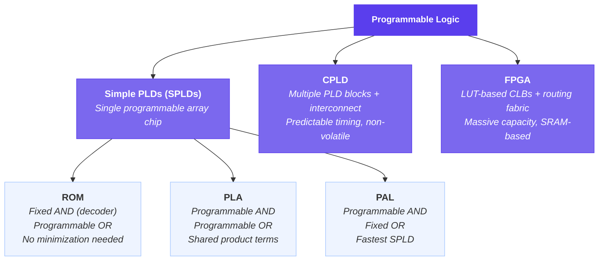
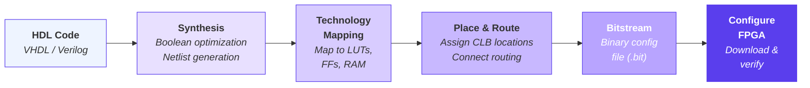

# Unit 11: Programmable Logic Devices

<strong>Unit Overview</strong> (click to expand)

Welcome to Unit 11. So far, you have been designing digital circuits on paper and in simulation. Now, we explore the devices that let you bring those designs into the physical world — programmable logic devices, or PLDs.

ROM can implement any combinational function by treating address lines as inputs and stored data as outputs. From this foundation, PAL devices contain a programmable AND array feeding a fixed OR array, while PLAs offer both programmable AND and programmable OR arrays for more flexibility.

As designs grew more complex, CPLDs emerged — multiple PLD-like blocks connected through a programmable interconnect, with each block featuring a macrocell that includes flip-flops and output control. CPLDs offer predictable timing, making them well-suited for timing-critical glue logic.

The real revolution came with FPGAs. Instead of AND-OR arrays, FPGAs use lookup tables — small memories that can implement any function of their input variables. These sit inside configurable logic blocks (CLBs), which also contain flip-flops and carry logic. Thousands or millions of these blocks are connected by a rich programmable routing network.

The FPGA design flow — describing your circuit in a hardware description language, synthesizing, placing and routing, and downloading the configuration — will become central to your practice.

**Key Takeaways**

1. ROM, PAL, and PLA devices implement combinational logic using programmable arrays of connections, evolving from brute-force lookup to efficient sum-of-products architectures.
2. CPLDs group multiple PLD blocks with a predictable interconnect, while FPGAs use lookup tables within configurable logic blocks to achieve massive flexibility and capacity.
3. The FPGA design flow — from HDL description through synthesis, place-and-route, and device programming — is the modern pathway for turning digital designs into working hardware.

<h2 style="color: #5A3EED !important; border-bottom: 2px solid #5A3EED; padding-bottom: 0.3rem; font-weight: 700; margin-top: 2rem;">Summary</h2>

This unit bridges the gap between designing logic circuits on paper and implementing them in real hardware. Students will explore the family of programmable logic devices (PLDs) that allow designers to configure hardware functionality after manufacturing. Beginning with read-only memories (ROMs) used as combinational logic generators, the unit progresses through simple PLDs (SPLDs) such as PALs and PLAs, then advances to complex PLDs (CPLDs) and field-programmable gate arrays (FPGAs). Students will understand how each device architecture maps Boolean functions to programmable hardware, compare the trade-offs among device families, and appreciate how modern FPGAs implement the combinational and sequential circuits studied in prior units using lookup tables and configurable logic blocks.

<h2 style="color: #5A3EED !important; border-bottom: 2px solid #5A3EED; padding-bottom: 0.3rem; font-weight: 700; margin-top: 2rem;">Concepts Covered</h2>

1. Introduction to Programmable Logic
2. Fixed Logic vs Programmable Logic
3. Programmable Connections
4. Fuse and Antifuse Technology
5. ROM as a Logic Device
6. ROM Truth Table Implementation
7. ROM Internal Architecture
8. PROM, EPROM, EEPROM, and Flash
9. Programmable Logic Array (PLA)
10. PLA Architecture and Programming
11. PLA AND Plane and OR Plane
12. Programmable Array Logic (PAL)
13. PAL Architecture and Constraints
14. PAL vs PLA Trade-offs
15. Simple PLD (SPLD) Summary
16. Complex PLD (CPLD) Architecture
17. CPLD Macrocells
18. CPLD Interconnect Matrix
19. Field-Programmable Gate Array (FPGA) Concepts
20. FPGA Architecture Overview
21. Lookup Tables (LUTs)
22. Configurable Logic Blocks (CLBs)
23. FPGA Routing Resources
24. FPGA I/O Blocks
25. SRAM-Based vs Flash-Based FPGAs
26. FPGA Design Flow
27. Hardware Description Languages for PLDs
28. Technology Mapping
29. PLD Selection Criteria
30. Applications of Programmable Logic

<h2 style="color: #5A3EED !important; border-bottom: 2px solid #5A3EED; padding-bottom: 0.3rem; font-weight: 700; margin-top: 2rem;">Prerequisites</h2>

Before studying this unit, students should be familiar with:

- Sum of Products and Product of Sums forms (Unit 4)
- K-map and Quine-McCluskey simplification (Units 5-6)
- Multi-level gate implementations (Unit 7)
- Combinational modules: MUX, decoders, encoders (Unit 8)
- Flip-flops and sequential circuits (Units 9-10)

---

<h2 style="color: #5A3EED !important; border-bottom: 2px solid #5A3EED; padding-bottom: 0.3rem; font-weight: 700; margin-top: 2rem;">11.1 Introduction to Programmable Logic</h2>

Every circuit designed in Units 1 through 10 assumed that the designer selects individual logic gates—AND, OR, NOT, NAND, NOR—and connects them with dedicated wires to build a specific function. This approach, called **fixed logic** or **standard logic** design, works well for small circuits but becomes impractical as systems grow to thousands or millions of gates. Routing individual wires on a printed circuit board for a complex Boolean function is time-consuming, error-prone, and expensive to modify.

**Programmable logic devices** (PLDs) offer a fundamentally different approach: the manufacturer builds a chip containing a large array of uncommitted logic elements and configurable interconnections. The designer then **programs** (configures) the device to implement the desired function. If the design contains an error, many PLD types can be erased and reprogrammed rather than discarding the hardware.

| Design Approach | Manufacturing | Modification | Per-Unit Cost | NRE Cost |
|----------------|---------------|--------------|---------------|----------|
| Standard Logic (74xx) | Use off-the-shelf ICs | Redesign PCB | Low | Low |
| Custom ASIC | Full mask fabrication | New mask set | Very Low | Very High |
| Programmable Logic | Configure after manufacturing | Reprogram device | Medium | Low |

The key advantage of programmable logic is the trade-off between **non-recurring engineering (NRE) cost** and **per-unit cost**. ASICs minimize per-unit cost for high volumes but require expensive mask fabrication. PLDs eliminate mask costs entirely, making them ideal for prototyping, low-to-medium volume production, and designs that may need field updates.

!!! tip "Historical Context"
    The first programmable logic devices appeared in the 1970s. Today, FPGAs containing billions of transistors can implement entire systems-on-chip, including processors, memory controllers, and custom accelerators—all on a single configurable device.

---

<h2 style="color: #5A3EED !important; border-bottom: 2px solid #5A3EED; padding-bottom: 0.3rem; font-weight: 700; margin-top: 2rem;">11.2 Programmable Connections</h2>

At the heart of every PLD is a mechanism for making or breaking connections between logic elements. Understanding these connection technologies is essential before studying specific device architectures.

**Fuse-based connections** were the earliest technology. The device ships with all connections intact (fuses present). Programming the device means selectively **blowing** (destroying) specific fuses to remove unwanted connections. Once blown, a fuse cannot be restored—making these devices **one-time programmable (OTP)**.

**Antifuse-based connections** work in reverse: the device ships with all connections open. Programming creates connections by applying a high voltage that permanently forms a conductive path. Like fuses, antifuses are OTP.

**SRAM-based connections** use static RAM cells to control pass transistors or multiplexers. The configuration is stored in volatile memory, so it must be reloaded every time the device powers up (typically from an external flash memory). The advantage is unlimited reprogrammability.

**Flash-based connections** store the configuration in non-volatile flash memory cells. The device retains its programming when powered off and can be reprogrammed thousands of times.

| Technology | Reprogrammable | Non-Volatile | Speed | Density |
|-----------|---------------|-------------|-------|---------|
| Fuse | No (OTP) | Yes | Fast | Low |
| Antifuse | No (OTP) | Yes | Very Fast | Medium |
| SRAM | Yes (unlimited) | No | Fast | High |
| Flash | Yes (~10K cycles) | Yes | Medium | Medium |

<h4 style="color: #5A3EED; font-weight: 600;">Diagram: Programmable Connection Technologies</h4>

<iframe src="../sims/programmable-connections/main.html" width="100%" height="550px" scrolling="no" style="border:none; border-radius:8px; overflow:hidden;"></iframe>

---

<h2 style="color: #5A3EED !important; border-bottom: 2px solid #5A3EED; padding-bottom: 0.3rem; font-weight: 700; margin-top: 2rem;">11.3 ROM as a Logic Device</h2>

A **read-only memory** (ROM) is the simplest programmable logic device, though it may not be immediately obvious why a "memory" qualifies as a logic implementation device. The connection becomes clear when you consider the structure.

A ROM with $n$ address inputs and $m$ data outputs implements **any** combinational function of $n$ variables with $m$ outputs. The address inputs serve as the Boolean input variables, and each address location stores the output values for that particular input combination. In effect, a ROM is a complete **truth table stored in hardware**.

Consider a ROM with 3 address lines ($A_2, A_1, A_0$) and 2 data outputs ($D_1, D_0$):

| Address ($A_2 A_1 A_0$) | Location | $D_1$ | $D_0$ |
|--------------------------|----------|-------|-------|
| 000 | 0 | 0 | 1 |
| 001 | 1 | 0 | 1 |
| 010 | 2 | 1 | 0 |
| 011 | 3 | 1 | 1 |
| 100 | 4 | 0 | 0 |
| 101 | 5 | 1 | 0 |
| 110 | 6 | 1 | 1 |
| 111 | 7 | 0 | 0 |

This ROM simultaneously implements two functions:

- $D_1 = \Sigma m(2, 3, 5, 6)$
- $D_0 = \Sigma m(0, 1, 3, 6)$

<h3 style="color: #5A3EED; font-weight: 600; margin-top: 1.2rem;">ROM Internal Architecture</h3>

Internally, a ROM consists of two sections:

- **Decoder (AND plane):** An $n$-to-$2^n$ decoder that generates all $2^n$ minterms of the input variables. This is a **fixed** AND array—every possible minterm is always generated.
- **OR array:** A programmable OR plane where each output is connected to the minterms that should make it HIGH. Programming the ROM means configuring which minterms connect to which outputs.

Because the decoder generates **all** minterms, no minimization is needed. The trade-off is that ROM size grows exponentially with the number of inputs: an $n$-input ROM requires $2^n$ rows, regardless of how simple the function actually is.

<h4 style="color: #5A3EED; font-weight: 600;">Diagram: ROM Internal Architecture</h4>

<iframe src="../sims/rom-architecture/main.html" width="100%" height="560px" scrolling="no" style="border:none; border-radius:8px; overflow:hidden;"></iframe>

<h3 style="color: #5A3EED; font-weight: 600; margin-top: 1.2rem;">ROM Variants</h3>

Several ROM technologies exist, distinguished by how and when they are programmed:

- **Mask ROM:** Programmed during manufacturing via the photolithographic mask. Cannot be changed. Lowest per-unit cost at high volume.
- **PROM (Programmable ROM):** Programmed by the user once using a device programmer that blows fuses. One-time programmable.
- **EPROM (Erasable PROM):** Can be erased by exposing the chip to ultraviolet light through a quartz window, then reprogrammed electrically. Erase is slow (15-20 minutes) and erases the entire chip.
- **EEPROM (Electrically Erasable PROM):** Can be erased and reprogrammed electrically, one byte at a time. Limited write cycles (~100K-1M).
- **Flash Memory:** Similar to EEPROM but erases in blocks rather than individual bytes. The dominant non-volatile memory technology today.

---

<h2 style="color: #5A3EED !important; border-bottom: 2px solid #5A3EED; padding-bottom: 0.3rem; font-weight: 700; margin-top: 2rem;">11.4 Programmable Logic Array (PLA)</h2>

The ROM approach is wasteful when a function uses only a few minterms out of the possible $2^n$. A **Programmable Logic Array (PLA)** addresses this inefficiency by making **both** the AND plane and the OR plane programmable.

Instead of generating all $2^n$ minterms, the PLA's AND plane generates only the **product terms** actually needed by the function. The OR plane then combines these product terms into the desired outputs. Because both planes are programmable, the designer must first minimize the Boolean expressions (using K-maps or Quine-McCluskey) to determine which product terms are needed.

A PLA with:

- $n$ inputs
- $k$ product terms (AND gates)
- $m$ outputs

can implement any $m$ functions of $n$ variables, provided the total number of distinct product terms does not exceed $k$.

<h3 style="color: #5A3EED; font-weight: 600; margin-top: 1.2rem;">PLA Architecture</h3>

The PLA consists of:

1. **Input buffers:** Generate both the true and complement of each input ($x_i$ and $\bar{x_i}$), providing $2n$ lines to the AND plane.
2. **Programmable AND plane:** Each AND gate (product term) can be connected to any combination of the $2n$ input lines. Programming selects which literals appear in each product term.
3. **Programmable OR plane:** Each output can be connected to any combination of the $k$ product terms. Programming selects which product terms contribute to each output.
4. **Optional output inversions:** Some PLAs include programmable XOR gates at the outputs, allowing the designer to choose between the function and its complement (useful for POS implementations).

<h4 style="color: #5A3EED; font-weight: 600;">Diagram: PLA Architecture and Programming</h4>

<iframe src="../sims/pla-architecture/main.html" width="100%" height="560px" scrolling="no" style="border:none; border-radius:8px; overflow:hidden;"></iframe>

<h3 style="color: #5A3EED; font-weight: 600; margin-top: 1.2rem;">PLA Example</h3>

Implement the following functions using a PLA with 3 inputs and 4 product terms:

- $F_1(A,B,C) = A\bar{B} + \bar{A}BC$
- $F_2(A,B,C) = A\bar{B} + AB$

**Step 1:** Identify all distinct product terms: $A\bar{B}$, $\bar{A}BC$, $AB$. Three product terms are needed (within the 4-term limit).

**Step 2:** Program the AND plane:

| Product Term | A | $\bar{A}$ | B | $\bar{B}$ | C | $\bar{C}$ |
|-------------|---|---|---|---|---|---|
| $A\bar{B}$ | x | - | - | x | - | - |
| $\bar{A}BC$ | - | x | x | - | x | - |
| $AB$ | x | - | x | - | - | - |

**Step 3:** Program the OR plane:

| Output | $A\bar{B}$ | $\bar{A}BC$ | $AB$ |
|--------|-----------|------------|------|
| $F_1$ | x | x | - |
| $F_2$ | x | - | x |

The product term $A\bar{B}$ is **shared** between both outputs—a key advantage of PLAs over separate circuit implementations.

---

<h2 style="color: #5A3EED !important; border-bottom: 2px solid #5A3EED; padding-bottom: 0.3rem; font-weight: 700; margin-top: 2rem;">11.5 Programmable Array Logic (PAL)</h2>

A **Programmable Array Logic (PAL)** device simplifies the PLA by keeping the AND plane programmable but making the OR plane **fixed**. Each output is permanently connected to a predetermined set of AND gates (product terms).

This simplification has important consequences:

- **Advantage:** Faster propagation delay because the fixed OR connections are hardwired (no programmable delay).
- **Advantage:** Simpler programming—only the AND plane needs configuration.
- **Disadvantage:** Product terms **cannot be shared** between outputs. Each output has its own dedicated set of AND gates.
- **Disadvantage:** If a function requires more product terms than the fixed OR gate provides, it cannot be implemented in a single PAL output.

<h3 style="color: #5A3EED; font-weight: 600; margin-top: 1.2rem;">PAL Architecture</h3>

A typical PAL (such as the classic PAL16L8) provides:

- 16 input pins
- 8 outputs, each with a fixed number of product terms (typically 7-8)
- A programmable AND array connecting inputs and their complements to dedicated AND gates
- Fixed OR gates summing the product terms for each output

Some PAL outputs are registered (include a flip-flop), enabling sequential logic implementation. The output may also feed back into the AND array as an additional input, supporting state machine designs.

<h3 style="color: #5A3EED; font-weight: 600; margin-top: 1.2rem;">PAL vs PLA Comparison</h3>

| Feature | PLA | PAL |
|---------|-----|-----|
| AND Plane | Programmable | Programmable |
| OR Plane | Programmable | Fixed |
| Product Term Sharing | Yes | No |
| Speed | Slower (two programmable planes) | Faster (one programmable plane) |
| Flexibility | Higher | Lower |
| Cost | Higher | Lower |
| Typical Products | PLA series | PAL16L8, PAL22V10, GAL |

<h4 style="color: #5A3EED; font-weight: 600;">Diagram: PLA vs PAL Architecture Comparison</h4>

<iframe src="../sims/pla-vs-pal/main.html" width="100%" height="580px" scrolling="no" style="border:none; border-radius:8px; overflow:hidden;"></iframe>

---

<h2 style="color: #5A3EED !important; border-bottom: 2px solid #5A3EED; padding-bottom: 0.3rem; font-weight: 700; margin-top: 2rem;">11.6 Simple PLD (SPLD) Summary</h2>

ROMs, PLAs, and PALs collectively form the **Simple PLD** (SPLD) family. Each represents a different point in the trade-off space between flexibility, speed, and cost.

Choosing among SPLDs depends on the application:

- **Use a ROM** when the function has many inputs that contribute many product terms (the ROM generates all minterms automatically, so no minimization is needed).
- **Use a PLA** when the function has shared product terms across multiple outputs and the total number of distinct terms is small relative to the number of minterms.
- **Use a PAL** when speed is critical, functions have moderate complexity, and product term sharing is not essential.

| Criterion | ROM | PLA | PAL |
|-----------|-----|-----|-----|
| AND plane | Fixed (decoder) | Programmable | Programmable |
| OR plane | Programmable | Programmable | Fixed |
| Minimization needed? | No | Yes | Yes |
| Product term sharing | N/A (all minterms) | Yes | No |
| Size growth | $2^n$ (exponential) | Linear in terms | Linear per output |
| Best for | Dense functions | Shared-term functions | Speed-critical designs |

!!! note "The GAL Device"
    The **Generic Array Logic (GAL)** device, introduced by Lattice Semiconductor, is an electrically erasable PAL. The GAL16V8 and GAL22V10 became industry standards because they could emulate most PAL devices while being reprogrammable, dramatically reducing development costs.

<h4 style="color: #5A3EED; font-weight: 700;">Diagram: PLD Family Hierarchy</h4>

---

<h2 style="color: #5A3EED !important; border-bottom: 2px solid #5A3EED; padding-bottom: 0.3rem; font-weight: 700; margin-top: 2rem;">11.7 Complex PLD (CPLD) Architecture</h2>

As designs grew beyond the capacity of a single PAL, designers needed more logic capacity without the wiring complexity of multiple discrete PLDs on a board. **Complex PLDs (CPLDs)** address this by integrating multiple PAL-like blocks onto a single chip and connecting them through a programmable interconnect matrix.

<h3 style="color: #5A3EED; font-weight: 600; margin-top: 1.2rem;">CPLD Structure</h3>

A CPLD consists of:

1. **Function Blocks (FBs):** Each function block resembles a complete PAL device with a programmable AND array, fixed OR gates, and macrocells. A typical CPLD contains 2 to 64 function blocks.
2. **Macrocells:** Each function block contains multiple macrocells (typically 16-36). A macrocell includes an OR gate (combining product terms), an optional flip-flop for registered outputs, and output configuration logic (polarity, tri-state, feedback path).
3. **Programmable Interconnect Matrix:** A global routing structure that connects the outputs of any function block to the inputs of any other function block. This matrix enables inter-block communication without external wiring.
4. **I/O Blocks:** Interface between internal logic and external pins, with configurable direction (input, output, bidirectional) and drive strength.

<h4 style="color: #5A3EED; font-weight: 600;">Diagram: CPLD Architecture Block Diagram</h4>

<iframe src="../sims/cpld-architecture/main.html" width="100%" height="640px" scrolling="no" style="border:none; border-radius:8px; overflow:hidden;"></iframe>

<h3 style="color: #5A3EED; font-weight: 600; margin-top: 1.2rem;">CPLD Characteristics</h3>

- **Predictable timing:** Because the interconnect matrix provides fixed routing paths, propagation delays through a CPLD are predictable and consistent—critical for timing-sensitive designs.
- **Non-volatile:** Most CPLDs use EEPROM or flash-based programming, retaining their configuration without external memory.
- **Instant-on:** CPLDs are functional immediately at power-up (no configuration loading time).
- **Moderate capacity:** Typically range from hundreds to tens of thousands of logic gates equivalent.

---

<h2 style="color: #5A3EED !important; border-bottom: 2px solid #5A3EED; padding-bottom: 0.3rem; font-weight: 700; margin-top: 2rem;">11.8 Field-Programmable Gate Array (FPGA) Concepts</h2>

The **Field-Programmable Gate Array (FPGA)** represents the most flexible and highest-capacity family of programmable logic devices. Unlike CPLDs, which build logic from AND-OR arrays, FPGAs use a fundamentally different approach: **lookup tables (LUTs)** that can implement any Boolean function of a small number of variables.

An FPGA is not programmed with product terms—it is configured by loading a **bitstream** that sets the contents of thousands of small lookup tables, configures multiplexers for routing, and sets flip-flop initial states. This architecture enables FPGAs to implement not just combinational logic but also complex sequential systems, processors, memory interfaces, and entire systems-on-chip.

<h3 style="color: #5A3EED; font-weight: 600; margin-top: 1.2rem;">FPGA vs CPLD</h3>

| Feature | CPLD | FPGA |
|---------|------|------|
| Logic Implementation | AND-OR arrays (product terms) | Lookup Tables (LUTs) |
| Architecture | PAL-like function blocks | Array of configurable logic blocks |
| Routing | Global interconnect matrix (predictable) | Segmented routing (variable delay) |
| Configuration Storage | Non-volatile (flash/EEPROM) | Usually SRAM (volatile) |
| Power-up | Instant-on | Requires configuration loading |
| Capacity | Hundreds to thousands of gates | Thousands to billions of gates |
| Best for | Glue logic, simple state machines | Complex systems, DSP, processors |

---

<h2 style="color: #5A3EED !important; border-bottom: 2px solid #5A3EED; padding-bottom: 0.3rem; font-weight: 700; margin-top: 2rem;">11.9 Lookup Tables (LUTs)</h2>

A **Lookup Table (LUT)** is a small memory (essentially a tiny ROM) that stores the truth table of a Boolean function. A $k$-input LUT contains $2^k$ memory cells and can implement **any** Boolean function of $k$ or fewer variables.

The most common sizes are:

- **4-input LUT (LUT-4):** Contains $2^4 = 16$ memory cells. Can implement any function of up to 4 variables.
- **6-input LUT (LUT-6):** Contains $2^6 = 64$ memory cells. Can implement any function of up to 6 variables. Used in modern Xilinx and Intel FPGAs.

A LUT-4 works exactly like the ROM described in Section 11.3, but with only 4 address inputs:

1. The 4 input signals select one of the 16 stored values via a 16:1 multiplexer.
2. The selected value appears at the output.
3. The stored values are loaded from the FPGA bitstream during configuration.

<h4 style="color: #5A3EED; font-weight: 600;">Diagram: 4-Input LUT Structure and Operation</h4>

<iframe src="../sims/lut-explorer/main.html" width="100%" height="520px" scrolling="no" style="border:none; border-radius:8px; overflow:hidden;"></iframe>

<h3 style="color: #5A3EED; font-weight: 600; margin-top: 1.2rem;">Why LUTs Are Powerful</h3>

The LUT approach has a remarkable property: **any** Boolean function of $k$ inputs requires exactly one $k$-input LUT, regardless of the function's complexity. Whether the function is a simple AND gate or a complex expression with many product terms, the LUT implements it in constant time with identical propagation delay.

For functions with more than $k$ inputs, the FPGA tools automatically decompose the function across multiple LUTs and route signals between them. This decomposition is handled by the **technology mapping** step of the FPGA design flow.

---

<h2 style="color: #5A3EED !important; border-bottom: 2px solid #5A3EED; padding-bottom: 0.3rem; font-weight: 700; margin-top: 2rem;">11.10 Configurable Logic Blocks (CLBs)</h2>

LUTs are grouped into larger units called **Configurable Logic Blocks (CLBs)**, which form the basic building blocks of the FPGA fabric. The exact composition varies by manufacturer, but a typical CLB contains:

- **Multiple LUTs** (2 to 8 per CLB) for implementing combinational logic
- **Flip-flops** (one per LUT output) for implementing sequential logic—each LUT output can optionally be registered
- **Carry chain logic** for efficient arithmetic (adders, counters)
- **Multiplexers** for combining LUT outputs and selecting between combinational and registered outputs
- **Local routing** connecting elements within the CLB

A modern FPGA may contain thousands to millions of CLBs arranged in a regular two-dimensional array.

<h3 style="color: #5A3EED; font-weight: 600; margin-top: 1.2rem;">CLB Architecture (Simplified)</h3>

A simplified CLB with 2 LUT-4s and 2 flip-flops provides:

- Two independent 4-input combinational functions, **or**
- One 5-input function (by using both LUTs with a combining MUX), **or**
- Two 4-input registered functions (outputs captured by flip-flops), **or**
- Various combinations of combinational and sequential logic

The versatility of CLBs means that the same physical hardware can implement combinational circuits (Units 2-8) or sequential circuits (Units 9-10) simply by loading different configuration bits.

<h4 style="color: #5A3EED; font-weight: 600;">Diagram: CLB Internal Architecture</h4>

<iframe src="../sims/clb-architecture/main.html" width="100%" height="630px" scrolling="no" style="border:none; border-radius:8px; overflow:hidden;"></iframe>

---

<h2 style="color: #5A3EED !important; border-bottom: 2px solid #5A3EED; padding-bottom: 0.3rem; font-weight: 700; margin-top: 2rem;">11.11 FPGA Routing Resources</h2>

The routing fabric is what transforms an array of isolated CLBs into a connected system. FPGA routing resources typically include:

- **Local interconnects:** Short wires connecting adjacent CLBs for fast, direct communication between neighbors.
- **General-purpose routing:** Longer segmented wire channels running horizontally and vertically through the FPGA. Programmable switch matrices at intersections connect wire segments.
- **Long lines:** Dedicated wires spanning the full width or height of the chip for global signals (clocks, resets) that must reach all CLBs with minimal skew.
- **Clock distribution networks:** Specialized low-skew routing trees that deliver clock signals simultaneously to all flip-flops across the device.

The routing architecture is a critical factor in FPGA performance. Unlike CPLDs where the global interconnect matrix provides predictable delays, FPGA signal delays vary depending on the route taken—a signal passing through many switch matrices experiences more delay than one using a direct connection. This makes **timing analysis** essential in FPGA design.

!!! warning "Routing Congestion"
    An FPGA design can fail to implement even when sufficient CLBs are available if the routing resources are exhausted. Modern FPGA tools report routing utilization alongside logic utilization to help designers avoid this problem.

---

<h2 style="color: #5A3EED !important; border-bottom: 2px solid #5A3EED; padding-bottom: 0.3rem; font-weight: 700; margin-top: 2rem;">11.12 FPGA I/O Blocks</h2>

The **Input/Output (I/O) blocks** surround the FPGA's CLB array and interface between internal logic and external pins. Modern FPGA I/O blocks are highly configurable:

- **Direction:** Configurable as input, output, or bidirectional
- **Voltage levels:** Support multiple I/O standards (LVCMOS, LVTTL, LVDS, SSTL)
- **Drive strength:** Programmable output current
- **Slew rate:** Fast or slow edge rates to control signal integrity
- **Pull-up/pull-down:** Internal resistors for default states
- **Input registers:** Flip-flops within the I/O block to capture incoming data with minimal setup time
- **Output registers:** Flip-flops to drive outputs synchronously with the clock
- **DDR support:** Double-data-rate registers for high-speed interfaces

---

<h2 style="color: #5A3EED !important; border-bottom: 2px solid #5A3EED; padding-bottom: 0.3rem; font-weight: 700; margin-top: 2rem;">11.13 SRAM-Based vs Flash-Based FPGAs</h2>

The two dominant FPGA configuration technologies present a fundamental trade-off:

**SRAM-based FPGAs** (Xilinx/AMD, Intel/Altera):

- Configuration stored in volatile SRAM cells
- Must be loaded from external flash memory at every power-up
- Unlimited reconfiguration
- Highest density (smallest transistor sizes)
- Supports **partial reconfiguration**—changing part of the design while the rest continues operating
- Configuration time: milliseconds to seconds depending on size
- Dominant in high-performance applications

**Flash-based FPGAs** (Microchip/Microsemi):

- Configuration stored in non-volatile flash cells
- Instant-on operation (no boot time)
- Retains configuration without external memory
- Lower density than SRAM-based devices
- Lower static power consumption
- Preferred for safety-critical and space applications
- Limited reprogramming cycles (~10K)

<h4 style="color: #5A3EED; font-weight: 600;">Diagram: FPGA Configuration and Operation Flow</h4>

<iframe src="../sims/fpga-config-flow/main.html" width="100%" height="470px" scrolling="no" style="border:none; border-radius:8px; overflow:hidden;"></iframe>

---

<h2 style="color: #5A3EED !important; border-bottom: 2px solid #5A3EED; padding-bottom: 0.3rem; font-weight: 700; margin-top: 2rem;">11.14 FPGA Design Flow</h2>

Implementing a digital design on an FPGA involves a well-defined sequence of steps, quite different from the "draw a schematic and build it" approach of discrete logic:

1. **Design Entry:** Describe the circuit using a Hardware Description Language (HDL) such as VHDL or Verilog, or using schematic capture tools. HDL is the industry standard for any non-trivial design.

2. **Functional Simulation:** Verify that the HDL code behaves correctly by simulating it with test inputs (a **testbench**). This step catches logical errors before any hardware is involved.

3. **Synthesis:** A synthesis tool translates the HDL into a **netlist**—a description of the design in terms of generic logic elements (gates, flip-flops, MUXes). The tool performs Boolean optimization and technology-independent simplification.

4. **Technology Mapping:** The generic netlist is mapped to the specific resources of the target FPGA (LUTs, flip-flops, carry chains, block RAMs). This step determines how many CLBs are needed.

5. **Placement:** The mapped elements are assigned to specific physical CLB locations on the FPGA chip. Good placement minimizes routing distances and improves timing.

6. **Routing:** The placement tool's output is fed to a router that connects CLB inputs and outputs using the FPGA's routing fabric. The router must satisfy all connections while meeting timing constraints.

7. **Timing Analysis:** A static timing analyzer verifies that all signal paths meet setup and hold time requirements. Critical paths that violate timing may require the designer to restructure the HDL or add pipeline stages.

8. **Bitstream Generation:** The final placement and routing are converted into a binary bitstream file that configures the FPGA.

9. **Programming:** The bitstream is loaded into the FPGA (and optionally into an external flash for persistent storage).

10. **Hardware Verification:** The configured FPGA is tested with real signals to verify correct operation in the target system.

<h4 style="color: #5A3EED; font-weight: 700;">Diagram: FPGA Design Flow Overview</h4>

<h4 style="color: #5A3EED; font-weight: 600;">Diagram: FPGA Design Flow</h4>

<iframe src="../sims/fpga-design-flow/main.html" width="100%" height="620px" scrolling="no" style="border:none; border-radius:8px; overflow:hidden;"></iframe>

---

<h2 style="color: #5A3EED !important; border-bottom: 2px solid #5A3EED; padding-bottom: 0.3rem; font-weight: 700; margin-top: 2rem;">11.15 Technology Mapping</h2>

**Technology mapping** is the process of transforming a generic netlist (from synthesis) into the specific primitives available on the target FPGA or PLD. This step is critical because it determines how efficiently the design uses the available hardware.

For FPGA targets, technology mapping involves:

- **Decomposing functions into LUTs:** A Boolean function with more than $k$ inputs (where $k$ is the LUT size) must be broken into a network of smaller functions, each fitting in a single LUT. The mapper minimizes the total number of LUTs while keeping the critical path delay short.
- **Packing into CLBs:** The mapper groups related LUTs and flip-flops into CLBs, maximizing the use of internal CLB resources (carry chains, local routing).
- **Inferring dedicated resources:** Modern FPGAs include specialized blocks for common functions—block RAM for memory, DSP slices for multiplication, and clock managers for frequency synthesis. The mapper recognizes patterns in the netlist and maps them to these dedicated resources instead of using general-purpose CLBs.

For CPLD/PAL targets, technology mapping involves:

- **Fitting functions into product terms:** The mapper determines whether each function can fit within the available product terms per macrocell.
- **Pin assignment:** Mapping logical I/O to physical device pins.

---

<h2 style="color: #5A3EED !important; border-bottom: 2px solid #5A3EED; padding-bottom: 0.3rem; font-weight: 700; margin-top: 2rem;">11.16 Hardware Description Languages for PLDs</h2>

All modern PLD design uses **Hardware Description Languages (HDLs)** rather than manual schematic entry. The two dominant HDLs are:

- **VHDL (VHSIC Hardware Description Language):** A strongly-typed, verbose language originating from a U.S. Department of Defense initiative. VHDL emphasizes design safety through strict type checking. Widely used in aerospace, defense, and European industry.
- **Verilog:** A more concise language with syntax resembling C. Popular in the U.S. semiconductor industry and for ASIC design. Its successor, **SystemVerilog**, adds verification features.

Both languages can describe:

- **Combinational logic:** Boolean equations, truth tables, conditional assignments
- **Sequential logic:** Flip-flops, registers, state machines
- **Structural designs:** Hierarchical interconnection of components
- **Behavioral designs:** High-level algorithmic descriptions that synthesis tools convert to hardware

Unit 12 provides a detailed introduction to VHDL for implementing the circuits studied throughout this course.

---

<h2 style="color: #5A3EED !important; border-bottom: 2px solid #5A3EED; padding-bottom: 0.3rem; font-weight: 700; margin-top: 2rem;">11.17 PLD Selection Criteria</h2>

Choosing the right programmable logic device for a project involves evaluating several factors:

- **Logic capacity:** How many equivalent gates or LUTs does the design require? SPLDs handle hundreds of gates; CPLDs handle thousands; FPGAs handle millions.
- **Speed requirements:** CPLDs offer predictable timing; FPGAs offer higher clock frequencies but variable routing delays.
- **Power consumption:** Flash-based devices offer lower standby power; SRAM-based FPGAs consume more due to configuration storage.
- **Configuration volatility:** Does the application require instant-on (non-volatile) or can it tolerate boot-up time?
- **I/O requirements:** How many pins are needed? What I/O standards must be supported?
- **Cost sensitivity:** SPLDs cost pennies; high-end FPGAs cost thousands of dollars.
- **Development tools:** Are vendor tools and IP libraries available?
- **Production volume:** PLDs are cost-effective for low-to-medium volumes; ASICs become economical at high volumes.

<h4 style="color: #5A3EED; font-weight: 600;">Diagram: PLD Selection Decision Tree</h4>

<iframe src="../sims/pld-selection-tree/main.html" width="100%" height="520px" scrolling="no" style="border:none; border-radius:8px; overflow:hidden;"></iframe>

---

<h2 style="color: #5A3EED !important; border-bottom: 2px solid #5A3EED; padding-bottom: 0.3rem; font-weight: 700; margin-top: 2rem;">11.18 Applications of Programmable Logic</h2>

Programmable logic devices permeate modern electronic systems:

- **Prototyping and development:** FPGAs allow designers to test digital designs in real hardware before committing to expensive ASIC fabrication.
- **Telecommunications:** FPGAs implement signal processing algorithms in 5G base stations, network switches, and fiber-optic transceivers.
- **Automotive:** CPLDs and FPGAs implement sensor fusion, ADAS (Advanced Driver-Assistance Systems), and in-vehicle networking.
- **Aerospace and defense:** Flash-based FPGAs are used in satellites and avionics where radiation tolerance and non-volatility are essential.
- **Data centers:** FPGAs serve as hardware accelerators for machine learning inference, database queries, and network packet processing.
- **Consumer electronics:** CPLDs handle glue logic in displays, peripheral interfaces, and power management controllers.
- **Medical devices:** FPGAs implement real-time image processing in ultrasound machines and MRI systems.
- **Industrial control:** PLDs implement custom motor controllers, PLC logic, and safety interlocks.

!!! info "FPGA vs GPU vs CPU"
    FPGAs excel at tasks requiring massive parallelism with low latency, such as real-time signal processing. Unlike CPUs (serial execution) or GPUs (parallel but with fixed architecture), FPGAs can be configured with custom data paths optimized for specific algorithms, achieving both high throughput and low power consumption.

---

<h2 style="color: #5A3EED !important; border-bottom: 2px solid #5A3EED; padding-bottom: 0.3rem; font-weight: 700; margin-top: 2rem;">11.19 Connecting PLDs to Prior Units</h2>

Every concept from Units 1 through 10 finds direct application in programmable logic:

| Prior Unit Topic | Application in PLDs |
|-----------------|-------------------|
| Boolean algebra (Unit 2) | Synthesis tools optimize Boolean expressions for LUT mapping |
| SOP/POS forms (Unit 4) | PLAs implement SOP directly; PALs use SOP with fixed OR |
| K-map/QM minimization (Units 5-6) | Minimization reduces product terms for PLA/PAL fitting |
| Multi-level logic (Unit 7) | FPGA synthesis creates multi-level networks of LUTs |
| MUX/Decoders (Unit 8) | LUTs are essentially MUXes; decoders form ROM addressing |
| Flip-flops (Unit 9) | CLB flip-flops implement registers and state machines |
| Counters/FSMs (Unit 10) | PAL registered outputs and FPGA CLBs implement sequential designs |

This connection illustrates why the foundational units matter: understanding Boolean algebra, minimization, and circuit design is essential for effective PLD programming, even when synthesis tools automate much of the process.

---

<h2 style="color: #5A3EED !important; border-bottom: 2px solid #5A3EED; padding-bottom: 0.3rem; font-weight: 700; margin-top: 2rem;">11.20 Summary and Key Takeaways</h2>

- **Programmable logic devices** allow hardware functionality to be configured after manufacturing, offering a balance between the flexibility of standard logic and the efficiency of custom ASICs.
- **ROMs** implement combinational logic by storing complete truth tables but grow exponentially with input count.
- **PLAs** offer maximum flexibility with both programmable AND and OR planes, supporting product term sharing across outputs.
- **PALs** trade flexibility for speed by fixing the OR plane, with each output having dedicated product terms.
- **CPLDs** integrate multiple PAL-like function blocks with a global interconnect matrix for predictable-timing designs of moderate complexity.
- **FPGAs** use lookup tables and configurable logic blocks to achieve the highest capacity and flexibility, capable of implementing entire systems-on-chip.
- **LUTs** are the fundamental building blocks of FPGAs—small memories that implement any Boolean function of $k$ inputs in constant time.
- The **FPGA design flow** transforms HDL code through synthesis, mapping, placement, routing, and timing analysis to produce a configuration bitstream.
- **Device selection** requires balancing capacity, speed, power, cost, and volatility requirements against the strengths of each PLD family.

??? question "Self-Check: Why can't a PAL share product terms between outputs like a PLA can?"
    In a PAL, the OR plane is **fixed**—each output is permanently connected to its own dedicated set of AND gates. Because these connections cannot be changed, a product term generated by one output's AND gates cannot be routed to another output's OR gate. In a PLA, the OR plane is programmable, so any product term from the AND plane can be connected to any output.

<h2 style="color: #5A3EED !important; border-bottom: 2px solid #5A3EED; padding-bottom: 0.3rem; font-weight: 700; margin-top: 2rem;">Interactive Walkthrough</h2>

Program a PLA step-by-step by selecting product terms and connecting them to outputs:

<iframe src="../sims/pla-programming-walkthrough/main.html" width="100%" height="590px" scrolling="no" style="border:none; border-radius:8px; overflow:hidden;"></iframe>

---

[Take the Unit Quiz](./quiz.md) | [See Annotated References](./references.md)

