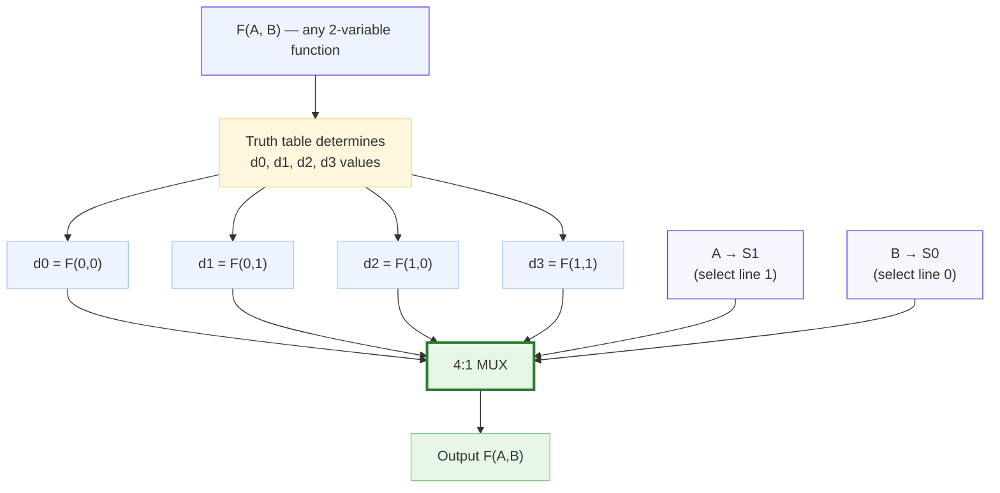
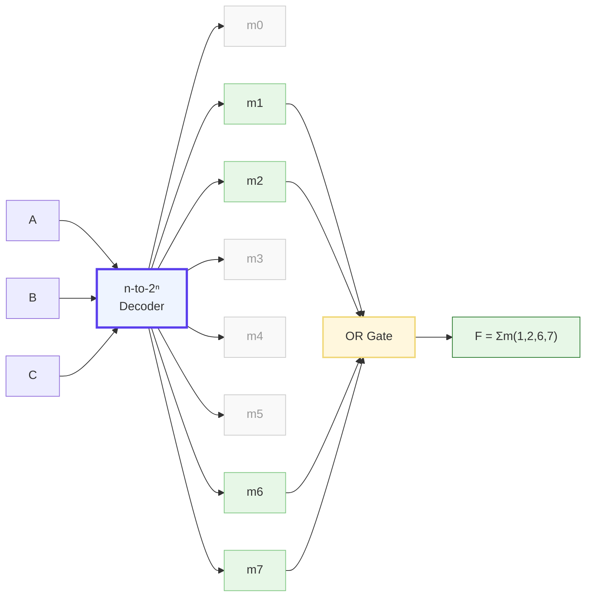

<div class="unit1-styled" markdown>

# Unit 8: Combinational Logic Modules

<details class="video-overview">
<summary><strong>Unit Overview</strong> (click to expand)</summary>

Welcome to Unit 8, where we move beyond individual gates and start working with combinational logic modules — the medium-scale building blocks that make complex digital systems practical to design.

We will begin with the multiplexer, or MUX, one of the most versatile modules in digital design. A multiplexer selects one of several input signals and routes it to a single output, controlled by selection lines. Interestingly, a MUX can also implement arbitrary Boolean functions — a single eight-to-one MUX can replace an entire network of gates for any three-variable function.

Working in the opposite direction, we have the demultiplexer, or DEMUX, which takes a single input and routes it to one of many outputs. Together, MUX and DEMUX form the foundation of data routing in everything from communication systems to memory buses.

Next, we explore encoders and decoders. An encoder converts one active input line into a compact binary code. Priority encoders report only the highest-priority active input. Decoders do the reverse, taking a binary code and activating exactly one output line — essential for address decoding in memory systems.

We will also cover magnitude comparators, which determine whether one binary number is greater than, less than, or equal to another, and code converters, particularly the conversion between standard binary and Gray code.

**Key Takeaways**

1. Multiplexers and demultiplexers are fundamental data-routing components, and a MUX can implement any Boolean function of its select variables.
2. Encoders compress information into binary codes while decoders expand binary codes to activate individual lines — both are essential for address decoding and priority arbitration.
3. Magnitude comparators and code converters such as Binary-to-Gray round out a practical toolkit of combinational modules used throughout real digital systems.

</details>

<h2 style="color: #5A3EED !important; border-bottom: 2px solid #5A3EED; padding-bottom: 0.3rem; font-weight: 700; margin-top: 2rem;">Summary</h2>

<div style="background: #EEF4FF; border: 2px solid #A8C8FF; border-radius: 12px; padding: 20px 24px; margin: 1rem 0; box-shadow: 0 2px 8px rgba(90,61,237,0.07);">
<p style="color: #333; line-height: 1.85; font-size: 1.02rem; margin: 0;">
This unit introduces medium-scale integration (MSI) combinational logic modules that serve as fundamental building blocks in digital system design. Multiplexers, demultiplexers, encoders, and decoders perform essential data routing and code conversion functions. Students will learn the internal structure and operation of these modules, understand their role in implementing arbitrary Boolean functions, and apply them to practical design problems including memory addressing, data bus management, and code translation.
</p>
</div>

<h2 style="color: #5A3EED !important; border-bottom: 2px solid #5A3EED; padding-bottom: 0.3rem; font-weight: 700; margin-top: 2rem;">Concepts Covered</h2>

<div style="background: #F8F6FF; border: 2px solid #D4C8FF; border-radius: 12px; padding: 20px 24px; margin: 1rem 0;" markdown>

1. Combinational Building Blocks
2. Multiplexer (MUX) Fundamentals
3. 2-to-1 Multiplexer Structure
4. 4-to-1 Multiplexer Structure
5. 8-to-1 and Larger Multiplexers
6. Multiplexer Tree Expansion
7. Implementing Functions with MUX
8. Shannon Expansion and MUX
9. Demultiplexer (DEMUX) Fundamentals
10. Decoder Fundamentals
11. 2-to-4 Decoder Structure
12. 3-to-8 Decoder Structure
13. Decoder Enable Inputs
14. Decoder Tree Expansion
15. Implementing Functions with Decoders
16. Minterm Generation with Decoders
17. Encoder Fundamentals
18. Priority Encoder Operation
19. 8-to-3 Priority Encoder
20. Binary-to-Gray Code Converter
21. Gray-to-Binary Code Converter
22. BCD-to-Seven-Segment Decoder
23. Comparator Circuits
24. Magnitude Comparator Design
25. Cascading Combinational Modules

</div>

<h2 style="color: #5A3EED !important; border-bottom: 2px solid #5A3EED; padding-bottom: 0.3rem; font-weight: 700; margin-top: 2rem;">Prerequisites</h2>

<div style="background: #EEF4FF; border: 2px solid #A8C8FF; border-radius: 12px; padding: 20px 24px; margin: 1rem 0; box-shadow: 0 2px 8px rgba(90,61,237,0.07);" markdown>

Before studying this unit, students should be familiar with:

- Boolean algebra and logic gates (Unit 2)
- Minterms and canonical forms (Unit 4)
- K-map simplification (Unit 5)
- Shannon expansion theorem (Unit 4)
- Binary number systems (Unit 1)

</div>

---

<h2 style="color: #5A3EED !important; border-bottom: 2px solid #5A3EED; padding-bottom: 0.3rem; font-weight: 700; margin-top: 2rem;">8.1 Introduction to Combinational Building Blocks</h2>

<div markdown style="background: #EEF4FF; border: 2px solid #A8C8FF; border-radius: 12px; padding: 24px 28px; margin: 1.2rem 0; box-shadow: 0 2px 8px rgba(90,61,237,0.07);">

Digital systems are constructed from a hierarchy of modules, ranging from individual logic gates to complex subsystems. In previous units, we designed circuits directly from Boolean expressions using basic gates. While this approach works for small functions, larger designs demand a higher level of abstraction. **Combinational building blocks** are pre-designed functional units that perform common operations, allowing designers to think in terms of data selection, routing, and code conversion rather than individual gates.

These modules belong to the category of **medium-scale integration (MSI)** devices, historically containing tens to hundreds of gates within a single integrated circuit package. The key MSI combinational modules include:

| Module | Function | Inputs | Outputs | Typical Notation |
|--------|----------|--------|---------|------------------|
| Multiplexer | Select one of $2^n$ inputs | $2^n$ data + $n$ select | 1 | MUX |
| Demultiplexer | Route input to one of $2^n$ outputs | 1 data + $n$ select | $2^n$ | DEMUX |
| Decoder | Convert $n$-bit code to one-hot | $n$ | $2^n$ | DEC |
| Encoder | Convert one-hot to $n$-bit code | $2^n$ | $n$ | ENC |
| Priority Encoder | Encode highest-priority active input | $2^n$ | $n$ + valid | PENC |
| Comparator | Compare two $n$-bit numbers | $2n$ | 3 (>, =, <) | COMP |

These modules are available as discrete ICs in the 74-series TTL and 4000-series CMOS families, and as library cells in FPGA and ASIC design flows. Understanding their internal structure is essential for three reasons:

- **Design verification:** Knowing how a module works enables debugging and testing
- **Custom implementations:** Some designs require modified versions of standard modules
- **Function implementation:** MUX and decoder modules can implement arbitrary Boolean functions, often more efficiently than gate-level designs

</div>

!!! info "Design Philosophy"
    Modern digital design often instantiates these modules directly from HDL (Verilog/VHDL) rather than designing equivalent gate-level circuits. Synthesis tools recognize these patterns and map them to optimized library cells.

---

<h2 style="color: #5A3EED !important; border-bottom: 2px solid #5A3EED; padding-bottom: 0.3rem; font-weight: 700; margin-top: 2rem;">8.2 Multiplexer Fundamentals</h2>

<div markdown style="background: #EEF4FF; border: 2px solid #A8C8FF; border-radius: 12px; padding: 24px 28px; margin: 1.2rem 0; box-shadow: 0 2px 8px rgba(90,61,237,0.07);">

A **multiplexer (MUX)** is a data selector that chooses one of several input signals and forwards it to a single output based on select (control) signals. It functions as a digitally controlled multi-position switch: the select inputs determine which data input is connected to the output.

A $2^n$-to-1 multiplexer has:

- $2^n$ data inputs ($D_0, D_1, ..., D_{2^n - 1}$)
- $n$ select inputs ($S_{n-1}, ..., S_1, S_0$)
- 1 output ($Y$)

The general Boolean expression for a $2^n$-to-1 MUX is:

$$Y = \sum_{i=0}^{2^n - 1} m_i \cdot D_i$$

where $m_i$ is the $i$-th minterm of the select inputs.

</div>

<h3 style="color: #5A3EED; font-weight: 600; margin-top: 1.2rem;">8.2.1 The 2-to-1 Multiplexer</h3>

<div markdown style="background: #EEF4FF; border: 2px solid #A8C8FF; border-radius: 12px; padding: 24px 28px; margin: 1.2rem 0; box-shadow: 0 2px 8px rgba(90,61,237,0.07);">

The simplest multiplexer has two data inputs ($D_0$, $D_1$), one select input ($S$), and one output ($Y$).

**Boolean Expression:**

$$Y = \overline{S} \cdot D_0 + S \cdot D_1$$

When $S = 0$, the output equals $D_0$. When $S = 1$, the output equals $D_1$.

| $S$ | $Y$ |
|-----|-----|
| 0 | $D_0$ |
| 1 | $D_1$ |

The gate-level implementation requires one inverter, two AND gates, and one OR gate—a total of 4 gates. In CMOS, a 2:1 MUX can also be implemented efficiently using transmission gates (as discussed in Unit 7), requiring only 4 transistors plus an inverter.

</div>

<h3 style="color: #5A3EED; font-weight: 600; margin-top: 1.2rem;">8.2.2 The 4-to-1 Multiplexer</h3>

<div markdown style="background: #EEF4FF; border: 2px solid #A8C8FF; border-radius: 12px; padding: 24px 28px; margin: 1.2rem 0; box-shadow: 0 2px 8px rgba(90,61,237,0.07);">

A 4-to-1 MUX has four data inputs ($D_0$ through $D_3$), two select inputs ($S_1$, $S_0$), and one output.

**Boolean Expression:**

$$Y = \overline{S_1}\,\overline{S_0}\,D_0 + \overline{S_1}\,S_0\,D_1 + S_1\,\overline{S_0}\,D_2 + S_1\,S_0\,D_3$$

Each term selects one data input: the select lines generate the corresponding minterm, which acts as an enable for that data input.

| $S_1$ | $S_0$ | $Y$ |
|-------|-------|-----|
| 0 | 0 | $D_0$ |
| 0 | 1 | $D_1$ |
| 1 | 0 | $D_2$ |
| 1 | 1 | $D_3$ |

The gate-level structure consists of:

- 2 inverters (for $\overline{S_1}$ and $\overline{S_0}$)
- 4 three-input AND gates (one per data input)
- 1 four-input OR gate

Total: 7 gates.

</div>

<h3 style="color: #5A3EED; font-weight: 600; margin-top: 1.2rem;">8.2.3 The 8-to-1 and Larger Multiplexers</h3>

<div markdown style="background: #EEF4FF; border: 2px solid #A8C8FF; border-radius: 12px; padding: 24px 28px; margin: 1.2rem 0; box-shadow: 0 2px 8px rgba(90,61,237,0.07);">

An 8-to-1 MUX extends the pattern to eight data inputs ($D_0$ through $D_7$) with three select inputs ($S_2$, $S_1$, $S_0$):

$$Y = \sum_{i=0}^{7} m_i(S_2, S_1, S_0) \cdot D_i$$

This requires 3 inverters, 8 four-input AND gates, and 1 eight-input OR gate. The 74151 is a classic 8-to-1 MUX IC.

For even larger multiplexers (16-to-1 and beyond), gate-level implementation becomes impractical due to fan-in limitations. Instead, **multiplexer tree expansion** builds larger MUXes from smaller ones.

| MUX Size | Select Inputs | Data Inputs | AND Gate Size | IC Example |
|----------|--------------|-------------|---------------|------------|
| 2:1 | 1 | 2 | 2-input | 74157 (quad) |
| 4:1 | 2 | 4 | 3-input | 74153 |
| 8:1 | 3 | 8 | 4-input | 74151 |
| 16:1 | 4 | 16 | 5-input | 74150 |

</div>

<h4 style="color: #5A3EED; font-weight: 600;">Diagram: Multiplexer Interactive Simulator</h4>

<div style="background: #EEF4FF; border: 2px solid #A8C8FF; border-radius: 12px; padding: 18px; margin: 1.2rem 0; box-shadow: 0 2px 8px rgba(90,61,237,0.07);">
<iframe src="../sims/mux-simulator/main.html" width="100%" height="530px" scrolling="no" style="border:none; border-radius:8px; overflow:hidden;"></iframe>
</div>

---

<h2 style="color: #5A3EED !important; border-bottom: 2px solid #5A3EED; padding-bottom: 0.3rem; font-weight: 700; margin-top: 2rem;">8.3 Multiplexer Tree Expansion</h2>

<div markdown style="background: #EEF4FF; border: 2px solid #A8C8FF; border-radius: 12px; padding: 24px 28px; margin: 1.2rem 0; box-shadow: 0 2px 8px rgba(90,61,237,0.07);">

When the required MUX size exceeds available components, smaller multiplexers can be cascaded to build larger ones. This technique, called **multiplexer tree expansion**, uses a hierarchical structure where the output of lower-level MUXes feeds the data inputs of higher-level MUXes.

</div>

<h3 style="color: #5A3EED; font-weight: 600; margin-top: 1.2rem;">Building a 16-to-1 MUX from 4-to-1 MUXes</h3>

<div markdown style="background: #EEF4FF; border: 2px solid #A8C8FF; border-radius: 12px; padding: 24px 28px; margin: 1.2rem 0; box-shadow: 0 2px 8px rgba(90,61,237,0.07);">

A 16-to-1 MUX requires 4 select lines ($S_3, S_2, S_1, S_0$). Using 4-to-1 MUXes:

**First level:** Four 4-to-1 MUXes, each selecting from 4 of the 16 data inputs using $S_1, S_0$:

- MUX A: selects among $D_0, D_1, D_2, D_3$
- MUX B: selects among $D_4, D_5, D_6, D_7$
- MUX C: selects among $D_8, D_9, D_{10}, D_{11}$
- MUX D: selects among $D_{12}, D_{13}, D_{14}, D_{15}$

**Second level:** One 4-to-1 MUX selects among the four first-level outputs using $S_3, S_2$.

Total: 5 four-to-1 MUXes implement a 16-to-1 MUX.

</div>

<h3 style="color: #5A3EED; font-weight: 600; margin-top: 1.2rem;">General Tree Construction</h3>

<div markdown style="background: #EEF4FF; border: 2px solid #A8C8FF; border-radius: 12px; padding: 24px 28px; margin: 1.2rem 0; box-shadow: 0 2px 8px rgba(90,61,237,0.07);">

To build a $2^n$-to-1 MUX from $2^k$-to-1 MUXes:

- **First level:** $2^{n-k}$ MUXes, each handling $2^k$ data inputs with select lines $S_{k-1}, ..., S_0$
- **Second level:** A $2^{n-k}$-to-1 MUX selecting among first-level outputs with $S_{n-1}, ..., S_k$

If the second level itself requires expansion, the process recurses.

| Target MUX | Building Block | First Level | Second Level | Total MUXes |
|-----------|---------------|-------------|--------------|-------------|
| 8:1 | 2:1 | 4 | 2 + 1 | 7 |
| 8:1 | 4:1 | 2 | 1 (2:1) | 3 |
| 16:1 | 4:1 | 4 | 1 | 5 |
| 32:1 | 8:1 | 4 | 1 (4:1) | 5 |

</div>

---

<h2 style="color: #5A3EED !important; border-bottom: 2px solid #5A3EED; padding-bottom: 0.3rem; font-weight: 700; margin-top: 2rem;">8.4 Implementing Boolean Functions with Multiplexers</h2>

<div markdown style="background: #EEF4FF; border: 2px solid #A8C8FF; border-radius: 12px; padding: 24px 28px; margin: 1.2rem 0; box-shadow: 0 2px 8px rgba(90,61,237,0.07);">

One of the most powerful applications of multiplexers is implementing arbitrary Boolean functions. A $2^n$-to-1 MUX can implement any $n$-variable function by connecting the input variables to the select lines and the truth table output values to the data inputs.

</div>

<h3 style="color: #5A3EED; font-weight: 600; margin-top: 1.2rem;">Direct Implementation (Full-Size MUX)</h3>

<div markdown style="background: #EEF4FF; border: 2px solid #A8C8FF; border-radius: 12px; padding: 24px 28px; margin: 1.2rem 0; box-shadow: 0 2px 8px rgba(90,61,237,0.07);">

For an $n$-variable function, use a $2^n$-to-1 MUX:

1. Connect the $n$ input variables to the select lines
2. Connect each data input to 0 or 1 based on the truth table output

**Example:** Implement $F(A, B, C) = \sum m(1, 2, 6, 7)$ using an 8-to-1 MUX.

Connect $A, B, C$ to $S_2, S_1, S_0$. From the truth table:

| $A$ | $B$ | $C$ | $F$ | Data Input |
|-----|-----|-----|-----|------------|
| 0 | 0 | 0 | 0 | $D_0 = 0$ |
| 0 | 0 | 1 | 1 | $D_1 = 1$ |
| 0 | 1 | 0 | 1 | $D_2 = 1$ |
| 0 | 1 | 1 | 0 | $D_3 = 0$ |
| 1 | 0 | 0 | 0 | $D_4 = 0$ |
| 1 | 0 | 1 | 0 | $D_5 = 0$ |
| 1 | 1 | 0 | 1 | $D_6 = 1$ |
| 1 | 1 | 1 | 1 | $D_7 = 1$ |

</div>

<h3 style="color: #5A3EED; font-weight: 600; margin-top: 1.2rem;">Shannon Expansion Method (Reduced MUX)</h3>

<div markdown style="background: #FFF8E1; border: 2px solid #F0D87A; border-radius: 12px; padding: 24px 28px; margin: 1.2rem 0; box-shadow: 0 2px 8px rgba(212,160,23,0.10);">
<strong style="color: #B8860B;">Shannon Expansion Procedure:</strong>

A more efficient approach uses an $n$-variable function with a $2^{n-1}$-to-1 MUX. The **Shannon expansion theorem** states:

$$F(X_1, ..., X_n) = \overline{X_n} \cdot F(X_1, ..., X_{n-1}, 0) + X_n \cdot F(X_1, ..., X_{n-1}, 1)$$

This means one variable can be "absorbed" into the data inputs rather than using a select line.

**Procedure for using a $2^{n-1}$-to-1 MUX:**

1. Choose one variable (typically the one that simplifies the most) for the data inputs
2. Use the remaining $n-1$ variables as select inputs
3. For each select combination, determine if $F$ equals 0, 1, the chosen variable, or its complement
4. Connect the appropriate value to each data input

**Example:** Implement $F(A, B, C) = \sum m(1, 2, 6, 7)$ using a 4-to-1 MUX.

Choose $C$ for the data inputs; use $A, B$ as select lines ($S_1 = A$, $S_0 = B$).

| $A$ | $B$ | $F$ when $C=0$ | $F$ when $C=1$ | Data Input |
|-----|-----|----------------|----------------|------------|
| 0 | 0 | $F(0,0,0) = 0$ | $F(0,0,1) = 1$ | $D_0 = C$ |
| 0 | 1 | $F(0,1,0) = 1$ | $F(0,1,1) = 0$ | $D_1 = \overline{C}$ |
| 1 | 0 | $F(1,0,0) = 0$ | $F(1,0,1) = 0$ | $D_2 = 0$ |
| 1 | 1 | $F(1,1,0) = 1$ | $F(1,1,1) = 1$ | $D_3 = 1$ |

The data input values follow this logic:

- If $F = 0$ for both $C=0$ and $C=1$: connect to 0
- If $F = 1$ for both $C=0$ and $C=1$: connect to 1
- If $F = 0$ when $C=0$ and $F = 1$ when $C=1$: connect to $C$
- If $F = 1$ when $C=0$ and $F = 0$ when $C=1$: connect to $\overline{C}$

</div>

<div style="background: #F8F6FF; border: 2px solid #D4C8FF; border-radius: 12px; padding: 20px 24px; margin: 1.5rem 0; box-shadow: 0 2px 8px rgba(90,61,237,0.07);">

<h4 style="color: #5A3EED; font-weight: 700;">Diagram: MUX as Universal Function Generator (4:1 MUX for 2-Variable Functions)</h4>



Each data input d0--d3 is set to 0 or 1 from the truth table. Since there are 2^4 = 16 possible assignments, a single 4:1 MUX can implement all 16 functions of two variables.

</div>

<h4 style="color: #5A3EED; font-weight: 600;">Diagram: MUX Function Implementation Tool</h4>

<div style="background: #EEF4FF; border: 2px solid #A8C8FF; border-radius: 12px; padding: 18px; margin: 1.2rem 0; box-shadow: 0 2px 8px rgba(90,61,237,0.07);">
<iframe src="../sims/mux-simulator/main.html" width="100%" height="550px" scrolling="no" style="border:none; border-radius:8px; overflow:hidden;"></iframe>
</div>

---

<h2 style="color: #5A3EED !important; border-bottom: 2px solid #5A3EED; padding-bottom: 0.3rem; font-weight: 700; margin-top: 2rem;">8.5 Demultiplexer Fundamentals</h2>

<div markdown style="background: #EEF4FF; border: 2px solid #A8C8FF; border-radius: 12px; padding: 24px 28px; margin: 1.2rem 0; box-shadow: 0 2px 8px rgba(90,61,237,0.07);">

A **demultiplexer (DEMUX)** performs the inverse function of a multiplexer—it routes a single data input to one of several outputs based on select signals. While a MUX is a "many-to-one" selector, a DEMUX is a "one-to-many" distributor.

A 1-to-$2^n$ demultiplexer has:

- 1 data input ($D$)
- $n$ select inputs ($S_{n-1}, ..., S_1, S_0$)
- $2^n$ outputs ($Y_0, Y_1, ..., Y_{2^n-1}$)

</div>

<h3 style="color: #5A3EED; font-weight: 600; margin-top: 1.2rem;">1-to-4 Demultiplexer</h3>

<div markdown style="background: #EEF4FF; border: 2px solid #A8C8FF; border-radius: 12px; padding: 24px 28px; margin: 1.2rem 0; box-shadow: 0 2px 8px rgba(90,61,237,0.07);">

**Boolean Expressions:**

$$Y_0 = \overline{S_1}\,\overline{S_0} \cdot D$$

$$Y_1 = \overline{S_1}\,S_0 \cdot D$$

$$Y_2 = S_1\,\overline{S_0} \cdot D$$

$$Y_3 = S_1\,S_0 \cdot D$$

| $S_1$ | $S_0$ | Active Output |
|-------|-------|---------------|
| 0 | 0 | $Y_0 = D$ |
| 0 | 1 | $Y_1 = D$ |
| 1 | 0 | $Y_2 = D$ |
| 1 | 1 | $Y_3 = D$ |

All non-selected outputs remain at 0. Only the selected output carries the data signal.

</div>

<h3 style="color: #5A3EED; font-weight: 600; margin-top: 1.2rem;">The DEMUX-Decoder Relationship</h3>

<div markdown style="background: #FFF8E1; border-left: 4px solid #F0D87A; border-radius: 8px; padding: 16px 20px; margin: 1rem 0;">
<strong style="color: #B8860B;">Key Insight:</strong> Comparing the DEMUX equations above with a 2-to-4 decoder with enable $E$:

$$Y_i(\text{decoder with enable}) = E \cdot m_i(S_1, S_0)$$

These are identical if we substitute $D = E$. This reveals an important equivalence:

- A **DEMUX** with data input $D$ = a **decoder** with enable input $E = D$
- A **decoder** with enable held at 1 = a **DEMUX** with data always 1 (which is just a decoder)

</div>

!!! tip "Practical Consequence"
    IC manufacturers often sell a single chip that can serve as either a decoder or a demultiplexer depending on how the enable/data input is used. The 74138 (3-to-8 decoder) is a common example.

<h3 style="color: #5A3EED; font-weight: 600; margin-top: 1.2rem;">Applications of Demultiplexers</h3>

<div markdown style="background: #EEF4FF; border: 2px solid #A8C8FF; border-radius: 12px; padding: 24px 28px; margin: 1.2rem 0; box-shadow: 0 2px 8px rgba(90,61,237,0.07);">

- **Data distribution:** Sending serial data to one of several destinations
- **Time-division demultiplexing:** Routing time-multiplexed channels to separate outputs
- **Address decoding:** Selecting one of several memory chips or peripheral devices
- **LED display multiplexing:** Routing data to individual display digits

</div>

---

<h2 style="color: #5A3EED !important; border-bottom: 2px solid #5A3EED; padding-bottom: 0.3rem; font-weight: 700; margin-top: 2rem;">8.6 Decoder Fundamentals</h2>

<div markdown style="background: #EEF4FF; border: 2px solid #A8C8FF; border-radius: 12px; padding: 24px 28px; margin: 1.2rem 0; box-shadow: 0 2px 8px rgba(90,61,237,0.07);">

A **decoder** converts an $n$-bit binary input code into $2^n$ output lines, activating exactly one output for each input combination. This produces a **one-hot encoding** where only the output corresponding to the binary input value is active.

</div>

<h3 style="color: #5A3EED; font-weight: 600; margin-top: 1.2rem;">8.6.1 The 2-to-4 Decoder</h3>

<div markdown style="background: #EEF4FF; border: 2px solid #A8C8FF; border-radius: 12px; padding: 24px 28px; margin: 1.2rem 0; box-shadow: 0 2px 8px rgba(90,61,237,0.07);">

The simplest useful decoder has two inputs ($A_1$, $A_0$) and four outputs ($Y_0$ through $Y_3$).

**Boolean Expressions:**

$$Y_0 = \overline{A_1}\,\overline{A_0} = m_0$$

$$Y_1 = \overline{A_1}\,A_0 = m_1$$

$$Y_2 = A_1\,\overline{A_0} = m_2$$

$$Y_3 = A_1\,A_0 = m_3$$

Each output is a **minterm** of the input variables. This is the key insight that makes decoders so useful for function implementation.

| $A_1$ | $A_0$ | $Y_0$ | $Y_1$ | $Y_2$ | $Y_3$ |
|-------|-------|-------|-------|-------|-------|
| 0 | 0 | 1 | 0 | 0 | 0 |
| 0 | 1 | 0 | 1 | 0 | 0 |
| 1 | 0 | 0 | 0 | 1 | 0 |
| 1 | 1 | 0 | 0 | 0 | 1 |

The gate-level implementation requires 2 inverters and 4 two-input AND gates.

</div>

<h3 style="color: #5A3EED; font-weight: 600; margin-top: 1.2rem;">8.6.2 The 3-to-8 Decoder</h3>

<div markdown style="background: #EEF4FF; border: 2px solid #A8C8FF; border-radius: 12px; padding: 24px 28px; margin: 1.2rem 0; box-shadow: 0 2px 8px rgba(90,61,237,0.07);">

A 3-to-8 decoder has three inputs ($A_2$, $A_1$, $A_0$) and eight outputs ($Y_0$ through $Y_7$), generating all eight 3-variable minterms.

$$Y_i = m_i(A_2, A_1, A_0) \quad \text{for } i = 0, 1, ..., 7$$

The gate-level implementation requires 3 inverters and 8 three-input AND gates.

**Common IC:** The 74138 is a 3-to-8 decoder with three enable inputs ($G_1$, $\overline{G_{2A}}$, $\overline{G_{2B}}$) and active-low outputs.

</div>

<h3 style="color: #5A3EED; font-weight: 600; margin-top: 1.2rem;">8.6.3 Decoder Enable Inputs</h3>

<div markdown style="background: #EEF4FF; border: 2px solid #A8C8FF; border-radius: 12px; padding: 24px 28px; margin: 1.2rem 0; box-shadow: 0 2px 8px rgba(90,61,237,0.07);">

Many decoders include **enable** inputs that control whether the decoder is active. When disabled, all outputs go to their inactive state (0 for active-high, 1 for active-low outputs).

**With active-high enable:**

$$Y_i = E \cdot m_i$$

**With active-low enable:**

$$Y_i = \overline{\overline{E}} \cdot m_i = \overline{E}' \cdot m_i$$

Enable inputs serve multiple purposes:

- **Power reduction:** Disable unused decoders to save power
- **Cascading:** Use the enable to expand decoder size (see next section)
- **DEMUX operation:** Use the enable as a data input for demultiplexer functionality
- **Glitch prevention:** Disable outputs during input transitions

</div>

<h4 style="color: #5A3EED; font-weight: 600;">Diagram: Decoder Interactive Simulator</h4>

<div style="background: #EEF4FF; border: 2px solid #A8C8FF; border-radius: 12px; padding: 18px; margin: 1.2rem 0; box-shadow: 0 2px 8px rgba(90,61,237,0.07);">
<iframe src="../sims/decoder-simulator/main.html" width="100%" height="530px" scrolling="no" style="border:none; border-radius:8px; overflow:hidden;"></iframe>
</div>

---

<h2 style="color: #5A3EED !important; border-bottom: 2px solid #5A3EED; padding-bottom: 0.3rem; font-weight: 700; margin-top: 2rem;">8.7 Decoder Tree Expansion</h2>

<div markdown style="background: #EEF4FF; border: 2px solid #A8C8FF; border-radius: 12px; padding: 24px 28px; margin: 1.2rem 0; box-shadow: 0 2px 8px rgba(90,61,237,0.07);">

Just as multiplexers can be cascaded into trees, decoders can be expanded using enable inputs to build larger decoders from smaller ones.

</div>

<h3 style="color: #5A3EED; font-weight: 600; margin-top: 1.2rem;">Building a 4-to-16 Decoder from 3-to-8 Decoders</h3>

<div markdown style="background: #EEF4FF; border: 2px solid #A8C8FF; border-radius: 12px; padding: 24px 28px; margin: 1.2rem 0; box-shadow: 0 2px 8px rgba(90,61,237,0.07);">

A 4-to-16 decoder requires 4 input bits ($A_3, A_2, A_1, A_0$) and produces 16 outputs ($Y_0$ through $Y_{15}$).

Using two 3-to-8 decoders with enable:

1. Both decoders receive $A_2, A_1, A_0$ as their select inputs
2. The **lower decoder** (outputs $Y_0$–$Y_7$) has its enable connected to $\overline{A_3}$
3. The **upper decoder** (outputs $Y_8$–$Y_{15}$) has its enable connected to $A_3$

When $A_3 = 0$: the lower decoder is active, producing minterms $m_0$ through $m_7$. The upper decoder is disabled (all outputs = 0).

When $A_3 = 1$: the upper decoder is active, producing minterms $m_8$ through $m_{15}$. The lower decoder is disabled.

</div>

<h3 style="color: #5A3EED; font-weight: 600; margin-top: 1.2rem;">General Decoder Expansion</h3>

<div markdown style="background: #EEF4FF; border: 2px solid #A8C8FF; border-radius: 12px; padding: 24px 28px; margin: 1.2rem 0; box-shadow: 0 2px 8px rgba(90,61,237,0.07);">

To build a $(n+k)$-to-$2^{n+k}$ decoder from $n$-to-$2^n$ decoders:

- Use $2^k$ copies of the $n$-to-$2^n$ decoder
- The lower $n$ bits of the address connect to all decoder select inputs (shared)
- A $k$-to-$2^k$ decoder generates the enable signals from the upper $k$ address bits

| Target | Building Block | Copies Needed | Enable Decoder |
|--------|---------------|---------------|----------------|
| 4-to-16 | 3-to-8 | 2 | 1-to-2 (inverter) |
| 5-to-32 | 3-to-8 | 4 | 2-to-4 |
| 6-to-64 | 3-to-8 | 8 | 3-to-8 |

</div>

---

<h2 style="color: #5A3EED !important; border-bottom: 2px solid #5A3EED; padding-bottom: 0.3rem; font-weight: 700; margin-top: 2rem;">8.8 Implementing Functions with Decoders</h2>

<div markdown style="background: #EEF4FF; border: 2px solid #A8C8FF; border-radius: 12px; padding: 24px 28px; margin: 1.2rem 0; box-shadow: 0 2px 8px rgba(90,61,237,0.07);">

Since an $n$-to-$2^n$ decoder generates all $2^n$ minterms of its $n$ input variables, any Boolean function of those variables can be implemented by combining (OR-ing) the appropriate minterm outputs. This is called **minterm generation** and provides a direct, systematic method for function implementation.

</div>

<h3 style="color: #5A3EED; font-weight: 600; margin-top: 1.2rem;">Procedure</h3>

<div markdown style="background: #FFF8E1; border: 2px solid #F0D87A; border-radius: 12px; padding: 24px 28px; margin: 1.2rem 0; box-shadow: 0 2px 8px rgba(212,160,23,0.10);">
<strong style="color: #B8860B;">Decoder-Based Function Implementation Procedure:</strong>

1. Express the function in canonical SOP form: $F = \sum m(...)$
2. Use an $n$-to-$2^n$ decoder with the function variables as inputs
3. Connect the decoder outputs corresponding to the function's minterms to an OR gate

**Example:** Implement $F(A, B, C) = \sum m(1, 2, 6, 7)$ using a 3-to-8 decoder.

$$F = m_1 + m_2 + m_6 + m_7 = Y_1 + Y_2 + Y_6 + Y_7$$

Connect outputs $Y_1$, $Y_2$, $Y_6$, and $Y_7$ to a 4-input OR gate. All other outputs are unused.

</div>

<h3 style="color: #5A3EED; font-weight: 600; margin-top: 1.2rem;">Multiple Function Implementation</h3>

<div markdown style="background: #EEF4FF; border: 2px solid #A8C8FF; border-radius: 12px; padding: 24px 28px; margin: 1.2rem 0; box-shadow: 0 2px 8px rgba(90,61,237,0.07);">

A single decoder can implement **multiple functions** of the same variables simultaneously, since all minterms are available. Each function simply uses a different OR gate connected to its respective minterms.

**Example:** Implement both $F_1 = \sum m(0, 1, 3)$ and $F_2 = \sum m(2, 3, 5, 7)$ with one 3-to-8 decoder:

$$F_1 = Y_0 + Y_1 + Y_3$$

$$F_2 = Y_2 + Y_3 + Y_5 + Y_7$$

Note that minterm $m_3$ ($Y_3$) is shared between both functions—its output wire connects to both OR gates.

</div>

<div style="background: #F8F6FF; border: 2px solid #D4C8FF; border-radius: 12px; padding: 20px 24px; margin: 1.5rem 0; box-shadow: 0 2px 8px rgba(90,61,237,0.07);">

<h4 style="color: #5A3EED; font-weight: 700;">Diagram: Decoder-Based Function Implementation (SOP via Minterm Generation)</h4>



The decoder generates all 2^n minterms. Only the minterms present in the SOP expression (highlighted in green) connect to the OR gate to produce the output function. Unused minterms (grayed out) are left unconnected.

</div>

<h3 style="color: #5A3EED; font-weight: 600; margin-top: 1.2rem;">Decoder vs. MUX for Function Implementation</h3>

<div markdown style="background: #f5f0ff; border: 2px solid #d1c4e9; border-radius: 12px; padding: 20px 24px; margin: 1.2rem 0; box-shadow: 0 2px 8px rgba(90,61,237,0.07);">

| Feature | Decoder + OR | MUX |
|---------|-------------|-----|
| Module size for $n$ variables | $n$-to-$2^n$ decoder + OR | $2^{n-1}$-to-1 MUX (Shannon) |
| Additional gates needed | OR gate(s) | Inverter (for complement) |
| Multiple outputs | Yes (share decoder) | No (one MUX per output) |
| Best for | Multiple functions of same variables | Single functions |

</div>

---

<h2 style="color: #5A3EED !important; border-bottom: 2px solid #5A3EED; padding-bottom: 0.3rem; font-weight: 700; margin-top: 2rem;">8.9 Encoder Fundamentals</h2>

<div markdown style="background: #EEF4FF; border: 2px solid #A8C8FF; border-radius: 12px; padding: 24px 28px; margin: 1.2rem 0; box-shadow: 0 2px 8px rgba(90,61,237,0.07);">

An **encoder** performs the inverse function of a decoder—it converts a set of input lines (typically one-hot) into a compact binary code. If $2^n$ input lines are provided, the encoder produces an $n$-bit binary output representing which input is active.

</div>

<h3 style="color: #5A3EED; font-weight: 600; margin-top: 1.2rem;">Basic 4-to-2 Encoder</h3>

<div markdown style="background: #EEF4FF; border: 2px solid #A8C8FF; border-radius: 12px; padding: 24px 28px; margin: 1.2rem 0; box-shadow: 0 2px 8px rgba(90,61,237,0.07);">

A 4-to-2 encoder has four inputs ($D_0$ through $D_3$) and two outputs ($Y_1$, $Y_0$).

**Assumption:** Exactly one input is active (HIGH) at any time.

**Boolean Expressions:**

$$Y_1 = D_2 + D_3$$

$$Y_0 = D_1 + D_3$$

| Active Input | $Y_1$ | $Y_0$ | Binary Code |
|-------------|-------|-------|-------------|
| $D_0$ | 0 | 0 | 00 |
| $D_1$ | 0 | 1 | 01 |
| $D_2$ | 1 | 0 | 10 |
| $D_3$ | 1 | 1 | 11 |

The encoder simply generates the binary index of the active input. It is implemented with OR gates—one for each output bit.

</div>

<h3 style="color: #5A3EED; font-weight: 600; margin-top: 1.2rem;">Limitations of Basic Encoders</h3>

<div markdown style="background: #FFF8E1; border-left: 4px solid #F0D87A; border-radius: 8px; padding: 16px 20px; margin: 1rem 0;">
<strong style="color: #B8860B;">Limitations:</strong> Basic encoders have two significant limitations:

1. **No input active:** When no input is HIGH, the output is 00—which is indistinguishable from $D_0$ being active
2. **Multiple inputs active:** If more than one input is HIGH simultaneously, the output is incorrect (the OR gates produce unpredictable results)

These limitations motivate the priority encoder.

</div>

---

<h2 style="color: #5A3EED !important; border-bottom: 2px solid #5A3EED; padding-bottom: 0.3rem; font-weight: 700; margin-top: 2rem;">8.10 Priority Encoder</h2>

<div markdown style="background: #EEF4FF; border: 2px solid #A8C8FF; border-radius: 12px; padding: 24px 28px; margin: 1.2rem 0; box-shadow: 0 2px 8px rgba(90,61,237,0.07);">

A **priority encoder** resolves the multiple-active-input problem by assigning priorities to the inputs and encoding only the highest-priority active input. By convention, higher-numbered inputs have higher priority.

</div>

<h3 style="color: #5A3EED; font-weight: 600; margin-top: 1.2rem;">Priority Encoder Operation</h3>

<div markdown style="background: #EEF4FF; border: 2px solid #A8C8FF; border-radius: 12px; padding: 24px 28px; margin: 1.2rem 0; box-shadow: 0 2px 8px rgba(90,61,237,0.07);">

For a 4-to-2 priority encoder:

| $D_3$ | $D_2$ | $D_1$ | $D_0$ | $Y_1$ | $Y_0$ | $V$ (Valid) |
|-------|-------|-------|-------|-------|-------|-------------|
| 0 | 0 | 0 | 0 | X | X | 0 |
| 0 | 0 | 0 | 1 | 0 | 0 | 1 |
| 0 | 0 | 1 | X | 0 | 1 | 1 |
| 0 | 1 | X | X | 1 | 0 | 1 |
| 1 | X | X | X | 1 | 1 | 1 |

The **Valid** output ($V$) indicates whether any input is active, solving the "no input" ambiguity problem.

The X entries in the truth table indicate "don't care"—once a higher-priority input is found active, lower-priority inputs are ignored.

</div>

<h3 style="color: #5A3EED; font-weight: 600; margin-top: 1.2rem;">8-to-3 Priority Encoder</h3>

<div markdown style="background: #EEF4FF; border: 2px solid #A8C8FF; border-radius: 12px; padding: 24px 28px; margin: 1.2rem 0; box-shadow: 0 2px 8px rgba(90,61,237,0.07);">

An 8-to-3 priority encoder accepts 8 inputs ($D_0$ through $D_7$) and produces a 3-bit binary code plus a valid flag.

The Boolean expressions for the outputs use don't care conditions extensively, making K-map simplification essential for an efficient implementation. The 74148 is a standard 8-to-3 priority encoder IC with active-low inputs and outputs.

**Applications of priority encoders:**

- **Interrupt controllers:** Identify the highest-priority interrupt request
- **Resource arbitration:** Select the highest-priority bus request
- **Leading-one detection:** Find the position of the most significant 1 bit (used in floating-point normalization)
- **Keyboard encoding:** Convert key press matrix position to scan code

</div>

<h4 style="color: #5A3EED; font-weight: 600;">Diagram: Priority Encoder Simulator</h4>

<div style="background: #EEF4FF; border: 2px solid #A8C8FF; border-radius: 12px; padding: 18px; margin: 1.2rem 0; box-shadow: 0 2px 8px rgba(90,61,237,0.07);">
<iframe src="../sims/priority-encoder-simulator/main.html" width="100%" height="900px" scrolling="auto" style="border:none; border-radius:8px;"></iframe>
</div>

---

<h2 style="color: #5A3EED !important; border-bottom: 2px solid #5A3EED; padding-bottom: 0.3rem; font-weight: 700; margin-top: 2rem;">8.11 Code Converters</h2>

<div markdown style="background: #EEF4FF; border: 2px solid #A8C8FF; border-radius: 12px; padding: 24px 28px; margin: 1.2rem 0; box-shadow: 0 2px 8px rgba(90,61,237,0.07);">

**Code converters** translate data from one binary coding scheme to another. These are combinational circuits designed for specific code-to-code translations, implemented using logic derived from the conversion rules.

</div>

<h3 style="color: #5A3EED; font-weight: 600; margin-top: 1.2rem;">8.11.1 Binary-to-Gray Code Converter</h3>

<div markdown style="background: #EEF4FF; border: 2px solid #A8C8FF; border-radius: 12px; padding: 24px 28px; margin: 1.2rem 0; box-shadow: 0 2px 8px rgba(90,61,237,0.07);">

**Gray code** (also called reflected binary code) has the property that successive code words differ in exactly one bit position. This property is valuable in:

- Rotary encoders (prevents ambiguous readings during transitions)
- Karnaugh maps (Gray code ordering of rows and columns)
- Analog-to-digital converters (reduces errors)

**Conversion formulas (binary $B$ to Gray $G$):**

$$G_{n-1} = B_{n-1}$$

$$G_i = B_{i+1} \oplus B_i \quad \text{for } i = n-2, n-3, ..., 0$$

The most significant bit is copied directly; each subsequent Gray bit is the XOR of two adjacent binary bits.

**4-bit example:**

| Decimal | Binary ($B_3B_2B_1B_0$) | Gray ($G_3G_2G_1G_0$) |
|---------|-------------------------|------------------------|
| 0 | 0000 | 0000 |
| 1 | 0001 | 0001 |
| 2 | 0010 | 0011 |
| 3 | 0011 | 0010 |
| 4 | 0100 | 0110 |
| 5 | 0101 | 0111 |
| 6 | 0110 | 0101 |
| 7 | 0111 | 0100 |
| 8 | 1000 | 1100 |
| 9 | 1001 | 1101 |
| 10 | 1010 | 1111 |
| 11 | 1011 | 1110 |
| 12 | 1100 | 1010 |
| 13 | 1101 | 1011 |
| 14 | 1110 | 1001 |
| 15 | 1111 | 1000 |

Notice that each consecutive Gray code pair differs by exactly one bit—verify this by scanning down the Gray column.

The circuit implementation requires only $n-1$ XOR gates, making it extremely efficient.

</div>

<h3 style="color: #5A3EED; font-weight: 600; margin-top: 1.2rem;">8.11.2 Gray-to-Binary Code Converter</h3>

<div markdown style="background: #EEF4FF; border: 2px solid #A8C8FF; border-radius: 12px; padding: 24px 28px; margin: 1.2rem 0; box-shadow: 0 2px 8px rgba(90,61,237,0.07);">

The inverse conversion reconstructs binary from Gray code:

$$B_{n-1} = G_{n-1}$$

$$B_i = B_{i+1} \oplus G_i \quad \text{for } i = n-2, n-3, ..., 0$$

Note the key difference: each binary bit depends on the **previously computed binary bit** (not the input Gray bit), creating a cascaded dependency. This means the Gray-to-binary converter has a ripple structure where the MSB must be computed before the next bit can be determined.

</div>

<h4 style="color: #5A3EED; font-weight: 600;">Diagram: Binary-Gray Code Converter</h4>

<div style="background: #EEF4FF; border: 2px solid #A8C8FF; border-radius: 12px; padding: 18px; margin: 1.2rem 0; box-shadow: 0 2px 8px rgba(90,61,237,0.07);">
<iframe src="../sims/binary-gray-converter/main.html" width="100%" height="500px" scrolling="no" style="border:none; border-radius:8px; overflow:hidden;"></iframe>
</div>

---

<h2 style="color: #5A3EED !important; border-bottom: 2px solid #5A3EED; padding-bottom: 0.3rem; font-weight: 700; margin-top: 2rem;">8.12 BCD-to-Seven-Segment Decoder</h2>

<div markdown style="background: #EEF4FF; border: 2px solid #A8C8FF; border-radius: 12px; padding: 24px 28px; margin: 1.2rem 0; box-shadow: 0 2px 8px rgba(90,61,237,0.07);">

A **BCD-to-seven-segment decoder** converts a 4-bit Binary Coded Decimal input (representing digits 0–9) into seven outputs that drive the individual segments of a seven-segment LED or LCD display.

</div>

<h3 style="color: #5A3EED; font-weight: 600; margin-top: 1.2rem;">Seven-Segment Display Convention</h3>

<div markdown style="background: #EEF4FF; border: 2px solid #A8C8FF; border-radius: 12px; padding: 24px 28px; margin: 1.2rem 0; box-shadow: 0 2px 8px rgba(90,61,237,0.07);">

The seven segments are labeled $a$ through $g$:

```
   aaa
  f   b
  f   b
   ggg
  e   c
  e   c
   ddd
```

Each digit (0–9) requires a specific combination of active segments:

| Digit | $a$ | $b$ | $c$ | $d$ | $e$ | $f$ | $g$ | Display |
|-------|-----|-----|-----|-----|-----|-----|-----|---------|
| 0 | 1 | 1 | 1 | 1 | 1 | 1 | 0 | 0 |
| 1 | 0 | 1 | 1 | 0 | 0 | 0 | 0 | 1 |
| 2 | 1 | 1 | 0 | 1 | 1 | 0 | 1 | 2 |
| 3 | 1 | 1 | 1 | 1 | 0 | 0 | 1 | 3 |
| 4 | 0 | 1 | 1 | 0 | 0 | 1 | 1 | 4 |
| 5 | 1 | 0 | 1 | 1 | 0 | 1 | 1 | 5 |
| 6 | 1 | 0 | 1 | 1 | 1 | 1 | 1 | 6 |
| 7 | 1 | 1 | 1 | 0 | 0 | 0 | 0 | 7 |
| 8 | 1 | 1 | 1 | 1 | 1 | 1 | 1 | 8 |
| 9 | 1 | 1 | 1 | 1 | 0 | 1 | 1 | 9 |

</div>

<h3 style="color: #5A3EED; font-weight: 600; margin-top: 1.2rem;">Design Using Don't Cares</h3>

<div markdown style="background: #EEF4FF; border: 2px solid #A8C8FF; border-radius: 12px; padding: 24px 28px; margin: 1.2rem 0; box-shadow: 0 2px 8px rgba(90,61,237,0.07);">

BCD inputs 10–15 (1010 through 1111) are invalid and never occur in a properly functioning BCD system. These can be treated as **don't care** conditions for K-map simplification, potentially yielding simpler Boolean expressions for each segment.

**Example: Segment $a$**

Using inputs $A_3A_2A_1A_0$, segment $a$ is active for digits 0, 2, 3, 5, 6, 7, 8, 9 and don't care for 10–15.

From a K-map with don't cares:

$$a = A_3 + A_1 + A_2A_0 + \overline{A_2}\,\overline{A_0}$$

Each segment function is simplified independently. The 7447 is a classic BCD-to-seven-segment decoder IC with open-collector outputs for driving common-anode displays.

</div>

!!! note "Active-High vs. Active-Low"
    Seven-segment decoders come in two varieties: active-high outputs (for common-cathode displays, like the 7448) and active-low outputs (for common-anode displays, like the 7447). The logic design is the same; only the output polarity differs.

---

<h2 style="color: #5A3EED !important; border-bottom: 2px solid #5A3EED; padding-bottom: 0.3rem; font-weight: 700; margin-top: 2rem;">8.13 Comparator Circuits</h2>

<div markdown style="background: #EEF4FF; border: 2px solid #A8C8FF; border-radius: 12px; padding: 24px 28px; margin: 1.2rem 0; box-shadow: 0 2px 8px rgba(90,61,237,0.07);">

**Comparators** determine the magnitude relationship between two binary numbers. They produce outputs indicating whether the first number is greater than, equal to, or less than the second number.

</div>

<h3 style="color: #5A3EED; font-weight: 600; margin-top: 1.2rem;">1-Bit Comparator</h3>

<div markdown style="background: #EEF4FF; border: 2px solid #A8C8FF; border-radius: 12px; padding: 24px 28px; margin: 1.2rem 0; box-shadow: 0 2px 8px rgba(90,61,237,0.07);">

For two 1-bit inputs $A$ and $B$, the three comparison outputs are:

$$\text{Equal: } E = A \odot B = AB + \overline{A}\,\overline{B}$$

$$\text{Greater: } G = A\overline{B}$$

$$\text{Less: } L = \overline{A}B$$

| $A$ | $B$ | $G$ $(A>B)$ | $E$ $(A=B)$ | $L$ $(A<B)$ |
|-----|-----|-------------|-------------|-------------|
| 0 | 0 | 0 | 1 | 0 |
| 0 | 1 | 0 | 0 | 1 |
| 1 | 0 | 1 | 0 | 0 |
| 1 | 1 | 0 | 1 | 0 |

Note that $G + E + L = 1$ always—exactly one relationship holds for any input pair.

</div>

<h3 style="color: #5A3EED; font-weight: 600; margin-top: 1.2rem;">Magnitude Comparator Design</h3>

<div markdown style="background: #EEF4FF; border: 2px solid #A8C8FF; border-radius: 12px; padding: 24px 28px; margin: 1.2rem 0; box-shadow: 0 2px 8px rgba(90,61,237,0.07);">

A **magnitude comparator** extends the comparison to multi-bit numbers. For two $n$-bit numbers $A = A_{n-1}...A_1A_0$ and $B = B_{n-1}...B_1B_0$, comparison proceeds from the most significant bit downward.

**Algorithm:**

1. Compare $A_{n-1}$ with $B_{n-1}$
2. If $A_{n-1} > B_{n-1}$: result is $A > B$ (done)
3. If $A_{n-1} < B_{n-1}$: result is $A < B$ (done)
4. If $A_{n-1} = B_{n-1}$: compare next lower bit pair
5. If all bits are equal: result is $A = B$

**4-Bit Magnitude Comparator Equations:**

Define the per-bit equality: $x_i = A_i \odot B_i = A_iB_i + \overline{A_i}\,\overline{B_i}$

$$(A > B) = A_3\overline{B_3} + x_3 A_2\overline{B_2} + x_3 x_2 A_1\overline{B_1} + x_3 x_2 x_1 A_0\overline{B_0}$$

$$(A = B) = x_3 x_2 x_1 x_0$$

$$(A < B) = \overline{A_3}B_3 + x_3 \overline{A_2}B_2 + x_3 x_2 \overline{A_1}B_1 + x_3 x_2 x_1 \overline{A_0}B_0$$

The 7485 is a standard 4-bit magnitude comparator IC with cascade inputs for building larger comparators.

</div>

<h4 style="color: #5A3EED; font-weight: 600;">Diagram: Magnitude Comparator Simulator</h4>

<div style="background: #EEF4FF; border: 2px solid #A8C8FF; border-radius: 12px; padding: 18px; margin: 1.2rem 0; box-shadow: 0 2px 8px rgba(90,61,237,0.07);">
<iframe src="../sims/magnitude-comparator/main.html" width="100%" height="530px" scrolling="no" style="border:none; border-radius:8px; overflow:hidden;"></iframe>
</div>

---

<h2 style="color: #5A3EED !important; border-bottom: 2px solid #5A3EED; padding-bottom: 0.3rem; font-weight: 700; margin-top: 2rem;">8.14 Cascading Combinational Modules</h2>

<div markdown style="background: #EEF4FF; border: 2px solid #A8C8FF; border-radius: 12px; padding: 24px 28px; margin: 1.2rem 0; box-shadow: 0 2px 8px rgba(90,61,237,0.07);">

Real-world designs frequently require functionality beyond what a single MSI module provides. **Cascading** connects multiple modules to handle wider data paths, more inputs, or combined functions.

</div>

<h3 style="color: #5A3EED; font-weight: 600; margin-top: 1.2rem;">Cascading Multiplexers</h3>

<div markdown style="background: #EEF4FF; border: 2px solid #A8C8FF; border-radius: 12px; padding: 24px 28px; margin: 1.2rem 0; box-shadow: 0 2px 8px rgba(90,61,237,0.07);">

As covered in Section 8.3, multiplexer trees expand MUX size. The key principle: lower-level MUXes handle the least significant select bits, and upper-level MUXes handle the most significant bits.

</div>

<h3 style="color: #5A3EED; font-weight: 600; margin-top: 1.2rem;">Cascading Decoders</h3>

<div markdown style="background: #EEF4FF; border: 2px solid #A8C8FF; border-radius: 12px; padding: 24px 28px; margin: 1.2rem 0; box-shadow: 0 2px 8px rgba(90,61,237,0.07);">

Decoder expansion uses enable inputs to create larger address spaces:

- Two 3-to-8 decoders → one 4-to-16 decoder (using MSB as enable selector)
- Four 3-to-8 decoders + one 2-to-4 decoder → one 5-to-32 decoder

</div>

<h3 style="color: #5A3EED; font-weight: 600; margin-top: 1.2rem;">Cascading Magnitude Comparators</h3>

<div markdown style="background: #EEF4FF; border: 2px solid #A8C8FF; border-radius: 12px; padding: 24px 28px; margin: 1.2rem 0; box-shadow: 0 2px 8px rgba(90,61,237,0.07);">

For comparing numbers wider than a single comparator can handle, cascade inputs propagate the comparison result from less significant stages to more significant stages.

**Example:** Two 4-bit comparators cascading to form an 8-bit comparator:

- **Lower comparator:** Compares $A_3A_2A_1A_0$ with $B_3B_2B_1B_0$
- **Upper comparator:** Compares $A_7A_6A_5A_4$ with $B_7B_6B_5B_4$
- **Cascade connection:** The three outputs of the lower comparator connect to the cascade inputs of the upper comparator

The upper comparator first checks its own bits. If they are equal ($A_{7..4} = B_{7..4}$), it passes through the cascade inputs (the lower comparator's result). If the upper bits differ, the cascade inputs are ignored.

</div>

<h3 style="color: #5A3EED; font-weight: 600; margin-top: 1.2rem;">Cascading Priority Encoders</h3>

<div markdown style="background: #EEF4FF; border: 2px solid #A8C8FF; border-radius: 12px; padding: 24px 28px; margin: 1.2rem 0; box-shadow: 0 2px 8px rgba(90,61,237,0.07);">

Multiple priority encoders cascade for wider input ranges. The 74148 includes cascade outputs (GS and EO) that facilitate expansion:

- **GS (Group Select):** Goes active when any input is active
- **EO (Enable Output):** Goes active when enabled but no input is active

Using these signals, a higher-level encoder determines which group contains the highest-priority active input.

| Cascade Application | Method | Key Signal |
|--------------------|--------|-----------|
| MUX expansion | Tree structure | Select line partitioning |
| Decoder expansion | Enable chaining | Enable from address MSBs |
| Comparator expansion | Cascade inputs | G, E, L from lower stage |
| Priority encoder expansion | GS/EO chaining | Group select signals |

</div>

!!! tip "Design Hierarchy"
    Cascading is an example of the broader digital design principle of hierarchy—building complex systems from simpler, well-understood components. This same principle extends from MSI modules to entire processor architectures.

---

<h2 style="color: #5A3EED !important; border-bottom: 2px solid #5A3EED; padding-bottom: 0.3rem; font-weight: 700; margin-top: 2rem;">8.15 Summary and Key Takeaways</h2>

<div style="background: #EEF4FF; border: 2px solid #A8C8FF; border-radius: 12px; padding: 20px 24px; margin: 1rem 0; box-shadow: 0 2px 8px rgba(90,61,237,0.07);" markdown>

This unit covered the essential MSI combinational building blocks that form the foundation for practical digital system design:

- **Combinational building blocks** (MUX, DEMUX, decoder, encoder, comparator) provide higher-level abstractions than individual gates, improving design productivity.

- **Multiplexers** select one of $2^n$ data inputs based on $n$ select signals. The general expression is $Y = \sum m_i \cdot D_i$.

- **MUX sizes** range from 2:1 to 16:1 and beyond, with larger MUXes built through **tree expansion** using smaller MUXes.

- **Function implementation with MUX** uses Shannon expansion to implement an $n$-variable function with a $2^{n-1}$-to-1 MUX, connecting one variable (or its complement, 0, or 1) to the data inputs.

- **Demultiplexers** route a single input to one of $2^n$ outputs. A DEMUX is structurally identical to a decoder with an enable input.

- **Decoders** generate all $2^n$ minterms of $n$ input variables. Each output corresponds to exactly one minterm, enabling **minterm generation** for function implementation.

- **Decoder tree expansion** uses enable inputs to cascade decoders into larger address spaces.

- **Implementing functions with decoders** requires only an OR gate combining the minterm outputs—useful when multiple functions share the same variables.

- **Encoders** perform the inverse of decoding, converting one-hot inputs to binary codes.

- **Priority encoders** handle multiple simultaneously active inputs by encoding only the highest-priority input, with a valid flag indicating activity.

- **Binary-to-Gray converters** use XOR gates: $G_i = B_{i+1} \oplus B_i$, producing codes where adjacent values differ by one bit.

- **Gray-to-binary converters** reverse the process with cascaded XOR: $B_i = B_{i+1} \oplus G_i$.

- **BCD-to-seven-segment decoders** convert BCD digits to segment drive signals, using don't cares for invalid BCD inputs (10–15).

- **Comparators** determine magnitude relationships ($>$, $=$, $<$) between binary numbers, using bit-by-bit comparison from MSB to LSB.

- **Magnitude comparator design** uses per-bit XNOR equality checks cascaded with priority from the most significant bit.

- **Cascading** connects multiple modules for wider data paths, using tree structures, enable chaining, or cascade inputs depending on the module type.

</div>

??? question "Self-Check: Why can a 4-to-1 MUX implement a 3-variable function, not just a 2-variable function?"
    Shannon expansion allows one variable to be "absorbed" into the data inputs rather than requiring a select line. The 4-to-1 MUX uses 2 variables as select lines, and the third variable appears at the data inputs as 0, 1, the variable itself, or its complement. This effectively evaluates the function for both values of the third variable and selects the correct result.

??? question "Self-Check: How many OR gates are needed to implement three different functions using a single 3-to-8 decoder?"
    Three OR gates—one for each function. Each OR gate connects to the decoder outputs corresponding to that function's minterms. The decoder is shared among all three functions since it generates all minterms simultaneously.

??? question "Self-Check: What advantage does a priority encoder have over a basic encoder when used in an interrupt controller?"
    In an interrupt controller, multiple interrupt requests may arrive simultaneously. A basic encoder would produce an incorrect (meaningless) output when multiple inputs are active. A priority encoder correctly identifies the highest-priority interrupt, ensuring the most critical request is serviced first. The valid flag also distinguishes between "no interrupt" and "interrupt 0."

---

<h2 style="color: #5A3EED !important; border-bottom: 2px solid #5A3EED; padding-bottom: 0.3rem; font-weight: 700; margin-top: 2rem;">Interactive Walkthrough</h2>

<div markdown style="background: #EEF4FF; border: 2px solid #A8C8FF; border-radius: 12px; padding: 24px 28px; margin: 1.2rem 0; box-shadow: 0 2px 8px rgba(90,61,237,0.07);">

Step through implementing a Boolean function using a 4:1 multiplexer:

</div>

<div style="background: #EEF4FF; border: 2px solid #A8C8FF; border-radius: 12px; padding: 18px; margin: 1.2rem 0; box-shadow: 0 2px 8px rgba(90,61,237,0.07);">
<iframe src="../sims/mux-function-walkthrough/main.html" width="100%" height="600px" scrolling="no" style="border:none; border-radius:8px; overflow:hidden;"></iframe>
</div>

---

[Take the Unit Quiz](./quiz.md) | [See Annotated References](./references.md)

</div>
